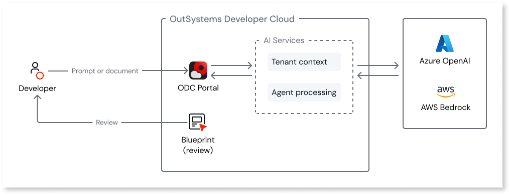
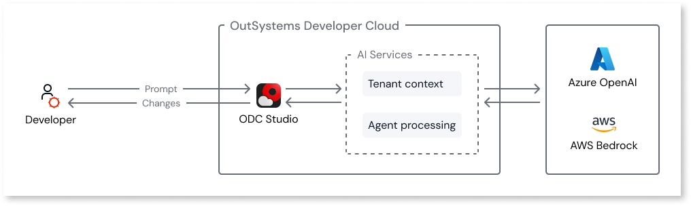

# Architecture

Agentic development in OutSystems combines three components to transform natural language into app structures. This architecture applies to both Mentor Web and Mentor Studio. Together, these components form the foundation of the OutSystems Enterprise Context Graph, the contextual architecture that gives AI agents the understanding to work across complex systems.

* **AI agents** interpret natural language and map it to OutSystems development patterns.
* **OutSystems Model** (the app model, not an AI model) represents the app's structure, data, logic, and UI at a high level of abstraction.
* **OutSystems compiler** translates the app model into deployable code, enforcing security and performance standards.

Understanding how these components work together explains why explicit prompts produce better results than vague descriptions.

## AI agents

Agentic development uses AI agents that combine general-purpose Large Language Models with OutSystems-specific knowledge and instructions. Unlike simple prompt-response AI, these agents autonomously plan, reason through multi-step tasks, and coordinate changes across different parts of an app. They understand natural language and map it to OutSystems development patterns. When you write a prompt or upload a requirement document, the agents interpret intent and identify entities, relationships, roles, and UI patterns. This interpretation becomes the blueprint (in Mentor Web) or implementation plan (in Mentor Studio) that you review before changes are applied.

The agents are equipped with knowledge of common app structures: entities and their relationships, user roles and permissions, screen layouts, and business logic patterns. When input matches these recognized patterns, agentic development generates accurate structures. When input is ambiguous or uses terms that don't match recognized patterns, the agents make their best interpretation based on context.

This is why explicit, structured prompts produce better results than vague descriptions. The agents work with pattern recognition, not inference of unstated requirements.

## Tenant context

The Mentor tools in ODC retrieve context from your development environment to generate more relevant results. This applies to both new app creation and modification of existing apps. The context includes existing entities, public actions, Data Fabric connections, and app metadata from your tenant. When you reference existing elements in a prompt, Mentor uses this context to understand the relationships and generate code that integrates correctly.

A populated development environment improves results. If your tenant contains entities, actions, and established patterns, Mentor can reference them when generating new elements. For new tenants with minimal existing structure, Mentor relies more heavily on the prompt and recognized patterns.

## OutSystems Model

The OutSystems Model is a high-level abstraction that represents an app's structure, data, logic, and UI. This is how all OutSystems apps work, not something specific to agentic development. Every app built in ODC, whether created manually in ODC Studio or generated through Mentor, is defined as an app model.

Agentic development creates and modifies the app model, not raw code. This abstraction layer enables ODC standards enforcement, consistency across generated apps, and maintainability when development continues in ODC Studio.

The app model captures what needs to be built, not how to build it. This provides several advantages:

**ODC standards.** The compiler enforces security, performance, and architecture requirements when translating the app model to code. AI-generated apps follow the same standards as manually built apps.

**Consistency.** The app model ensures generated apps use OutSystems patterns correctly. Entity relationships, screen bindings, and authorization rules follow ODC conventions.

**Maintainability.** Because agentic development works at the app model level, development can continue in ODC Studio without dealing with AI-generated code quality issues.

## Compiler

The OutSystems compiler translates the app model into deployable app code when published. The compiler applies ODC standards for security, performance, and architecture regardless of whether you created the app model through agentic development or built it manually in ODC Studio. AI-generated apps receive the same security enforcement, including role-based access, data encryption, and input validation, as any other OutSystems app.

## Generation flow (Mentor Web)

When creating new apps in Mentor Web, each interaction follows a consistent flow from input to deployable code. Understanding this flow helps identify where to make corrections when results differ from expectations. The flow includes human validation at the blueprint stage before generation.

The diagram shows the components involved in app generation. When you enter a prompt or upload a requirement document, the request flows through these components to produce a deployable app. The blueprint review loop gives you a checkpoint before generation begins.

* **Input.** A prompt or requirement document describing the desired app.
* **Interpretation.** The AI agents analyze the input using [tenant context](#tenant-context), identifying entities, relationships, roles, UI patterns, and business logic.
* **Blueprint.** ODC produces a visual representation of the interpreted requirements for review.
* **App model generation.** After blueprint approval, ODC creates the app model.
* **Compilation.** When published, the compiler translates the app model into deployable code.

Refinement prompts repeat the interpretation and generation phases, applying changes incrementally to the existing app model.

## Modification flow (Mentor Studio)

When modifying existing apps in Mentor Studio, the flow differs from generation. Instead of creating a new app from scratch, Mentor analyzes the existing app model and applies targeted changes.

The diagram shows the components involved in app modification. When you enter a prompt in the Mentor panel, the request flows through these components. Unlike generation, Mentor Studio starts by reading the existing app to understand what is already built.

* **Context analysis.** Mentor reads the current app model, including entities, screens, actions, and relationships.
* **Input.** A prompt expressing your intent: changes, explanations, code review, or implementation guidance.
* **Interpretation.** The AI agents analyze the prompt in the context of the existing app structure.
* **Implementation plan.** Mentor presents the proposed changes for review before applying them.
* **App update.** After approval, Mentor applies the changes to the app model.
* **Compilation.** When published, the compiler translates the updated app model into deployable code.

The key difference is context: Mentor Studio understands the existing app structure and generates changes that integrate with what's already there. This enables targeted modifications without regenerating the entire app.

## How the tools work together

Both Mentor Web and Mentor Studio work with the same app model. Mentor Web creates new apps and supports iteration on existing apps. Mentor Studio provides the full development environment for modifications of any complexity. You can move between them based on what you need to accomplish.

A typical workflow might be:

1. **Create in Mentor Web.** Generate a new app from requirements.
1. **Refine in Mentor Web.** Use the editor to iterate on the generated app.
1. **Extend in Mentor Studio.** Open the app in ODC Studio and use Mentor Studio to add features, fix issues, or extend logic.
1. **Manual development.** Use ODC Studio's visual tools for advanced development that requires capabilities beyond the supported patterns.

All tools work with the same app model. Apps created through agentic development are standard OutSystems apps with no lock-in or special handling required. You can switch between AI-assisted prompts and manual development at any time.

## Related resources

The architecture described here supports both Mentor Web and Mentor Studio. The following resources explain how each tool interacts with the app model and how agentic development fits into your development lifecycle.

* For how Mentor Web uses this architecture to generate new apps from requirements, refer to [How AI app generation works](mentor-web/how-it-works.md).
* For how Mentor Studio uses this architecture to modify existing apps through conversation, refer to [AI development in Mentor Studio](mentor-studio/how-it-works.md).
* For how agentic development integrates with testing, deployment, and governance, refer to [Agentic development in the SDLC](sdlc.md).
