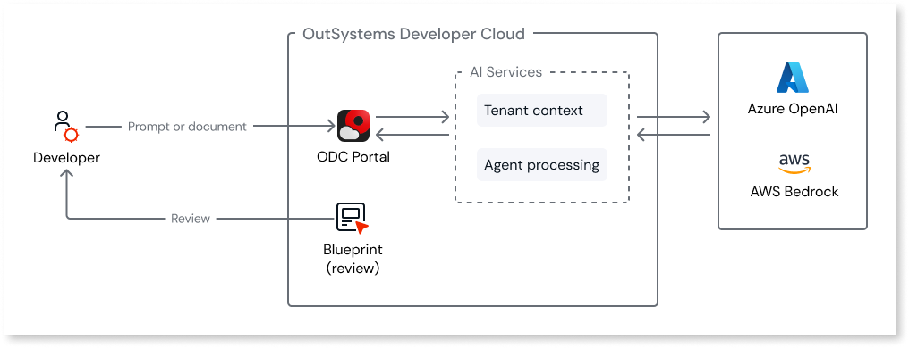
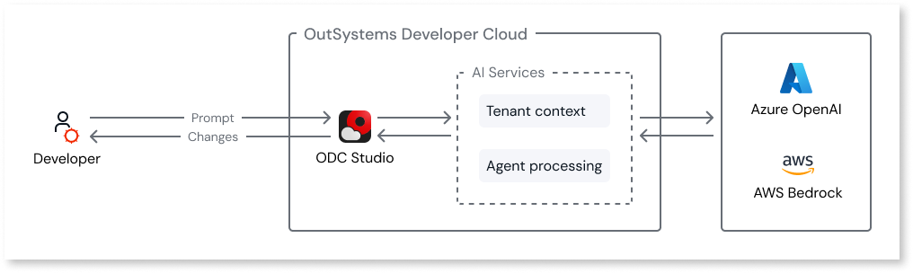

# Architecture

Agentic development in OutSystems combines three components to turn natural language into app structures. This architecture applies to every path. Mentor Web and Mentor Studio send your prompts to Mentor directly. With OutSystems MCP, the agent in your MCP host, such as Claude Code or Cursor, reaches Mentor through the OutSystems MCP server. For that request path, refer to [OutSystems MCP request architecture](outsystems-mcp/architecture.md). Together with tenant context, these components form the OutSystems Enterprise Context Graph. For what the graph indexes and how it stays current, refer to [Enterprise Context Graph](context-graph.md).

* **Mentor** interprets natural language and maps it to OutSystems development patterns.
* **OutSystems Model** represents the app's structure, data, logic, and UI at a high level of abstraction, distinct from the AI model that interprets your prompts.
* **OutSystems compiler** translates the app model into deployable code, enforcing security and performance standards.

Understanding how these components fit together shows where the AI interprets your intent and where the platform compiles and governs the result.

## Mentor

Mentor is the interpretation component. It combines general-purpose Large Language Models with OutSystems-specific knowledge to map your natural language to OutSystems development patterns, identifying entities, relationships, roles, and UI patterns. In Mentor Web the result is a blueprint; in Mentor Studio it's a set of proposed changes, which you review before anything is applied. For what Mentor is and how it operates, refer to [Mentor](coding-agents.md).

## Tenant context

Mentor reads context from your tenant to produce more relevant results, for new apps and for changes to existing apps. This context includes your existing entities, the public elements other apps expose, Data Fabric connections, and app metadata. A populated Development stage improves results, because Mentor references what already exists when it generates new elements. For what this context holds and how it stays current, refer to [Enterprise Context Graph](context-graph.md).

## OutSystems Model

The OutSystems Model is a structured representation of an app's data, logic, and UI. All OutSystems apps are built on this model, including those built through agentic development. Whether you build in ODC Studio or use Mentor, you work with the same app model.

Agentic development works at the app model level, generating and modifying model elements directly. Working at this level keeps generated apps consistent and straightforward to maintain in ODC Studio.

The app model captures what to build; the compiler determines how to build it. This brings three advantages:

**ODC standards.** The compiler enforces security, performance, and architecture rules when it turns the model into code. AI-generated apps follow the same standards as hand-built apps.

**Consistency.** The model ensures generated apps use OutSystems patterns correctly. Entity links, screen bindings, and authorization rules follow ODC conventions.

**Maintainability.** Because Mentor works at the model level, you continue development in ODC Studio on a standard OutSystems app model, the same as any hand-built app.

## Compiler

The OutSystems compiler turns the app model into deployable code when you publish, applying security, performance, and architecture rules and enforcing the roles and permissions the app defines. Review the access Mentor configures to confirm it matches your intent. For the guarantees this gives every app regardless of origin, refer to [Platform guarantees and AI interpretation](odc-ai-and-platform.md).

## Generation flow (Mentor Web)

When you create a new app in Mentor Web, the request follows a set path from input to deployable code. Knowing this path helps you spot where to adjust when results don't match what you expected. You review a blueprint before generation begins.

The diagram shows the components involved in app generation. When you enter a prompt or upload a document, the request moves through these components and produces a deployable app. The blueprint review gives you a checkpoint before generation starts.

* **Input.** A prompt or requirement document describing the desired app.
* **Interpretation.** Mentor analyzes the input using [tenant context](#tenant-context), identifying entities, relationships, roles, UI patterns, and business logic.
* **Blueprint.** ODC produces a visual representation of the interpreted requirements for review.
* **App model generation.** After blueprint approval, ODC creates the app model.
* **Compilation.** When published, the compiler translates the app model into deployable code.

Refinement prompts repeat the interpretation and generation phases, applying changes incrementally to the existing app model.

## Modification flow (Mentor Studio)

Mentor Studio works differently from Mentor Web. Mentor Studio reads the existing model and applies targeted changes to it.

The diagram shows the components for app modification. When you enter a prompt in the Mentor panel, the request moves through these components. Mentor Studio starts by reading the existing app to understand what is there.

* **Context analysis.** Mentor reads the current app model, including entities, screens, actions, and relationships.
* **Input.** A prompt expressing your intent: changes, explanations, code review, or implementation guidance.
* **Interpretation.** Mentor analyzes the prompt in the context of the existing app structure.
* **Proposed changes.** For complex requests, Mentor Studio presents the changes it plans to make and applies them after you accept. It applies simpler changes directly, and you review the result.
* **App update.** After approval, Mentor applies the changes to the app model.
* **Compilation.** When published, the compiler translates the updated app model into deployable code.

The key difference is context. Mentor Studio reads the existing app and generates changes that fit in. You can make targeted edits without rebuilding the whole app.

## How the tools work together

Both tools work with the same app model. Mentor Web creates new apps and supports iteration. Mentor Studio gives you the full development environment for changes of any complexity. You can switch between them as needed.

A typical workflow might be:

1. **Create in Mentor Web.** Generate a new app from requirements.
1. **Refine in Mentor Web.** Use the editor to iterate on the generated app.
1. **Extend in Mentor Studio.** Open the app in ODC Studio and use Mentor Studio to add features, fix issues, or extend logic.
1. **Manual development.** Use ODC Studio's visual tools for advanced development that requires capabilities beyond the supported patterns.

All tools share the same app model. Apps built through agentic development are standard OutSystems apps. You can switch between AI prompts and manual development at any time.

## Related resources

The architecture described here supports all three paths. OutSystems MCP adds a request path in front of it, from your MCP host to the OutSystems MCP server. The following resources explain how each path works and how agentic development fits into your development lifecycle.

* For how Mentor Web uses this architecture to generate new apps from requirements, refer to [AI app generation in Mentor Web](mentor-web/how-it-works.md).
* For how Mentor Studio uses this architecture to modify existing apps through conversation, refer to [AI development in Mentor Studio](mentor-studio/how-it-works.md).
* For how an MCP host connects to OutSystems through the OutSystems MCP server, refer to [OutSystems MCP request architecture](outsystems-mcp/architecture.md).
* For how agentic development integrates with testing, deployment, and governance, refer to [Agentic development in the SDLC](sdlc.md).
