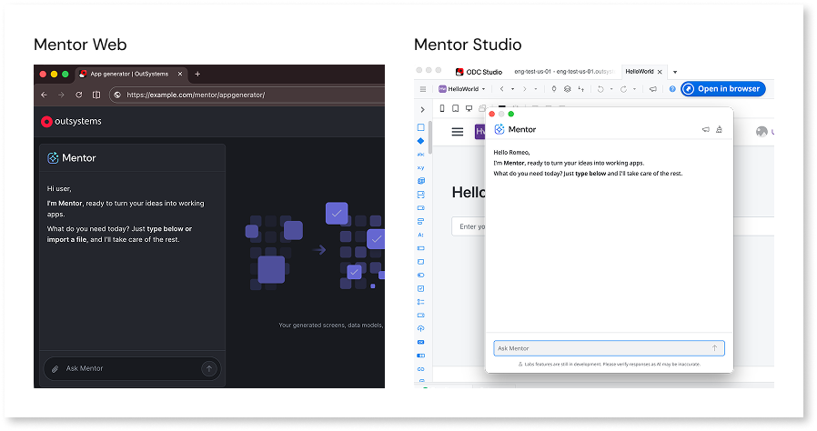

# Agentic development

Building apps often starts with translating requirements into screens, data models, and logic, work that follows predictable patterns. OutSystems Agentic Development accelerates this by letting you describe app requirements in natural language and having ODC generate or modify the app structure for you. Agentic development works through two tools: Mentor Web for creating apps in ODC Portal and Mentor Studio for modifying apps in ODC Studio. You stay in control by reviewing proposed changes and refining them through follow-up prompts before applying anything.

For a video walkthrough of agentic development concepts and tools, take the [Agentic development](https://www.outsystems.com/tk/redirect?g=eb9a16f2-f6b9-4903-9be8-122a0188f113) online course.

Choose your starting point based on what you want to accomplish:

| Goal | Overview | Tutorial |
| ---- | -------- | -------- |
| Create a new app from requirements | [AI app generation in Mentor Web](mentor-web/how-it-works.md) | [Create an app with AI](mentor-web/create-app.md) |
| Modify an existing app in ODC Studio | [AI development in Mentor Studio](mentor-studio/how-it-works.md) | [Modify an app with AI](mentor-studio/modify-app.md) |

## Agentic development vs AI-powered apps

Agentic development and AI-powered apps serve different purposes:

* **Agentic development** uses AI to help you build apps faster. You describe requirements, and ODC generates the app structure and code.

* **AI-powered apps** are apps that use AI capabilities at runtime. These apps call AI models to provide intelligent features to end users.

This guide covers agentic development. To build apps that use AI models, refer to [Build AI-powered apps](../building-apps/build-ai-powered-apps/intro.md).

## Agentic Systems Engineering

OutSystems Agentic Systems Engineering is the OutSystems approach to building governed, enterprise-ready agentic systems. Agentic development is the product capability at the center of this approach, providing the tools and workflows for creating and modifying apps through conversation: Mentor Web for creating apps in ODC Portal and Mentor Studio for modifying apps in ODC Studio. For the architecture that underpins agentic development, including the Enterprise Context Graph, refer to [Architecture](architecture.md).

## How it works

Agentic development follows an iterative workflow for both creating and modifying apps: describe, review, and refine.

You describe app requirements through prompts or requirement documents. ODC interprets the input and proposes changes through a [blueprint](mentor-web/blueprint.md) or implementation plan. You review and adjust the proposed changes, then continue iterating until the app meets requirements.

For new apps, the workflow is: describe requirements, review the blueprint, generate and publish, refine in Mentor Web, and continue in Mentor Studio when needed.

For existing apps, you reopen them in Mentor Web for further iteration, or use Mentor Studio for modifications in the full development environment.

You accept proposed changes or provide follow-up prompts to adjust the result. ODC applies recognized patterns, so clear and explicit descriptions produce more accurate results. For guidance on effective prompting and collaboration strategies, refer to [Thinking with AI](thinking-with-ai.md).

Don't include personally identifiable information (PII) such as real names, email addresses, phone numbers, or government IDs in prompts or requirement documents. Use placeholder or fictional data instead.

## Capabilities

Agentic development supports app creation and ongoing modification through conversation.

* **App generation**: Full-stack web apps created from natural language descriptions, including data models, screens, logic, and roles. The proposed app structure is reviewed and refined through a blueprint before generation.
* **App modification**: Features added, logic extended, and existing apps modified through conversation in Mentor Web or Mentor Studio.
* **Implementation plans**: Proposed changes reviewed before application, with the ability to accept or reject.

## Where AI fits in your workflow

Agentic development supports different phases of the software development lifecycle. Use Mentor Web to ideate and generate new apps, then use Mentor Studio to extend and refine them.

| Phase | What you do | Tool |
| ----- | ----------- | ---- |
| **Ideate** | Describe requirements and generate an app structure | Mentor Web |
| **Review** | Validate the blueprint before generation | Mentor Web |
| **Build** | Add features and extend existing apps | Mentor Studio |
| **Debug** | Fix errors and resolve issues | Mentor Studio |

## When to use each tool

Agentic development provides two tools for different stages of development. **Mentor Web** creates new apps and iterates on them through natural language in ODC Portal, targeting straightforward to moderate projects. **Mentor Studio** modifies apps of any complexity through conversation in the full development environment, including agents in Agent Workbench. Both tools follow OutSystems patterns for security, architecture, and code quality.

| Aspect | Mentor Web | Mentor Studio |
| ------ | ---------- | ------------- |
| Best for | Creating new apps, rapid prototyping, iterating on generated apps | Modifying apps, adding features, extending logic, explaining code, documenting elements, identifying technical debt |
| App type | New and existing web apps | Web apps; libraries and agentic apps (beta) |
| Complexity | Common app patterns and structures | Any, including advanced logic and integrations |
| Access | **ODC Portal** > **Apps** > **Create app** > **Generate with Mentor** | **ODC Studio** > **Mentor** icon in toolbar |
| Tutorial | [Create an app with AI](mentor-web/create-app.md) | [Modify an app with AI](mentor-studio/modify-app.md) |

For a detailed comparison of what each tool generates, refer to [Capabilities for Mentor Web](mentor-web/capabilities.md) and [Capabilities for Mentor Studio](mentor-studio/capabilities.md). For step-by-step guidance, refer to [Create an app with AI](mentor-web/create-app.md) and [Modify an app with AI](mentor-studio/modify-app.md).

For real-time logic suggestions during manual development in ODC Studio, refer to [AI logic suggestions](../building-apps/logic/ai-logic-suggestions.md).

## What AI can and cannot do

Agentic development handles common app patterns but has constraints. Understanding these constraints helps you set realistic expectations and plan your development approach.

What AI handles:

* Generating data models with entities, attributes, and relationships
* Creating screens with standard UI patterns (tables, cards, dashboards)
* Setting up roles and entity-level authorization
* Building basic CRUD operations and navigation logic
* Explaining code and suggesting fixes for errors

What requires manual development:

* Complex business logic and multi-step workflows
* External system integrations (REST APIs, custom connectors)
* Custom CSS, JavaScript, or advanced UI customization
* Mobile apps
* Performance optimization and advanced queries

For the complete list of constraints, refer to [Known limitations](ai-limitations.md).

## Security and data privacy

Agentic development follows the security and data handling policies that apply across ODC:

* **No training on your data.** Prompts and requirement documents are not used to train third-party AI models. Contractual agreements with AI model providers ensure data protection.
* **Prompt isolation.** User prompts are not injected into generated code. The AI agents interpret intent and produce app model structures, so prompt injection is not a concern.
* **App security equivalence.** AI-generated apps follow the same security standards as manually built apps. The OutSystems compiler enforces security controls regardless of how the app model was created.
* **Encryption.** Data is encrypted with tenant-specific keys both in transit and at rest.
* **Data residency.** Agentic development uses the Data Platform, which may process data outside your ODC organization region. For more information, refer to [Data Platform](../manage-platform-app-lifecycle/platform-architecture/intro.md#data-platform).

For technical details about how agentic development processes requests, refer to [Architecture](architecture.md). For organization-wide security documentation, compliance certifications, and policies, visit the [OutSystems Trust Center](https://security.outsystems.com/).
