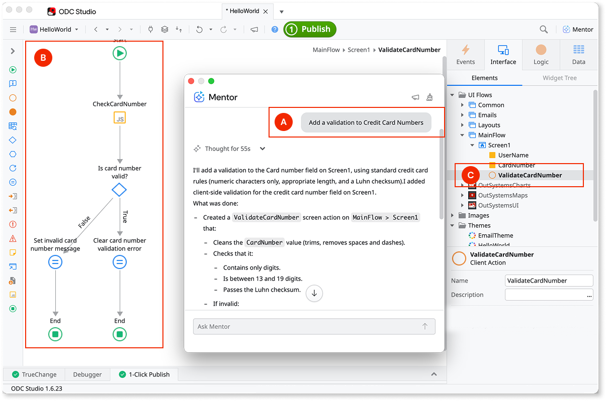
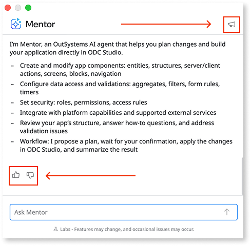
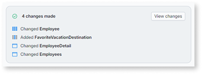

# AI development in Mentor Studio

Mentor Studio brings conversational AI directly into ODC Studio. You describe requirements in natural language, and Mentor transforms them into generated or modified logic, screens, and data within existing apps. This approach extends beyond initial app creation to support ongoing development, refinement, and feature enhancement.

Mentor analyzes the existing app model and generates changes that integrate with existing elements. Server actions, screen modifications, entity additions, and complex logic can be created through conversation. Mentor respects user permissions and follows OutSystems patterns when generating changes.

Use Mentor Studio to add features, fix issues, or refine logic in apps you're actively developing. To create a new app from requirements, refer to [AI app generation in Mentor Web](../mentor-web/how-it-works.md).

The image shows a typical Mentor interaction in ODC Studio. (A) **Mentor panel**. The prompt describes a credit card validation requirement, specifying the expected format, character limits, and Luhn algorithm check. (B) **Generated action flow**. Mentor creates the ValidateCreditCardNumber action with the complete logic, including input validation, format checks, and the checksum calculation, (C) **Element tree**. The generated elements appear in the app structure, including the new action and its input/output parameters.

## Interacting with Mentor Studio

Mentor is available in ODC Studio through the Mentor panel. Select the Mentor icon in the toolbar to open the panel. The panel remains open while you work and lets you describe requirements, review changes, and send follow-up prompts. You can continue working on the app or switch to another app while Mentor processes a request. Each app has its own Mentor conversation, so you can use Mentor across multiple tabs at the same time.

The Mentor panel includes several interaction options:

* **View changes.** After Mentor generates modifications, select this button to see a summary of what changed. The summary highlights affected elements and the nature of each change.
* **Thumbs up or thumbs down.** Rate each response to help improve Mentor. Select thumbs up for helpful responses or thumbs down when the outcome doesn't meet expectations.
* **Megaphone icon.** Share detailed feedback about your experience. Describe the action, expected result, and actual outcome. This feedback helps the development team understand real-world usage patterns and prioritize improvements.

Feedback is particularly valuable during general availability as the feature continues to evolve based on user input.

## The workflow

Mentor Studio follows an iterative workflow. Describe a goal in natural language, review the generated changes, and refine through additional prompts until the result meets requirements.

The workflow consists of three phases:

1. **Describe the goal.** Communicate the requirement in plain language, such as "add a comments feature to the Ticket entity" or "create a dashboard screen for order metrics."
1. **Review the changes.** Mentor generates modifications and applies them to the app. Review the affected elements in ODC Studio to verify the outcome.

    

1. **Iterate as needed.** Refine through follow-up prompts or start a new conversation for different requirements.

This iterative approach supports both small adjustments and complex multi-step development tasks.

Don't include personally identifiable information (PII) in prompts. Use placeholder or fictional data instead of real names, email addresses, phone numbers, or other sensitive data.

Mentor uses AI agents to process requests. When you describe a goal, Mentor analyzes the current app model, plans the required changes, and generates modifications that integrate with existing elements. This agent-based processing enables Mentor to handle multi-step tasks and coordinate changes across different parts of the app.

## Capabilities

Mentor generates and modifies elements across these categories:

* **Logic:** server actions, client actions, service actions, aggregates, and SQL nodes.
* **UI:** screens, web blocks, and emails.
* **Data:** entities, attributes, and relationships.
* **Other:** timers and events.

Mentor also analyzes existing code:

* **Code analysis:** explains existing logic, suggests implementation approaches, and identifies areas for improvement.

For detailed capabilities and use cases, refer to [Capabilities and patterns for Mentor Studio](capabilities.md).

Mentor operates on web apps only. For libraries, services, and mobile apps, build them manually in ODC Studio.

For real-time suggestions while building logic flows manually, [AI logic suggestions](../../building-apps/logic/ai-logic-suggestions.md) complements Mentor by predicting and suggesting next steps as you develop.

## Constraints

Mentor Studio works with web apps and can modify logic, UI, and data through conversation. For constraints and current limitations, refer to [Known limitations](../ai-limitations.md).

## Best practices

Follow these guidelines to improve outcomes:

* **Be specific.** Provide detailed requirements instead of generic instructions so Mentor doesn't have to make assumptions.
* **Break down complex requests.** Send one requirement per prompt rather than combining multiple requirements in a single message.

## Related resources

Mentor Studio is one of two AI development tools in ODC. The following resources cover prompt techniques, detailed capabilities, and how Mentor Studio connects to the broader agentic development workflow.

* For prompt patterns and examples specific to modifying apps in Mentor Studio, refer to [Prompts for Mentor Studio](prompts.md).
* For the full list of elements that Mentor Studio generates and modifies, refer to [Capabilities and patterns for Mentor Studio](capabilities.md).
* For prompting strategies that apply across all Mentor tools, refer to [Effective prompts for Mentor](../effective-prompts.md).
* For creating or iterating on apps in the browser editor, refer to [How AI app generation works](../mentor-web/how-it-works.md).
* For background on agentic development concepts, refer to [Thinking with AI](../thinking-with-ai.md).
