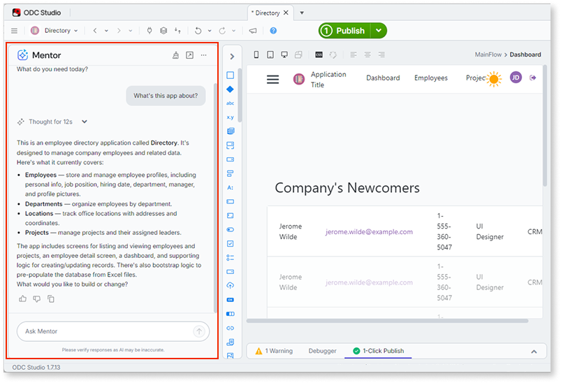
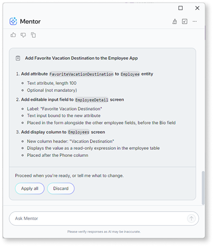
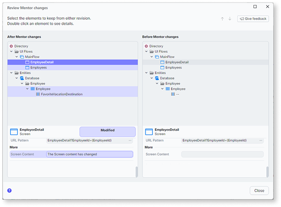

# AI development in Mentor Studio

Mentor Studio brings conversational AI into ODC Studio. It works across the assets you build there: web apps, libraries, and agentic apps. You describe requirements in natural language, and Mentor Studio generates or modifies the elements each asset supports. The elements available depend on the asset type. For what Mentor Studio edits in each, refer to [Element coverage](capabilities.md#element-coverage).

Mentor analyzes the app model and generates changes that integrate with the existing elements. Mentor also draws on tenant context, so it references and reuses public elements that other apps expose in your tenant. Mentor creates and modifies elements through conversation. Mentor works within your user permissions and applies OutSystems patterns when generating changes.

Mentor uses AI agents to process requests. When you describe a goal, Mentor analyzes the current app model, plans the required changes, and generates modifications that build on existing elements. This agent-based processing lets Mentor handle multi-step tasks and coordinate changes across different parts of the app. Mentor Studio works on the OutSystems app model rather than raw code, apart from elements that hold code by nature such as CSS or JavaScript, and draws on the Enterprise Context Graph for a high-fidelity view of your apps, data, and dependencies. For this architecture, refer to [Architecture](../architecture.md).

In a multi-portfolio organization, for more information about roles, portfolio-scoped permissions, and development with multiple portfolios, refer to [User management with multiple portfolios](../../manage-platform-app-lifecycle/portfolios/portfolios-user-management.md) and [Development with multiple portfolios](../../manage-platform-app-lifecycle/portfolios/portfolios-develop.md).

Use Mentor Studio to add features, fix issues, or refine logic in apps you're developing. To create a new app from requirements, refer to [AI app generation in Mentor Web](../mentor-web/how-it-works.md).

The image shows a Mentor interaction in ODC Studio. (A) **Mentor panel**. The prompt describes a credit card validation requirement, specifying the expected format, character limits, and Luhn algorithm check. (B) **Generated action flow**. Mentor creates the ValidateCreditCardNumber action with the complete logic, including input validation, format checks, and the checksum calculation, (C) **Element tree**. Mentor adds the elements to the app structure, including the new action and its input/output parameters.

## Interacting with Mentor Studio

Mentor is available in ODC Studio through the Mentor panel. Select the Mentor icon in the toolbar to open the panel. The panel remains open while you work and lets you describe requirements, review changes, and send follow-up prompts. Continue working on the app or switch to another app while Mentor processes a request. Use Mentor across multiple tabs at the same time, with each app maintaining its own conversation.

The Mentor panel includes several interaction options:

* **Dock or undock.** Toggle the panel between docked in ODC Studio and a separate window. Use the dock icon in the panel header.
* **Thumbs up or thumbs down.** Rate each response to help improve Mentor. Select thumbs up for helpful responses or thumbs down when the outcome doesn't meet expectations.
* **View changes.** Open the **Review Mentor changes** dialog to compare your app before and after Mentor Studio applies changes. Refer to [Review changes](#review-changes).
* **Feedback icon.** Share detailed feedback about your experience. Describe the action, expected result, and actual outcome. This feedback helps the development team understand your usage patterns and prioritize improvements.

### Use the current selection as context

Mentor reads what you select and what you have open in ODC Studio, so you refer to your work instead of describing it. Select an element or open a view, then prompt Mentor with a direct reference to it.

Mentor reads two kinds of context from ODC Studio:

* **The selected element.** The element you select in the current view, such as a button on a screen or an If element in a logic flow.
* **The open view.** The screen, action, or flow you have open, even when your focus is on an element inside it.

To scope a request to your work, select the element first, then prompt Mentor with a direct reference. For example, open a logic flow and ask "Explain this logic," or select an element that shows an error and ask "Fix this error."

You don't have to rely on the selection. To act on a different element, name it in your prompt, and Mentor uses the element you name.

## The workflow

Mentor Studio follows an iterative workflow. Describe a goal in natural language, review the changes Mentor generates, and refine through additional prompts until the result meets requirements.

The workflow has four steps:

1. **Describe the goal.** State your requirement in plain language, such as "add a comments feature to the Ticket entity" in a web app or "add a reusable date-formatting action" in a library.
1. **Review the plan.** For complex requests, Mentor Studio proposes the changes it intends to make and waits for your decision before applying anything. For how to read a proposal and apply, reject, or refine it, refer to [Review and accept the plan](#review-and-accept-the-plan).
1. **Verify the changes.** After Mentor Studio applies the changes, review what changed and confirm the outcome. Refer to [Review changes](#review-changes).
1. **Iterate.** Refine the result through follow-up prompts, or start a new conversation for a different requirement.

This iterative approach supports both small adjustments and multi-step development tasks.

Don't include personally identifiable information (PII) in prompts. Use placeholder or fictional data instead of real names, email addresses, phone numbers, or other sensitive data.

For how agentic development handles your data, including encryption, data residency, and the policy against training third-party models on your prompts, refer to [Security and data privacy](../intro.md#security-and-data-privacy).

## Review and accept the plan

For complex requests, Mentor Studio proposes the changes it plans to make and waits for you to accept them before applying anything. This step lets you review the intended work and its impact across the app before it modifies your app.

### When Mentor Studio proposes changes

Mentor Studio proposes changes for complex requests instead of applying them directly.

A high-level request that spans multiple elements, dependencies, or workflows produces a plan. Mentor Studio applies a simpler request that affects a single element directly.

### What the plan includes

The plan summarizes the work Mentor Studio intends to do before applying it.

* The steps Mentor Studio plans to take.
* Interactions with other parts of the app, including elements the change depends on or affects.
* UI adjustments and the implications for existing workflows.

Mentor Studio collapses long lists. Expand the list to review every step before you decide.

### Act on the plan

After you review the plan, you decide what happens next:

* Inspect the steps and impact to confirm the change matches your intent.
* Apply the changes to add them to your app.
* Reject the changes to leave your app unchanged.
* Refine your request through a follow-up prompt, and Mentor Studio revises the proposal.

## Review changes

After Mentor Studio applies changes, review what changed before you continue. Open the **Review Mentor changes** dialog by selecting **View changes** in the Mentor panel, or by asking Mentor Studio what changed, for example "Show me what changed in the CreateOrder action." Both open the same dialog.

The dialog shows a side-by-side comparison of your app, **After Mentor changes** on the left and **Before Mentor changes** on the right. It highlights the elements Mentor added or modified and shows the details of each element you select. Select the elements to keep from either revision to merge the result you want.

## Capabilities

Mentor edits the elements the open asset supports and analyzes existing code to explain logic, suggest implementation approaches, and identify areas for improvement. For the full list of supported tasks and asset coverage, refer to [Capabilities and patterns for Mentor Studio](capabilities.md).

Mentor Studio edits web apps, libraries, and agentic apps. Build mobile apps manually in ODC Studio.

Apps edited with Mentor Studio are standard OutSystems apps. They follow the same compilation, deployment, and governance as apps built manually in ODC Studio.

For real-time suggestions while building logic flows manually, [AI logic suggestions](../../building-apps/logic/ai-logic-suggestions.md) complements Mentor Studio by predicting and suggesting next steps as you develop.

## Constraints

Mentor Studio edits web apps, libraries, and agentic apps through conversation. The elements available in each conversation depend on the asset type. For constraints and current limitations, refer to [Known limitations](../ai-limitations.md).

## Best practices

Follow these guidelines to improve outcomes:

* **Be specific.** Provide detailed requirements instead of generic instructions so Mentor doesn't have to make assumptions.
* **Break down complex requests.** Send one requirement per prompt, review the result, then build on it. Smaller prompts produce more predictable outcomes and make it easier to spot what went wrong. For decomposition strategies and examples, refer to [Effective prompts for Mentor](../effective-prompts.md#decomposition).

## Related resources

Mentor Studio is one of two AI development tools in ODC. The following resources cover prompt techniques, detailed capabilities, and how Mentor Studio connects to the broader agentic development workflow.

* For prompt patterns and examples specific to modifying apps in Mentor Studio, refer to [Prompts for Mentor Studio](prompts.md).
* For the full list of elements that Mentor Studio generates and modifies, refer to [Capabilities and patterns for Mentor Studio](capabilities.md).
* For prompting strategies that apply across all Mentor tools, refer to [Effective prompts for Mentor](../effective-prompts.md).
* For creating or iterating on apps in the browser editor, refer to [How AI app generation works](../mentor-web/how-it-works.md).
* For background on agentic development concepts, refer to [Thinking with AI](../thinking-with-ai.md).
* For how agentic development fits testing, deployment, and governance, refer to [Agentic development in the SDLC](../sdlc.md).
* For the architecture behind Mentor Studio, including the OutSystems app model and the Enterprise Context Graph, refer to [Architecture](../architecture.md).
* For how agentic development secures and handles your data, refer to [Security and data privacy](../intro.md#security-and-data-privacy).
* For error codes that Mentor Studio can return, refer to [Mentor Studio errors](../../../error/aisa/mentor-studio-errors.md).
* [Agentic development](https://www.outsystems.com/tk/redirect?g=eb9a16f2-f6b9-4903-9be8-122a0188f113) online course: a video walkthrough of the Mentor Studio workflow.
