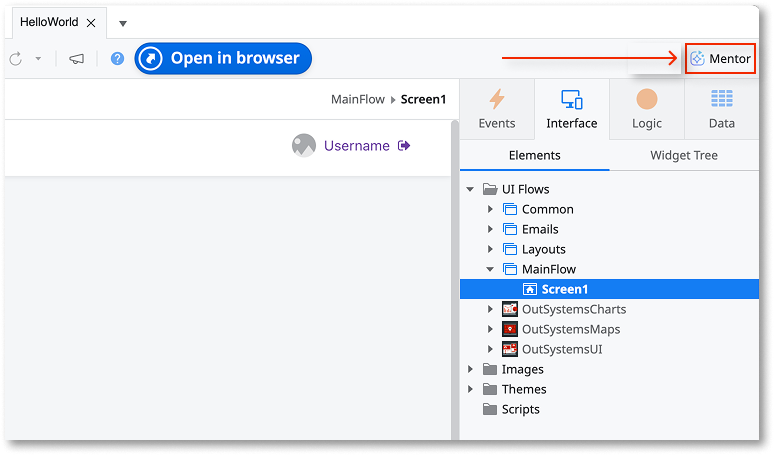
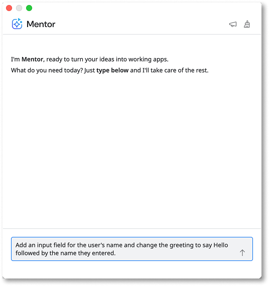
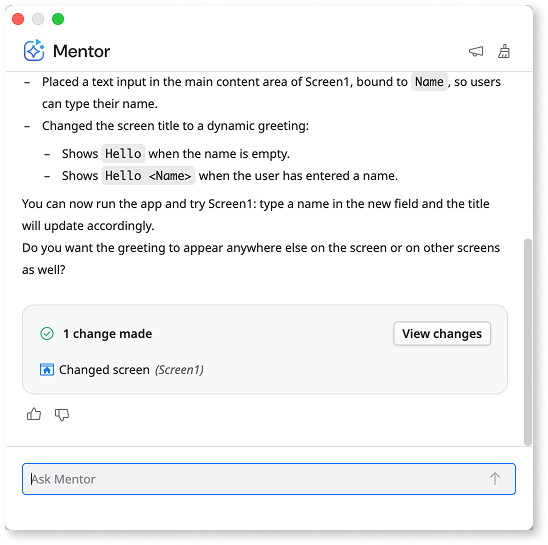
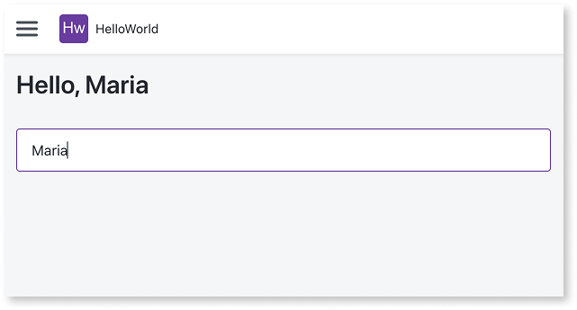

# Modify an app with AI in ODC Studio

In this tutorial, you use Mentor Studio to enhance an existing app. You transform a basic "Hello, world!" greeting into a personalized experience that asks for the user's name.

For background on how Mentor Studio works, refer to [AI development in Mentor Studio](how-it-works.md).

## Prerequisites

To complete this tutorial, you need:

* ODC Studio installed and connected to an ODC organization.
* The [Hello World app](../../getting-started/hello-world.md). If you haven't created it yet, follow that tutorial first.

## Use prompts to modify your app

With your "Hello, world" app open in ODC Studio, follow these steps to edit the app with AI:

1. Select the Mentor icon to open the Mentor panel.

    

1. In the Mentor panel, enter the following prompt: "Add an input field for the user's name and change the greeting to say Hello followed by the name they entered". Press **Enter** to confirm and Mentor starts working on the code.

    

1. Review the response and optionally select **View changes** to see what Mentor edited.

    

    

    AI-generated code is non-deterministic, meaning Mentor may produce different results each time you send the same prompt. Your app's code and layout may differ from the examples shown in this tutorial.

    

1. Select the **1-Click Publish** button to publish the app, then open the app in the browser.

    

## Next steps

You've successfully used Mentor to modify an existing app. To continue building with AI, describe your goals in the Mentor panel, review the generated changes, and iterate as needed.

For more information:

* [AI development in Mentor Studio](how-it-works.md) - Learn about the Mentor interface, workflow, and how to send feedback.
* [Capabilities and patterns for Mentor Studio](capabilities.md) - Review detailed examples and use cases for what Mentor generates.
* [Effective prompts for Mentor](../effective-prompts.md) - Strategies for writing prompts that produce accurate results.
