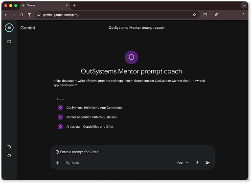

# AI tools for working with Mentor Web

The quality of Mentor Web's output depends on how well you describe your requirements. These companion tools help you write clearer prompts and structure requirement documents so Mentor Web generates apps closer to what you need on the first attempt.

* **OutSystems Mentor Web prompt coach**: A Google Gemini Gem that answers questions about prompting techniques, requirement documents, and Mentor Web capabilities.
* **Requirement document generator**: A prompt template that transforms meeting notes, user stories, and other artifacts into structured requirement documents.

## OutSystems Mentor Web prompt coach

Use this interactive assistant when you're unsure how to phrase a prompt, want to understand Mentor Web's constraints, or need help structuring a requirement document. The Gem is trained on Mentor Web documentation and provides guidance tailored to what Mentor Web recognizes.

Access the [OutSystems Mentor Web prompt coach](https://gemini.google.com/gem/1tI9yvDyJwt6-CNdfPD-i1Fgt9hqsCOTg).

## Requirement document generator

Complex apps benefit from requirement documents rather than simple prompts. This generator is a prompt template you run through any AI assistant to transform meeting notes, user stories, or existing specs into structured documents that Mentor Web interprets consistently.

### When to use it

The generator converts informal documentation into requirement documents structured for Mentor Web. Use it when you have:

* Meeting transcripts or notes from requirements gathering sessions
* Existing requirement documents that need restructuring
* User stories or technical specifications
* Business process descriptions or wireframes

### How to use it

Using the generator requires access to an AI assistant such as Claude, ChatGPT, or Gemini.

To generate a requirement document, follow these steps:

1. Download the [requirement document generator prompt](resources/mentor-prompt-generator.txt).
1. Copy the entire prompt into your AI assistant.
1. Replace the placeholder text at the end of the prompt with your raw artifacts (meeting notes, transcripts, user stories).
1. Review and refine the generated document before uploading to Mentor Web.

The output follows Mentor Web best practices, including proper data types, entity relationships, roles and permissions, and screen specifications.

### What it generates

The generator creates structured documents with the following sections:

* **App overview**: Description of purpose, goals, and key users
* **Data model**: Entities with data types, relationships, and static entities
* **Roles and permissions**: Entity-level and row-level access control specifications
* **Main features and screens**: Screen types, patterns, and business logic requirements
* **Dashboards**: Counter and chart specifications when applicable
* **External integrations**: Integration requirements when specified

The output follows the structure recommended in [Use requirement documents](requirements-doc.md) and can be uploaded to Mentor Web as `.txt` or `.docx` files.

If you have feedback or ideas, submit them in the feedback box on this page.

## Related resources

The requirement document generator works alongside other agentic development resources to improve the quality of input you give Mentor Web. The following articles cover how to structure requirements and how Mentor Web processes them.

* For how Mentor Web interprets requirements and generates apps, refer to [How AI app generation works](how-it-works.md).
* For manually structuring requirement documents with entity definitions and role specifications, refer to [Use requirement documents](requirements-doc.md).
* For prompting strategies that improve results whether you use prompts or requirement documents, refer to [Effective prompts for Mentor](../effective-prompts.md).
