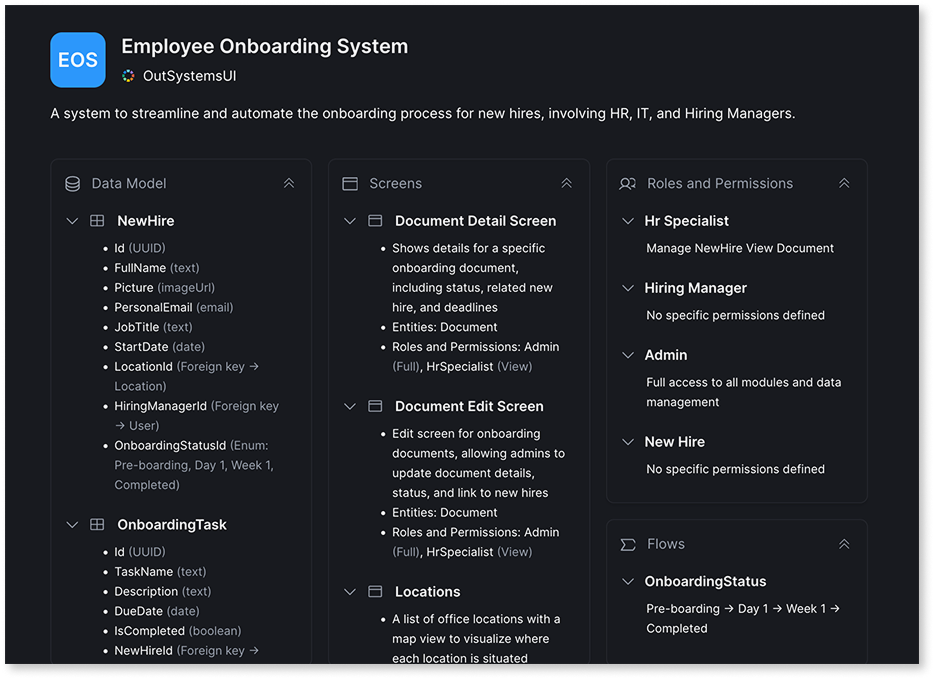

# The blueprint

The blueprint is a validation step that makes AI decisions transparent before generation. When you enter a prompt or upload a requirement document, Mentor Web analyzes the input and produces a visual representation of how it interpreted your requirements. The blueprint shows proposed entities, roles, screens, and relationships. You review these decisions, adjust what doesn't match your intent, and only then commit to generation.

This transparency helps you trust the AI-assisted workflow. You see exactly what Mentor plans to build, so you can catch mistakes early. Fixing a blueprint is faster than fixing a generated app.

## Blueprint components

The blueprint displays the AI's interpretation across five categories: entities, relationships, roles, screens, and stateflows. Each category shows decisions based on the input. Review each category to verify the interpretation matches intent.

For example, if the prompt is "Create an order management app with customers, orders, and products," the blueprint shows results such as:

* **Entities:** Customer with Name, Email, and Phone attributes. Order with OrderDate, Status, and Total. Product with Name, Price, and Stock.
* **Relationships:** Customer has many Orders. Order has many Products.
* **Roles:** Admin with full access. Sales Rep with view access to customers.
* **Screens:** Customer list with master-detail. Order table. Product gallery.

## Working with the blueprint

You interact with the blueprint through prompts, consistent with the overall agentic development workflow. Describe the desired changes in natural language, and Mentor Web updates the blueprint accordingly. This approach supports batch changes in a single prompt and maintains context so entities and roles can be referenced by name.

Example prompts:

* "Add an entity called Department with Name and Location attributes."
* "Give the Manager role edit access to the Employee entity."
* "Add a Status field to Order with values Pending, Shipped, and Delivered."

For prompt patterns, refer to [Prompts for Mentor Web](prompts.md).

## Switch between local and referenced entities

You can switch an entity between local and referenced directly in the blueprint. Local entities are defined within the app. Referenced entities come from other apps or external connections through Data Fabric. Switching between the two lets you iterate faster when deciding whether to build a custom data structure or reuse an existing one from another app or system.

## Resolve interpretation differences

When the blueprint differs from intent, adjust it through prompts before generating. Common adjustments include adding entities the AI did not infer, changing data types, correcting relationship direction, or adding roles. Addressing differences at this stage takes less effort than fixing a generated app.

For complex apps, use a [requirement document](requirements-doc.md) instead of a prompt. Structured documents with explicit entity definitions produce more precise blueprints than natural language prompts alone.

## From blueprint to app

When the blueprint reflects requirements, Mentor Web generates and publishes the app to the development stage. Refinement continues in the editor through additional prompts. Open the app in ODC Studio when development requires advanced capabilities.

## Related resources

The blueprint is most effective when the input is clear and well-structured. The following resources cover how to write prompts and requirement documents that produce accurate blueprints with fewer revision cycles.

* For prompt strategies that improve how Mentor interprets your requirements, refer to [Effective prompts for Mentor](../effective-prompts.md).
* For structured input that produces more precise blueprints than prompts alone, refer to [Use requirement documents](requirements-doc.md).
* For the complete app generation workflow from input to publication, refer to [How AI app generation works](how-it-works.md).
