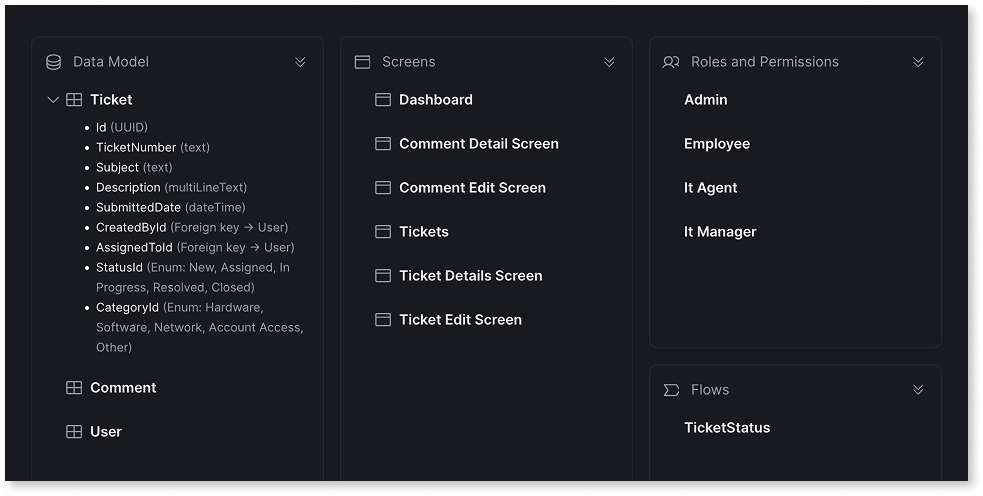
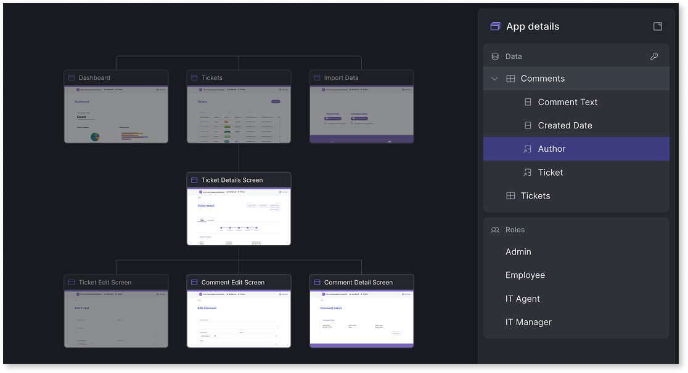
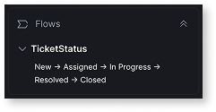

# Capabilities and patterns for Mentor Web

Mentor Web creates and refines web apps through two phases: generation and refinement. During generation, Mentor builds an initial app from [prompts](prompts.md) or requirement documents. During refinement, you improve the app through additional prompts in the editor.

This page describes the components and patterns available in each phase for Mentor Web. The capabilities apply to web apps in OutSystems Developer Cloud (ODC). For capabilities available when modifying existing apps in the full development environment, refer to [Capabilities and patterns for Mentor Studio](../mentor-studio/capabilities.md).

## Generation capabilities

During generation, Mentor Web converts natural language prompts or requirement documents into functional apps. Mentor Web analyzes input to identify entities, relationships, user roles, and UI requirements. It then applies design patterns and generates screens, data models, and authorization rules automatically.

### Data and entities

Mentor builds the data model by detecting entities, attributes, and relationships from input. You review and modify the proposed structure before generation, and Mentor handles validation rules automatically.

* **Data integration**. Reference entities from existing Data Fabric connections and public entities with read/write access. Set up Data Fabric connections in ODC before using Mentor.
* **Data manipulation**. Add, change, or remove entities and attributes before generation.
* **Static entity detection**. Recognize status and category fields as static entities with predefined records, displayed as tags in the UI.
* **Data management**. Download existing data or upload new data to replace sample data.
* **Data source swapping**. Switch entities between local and referenced (from other apps or external connections) directly in the blueprint, so you can iterate on whether to build custom data or reuse existing sources.
* **Field-level validation**. Generate client-side validation rules including mandatory fields, date constraints, value ranges, and format validation for email and phone numbers.

### Security

Mentor suggests roles based on app context and applies authorization rules at the entity level. You adjust role definitions and permissions before generation.

* **Predefined roles**. Receive role suggestions based on app context, then modify as needed.
* **Authorization rules**. Control entity-level read and edit access by role, including ownership-based permissions for records associated with the logged-in user, team, or department.

### Screen generation

Mentor selects screen patterns based on entity structure and relationships. Patterns convert automatically when constraints apply, such as the popup pattern converting to table when an entity exceeds five non-ID attributes.

* **Screen pattern selection**. Match patterns to entity structure. Popup for entities with five or fewer non-ID attributes, table for larger entities, tabs for organizing related content.
* **Context-aware layouts**. Generate layouts based on data context, such as list with map view for entities containing addresses or card layout for personal attributes.
* **Theme application**. Apply themes when specified in the prompt or requirement document. Reference themes by name, for example, `Use the CorporateBrand theme`. You can set or change the theme at any point during the blueprint phase. After generation, theme changes require ODC Studio. If no theme is specified, Mentor applies the default OutSystems UI. For prompt examples, see [Theme prompts](prompts.md#theme-prompts).
* **UI styling**. Apply a curated default color palette when no theme is specified, selecting from a set of primary colors with adaptive backgrounds for a consistent look. Suggest styling elements such as primary color and icon based on app context.
* **AI-suggested icons**. Apply Font Awesome icons for menu items and the app logo.

### Dashboards

Mentor generates dashboards with configurable layouts and data visualizations. Dashboard lists display a maximum of five records without filters, pagination, or navigation to edit screens.

* **Column layouts**. Configure 2 to 6 equal columns or asymmetric ratios (2:1 or 3:1).
* **Counters and charts**. Use aggregation functions (Count, Sum, Average, Minimum, Maximum) with date and status filters.
* **Chart types**. Choose from Bar, Column, Line, Pie, Donut, and Area charts.

## Refinement capabilities

After generation, Mentor provides tools and AI-powered suggestions to refine and evolve the app in the editor. You describe changes in natural language, and Mentor updates the app accordingly. The following table summarizes what you can modify during refinement.

| Area | What you can do |
| --- | --- |
| **Entities** | Add, replace, or delete local entities. Add or delete external entity references from Data Fabric. Convert external entities to local. Add static entities for enumerations. |
| **Attributes** | Add, replace, delete, or change attribute data types. Screens and bindings update automatically. |
| **Screens** | Add, rename, or delete screens. Add or remove attributes from screens. Change screen permissions. Adding a screen creates the corresponding menu item. |
| **Screen patterns** | Add map view to lists. Add master-detail or popup layouts. Entities with more than five attributes cannot use popup pattern. |
| **Roles and authorization** | Add or delete user roles. Configure entity-level authorization rules (View, Edit, No Access) by role. Adjust logged-in user permissions. |
| **Static entity records** | Add or delete records. Deleting a record removes counters from screens that reference it and validates affected workflows. |
| **App actions** | Undo or redo the last action. Publish or preview the app. |

The editor displays generated screens alongside the data model and roles, giving you a complete view of the app while you refine it through prompts.

### Additional capabilities

Mentor Web offers the following additional capabilities for refining apps in the editor.

* **WYSIWYG refinement**. Preview screens and data models immediately with automatic validation. Applied suggestions appear with sample data.
* **App customization**. Customize the app name and icon.

**About stateflows:** Mentor generates stateflows for entity lifecycle management. A stateflow defines statuses (such as Draft, Submitted, and Approved) and the allowed transitions between them, with conditions for which roles perform each transition and which attributes must be provided. At runtime, records move only along the defined transitions. For multi-step processes that orchestrate actions across entities and systems, use ODC workflows.

For a breakdown of what Mentor handles and what requires ODC Studio, refer to [When to use each tool](../intro.md#when-to-use-each-tool).
