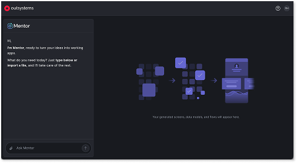
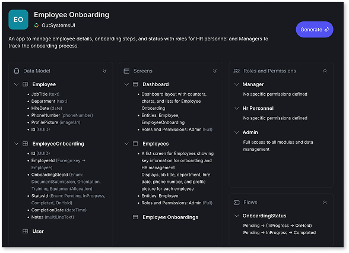
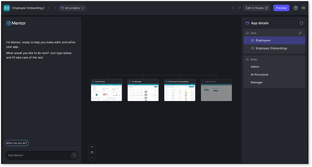
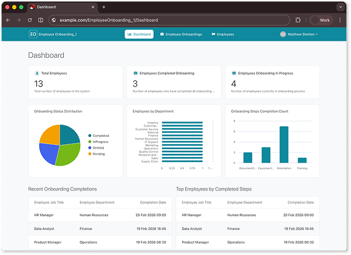

# Create an app with AI in ODC Portal

This procedure walks through creating a basic Employee Onboarding app using Mentor Web in ODC Portal. The workflow covers entering a prompt, reviewing and iterating on the blueprint, generating the app, and refining it in the editor. By the end, the app is published to the development stage and ready for preview or further development in ODC Studio.

For a conceptual overview of phases and checkpoints, refer to [How AI app generation works](how-it-works.md).

## Before you start

Before creating an app, verify the following:

* Access to an ODC organization with agentic development enabled.

Agentic development is an emerging capability with some constraints. Keep these in mind when creating apps:

* Closing or refreshing the browser loses the conversation and blueprint.
* Conversations support approximately 10 prompts before you need to start a new conversation.

For all constraints, refer to [Known limitations](../ai-limitations.md).

## Generate an app with AI

The following procedure uses an Employee Onboarding app as an example to demonstrate the app generation workflow.

To create an Employee Onboarding app with AI in ODC Portal:

1. Go to **Portal** > **Apps** > **Create** > **Web app** > **Generate with Mentor**.

      The app creation screen opens with a prompt field and an option to upload a requirements file.

      

1. Enter the following prompt and press **Enter**:

      "Create an Employee Onboarding app that tracks employee details, onboarding steps, and status. It should have list and edit screens and roles for HR and Managers."

      Mentor generates a blueprint for the app.

1. Review the [blueprint](blueprint.md). To edit the blueprint, enter a prompt in the Mentor panel. For example, enter: "Add a DreamVacation attribute to the Employee entity."

      

1. When the blueprint reflects the requirements, select **Generate**.

      Mentor generates and publishes the app to the development stage, then opens the editor. The app preview includes sample data immediately.

      At this stage, you can access your app in **Portal** > **Apps** or in ODC Studio. For the purposes of this tutorial, continue with the next step.

1. In the editor, refine the app through prompts. Then select **Publish** to publish the changes.

      

1. Select **Preview** to open the live app.

      If you're accessing the app for the first time, the sign-in screen opens with options to select a sample user.

      

1. The app is ready. You can continue with one of these options:

      * **Refine in the editor** through additional prompts to adjust entities, screens, or roles.
      * **Preview** to review generated screens with sample data before moving to implementation work.
      * **Open in ODC Studio** for capabilities beyond Mentor Web, such as complex logic, external integrations, or advanced UI customization. For a breakdown of what Mentor handles and what requires ODC Studio, refer to [When to use each tool](../intro.md#when-to-use-each-tool).
      * **Deploy** through **Portal** > **DELIVER** > **Deployments** to move your app to the test and production stage.

## Next steps

You've created an app from requirements using Mentor Web. To improve results on future apps, explore prompt strategies and learn about the patterns Mentor Web recognizes.

* [How AI app generation works](how-it-works.md) - Understand the full workflow from input to publication, including the blueprint review step.
* [Prompts for Mentor Web](prompts.md) - Browse prompt examples for UI patterns, dashboards, and multi-pattern scenarios.
* [Use requirement documents](requirements-doc.md) - Provide structured specifications as an alternative to prompts for complex apps.
* [Effective prompts for Mentor](../effective-prompts.md) - Learn prompting strategies that apply across all Mentor tools.
