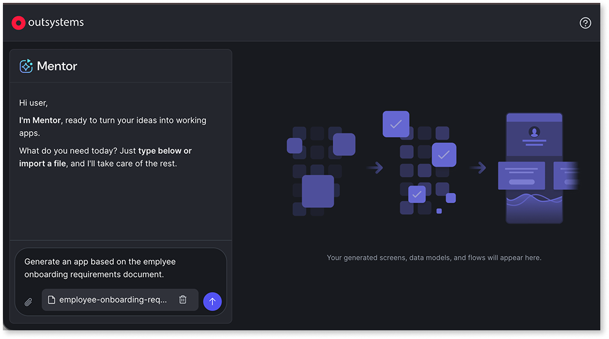
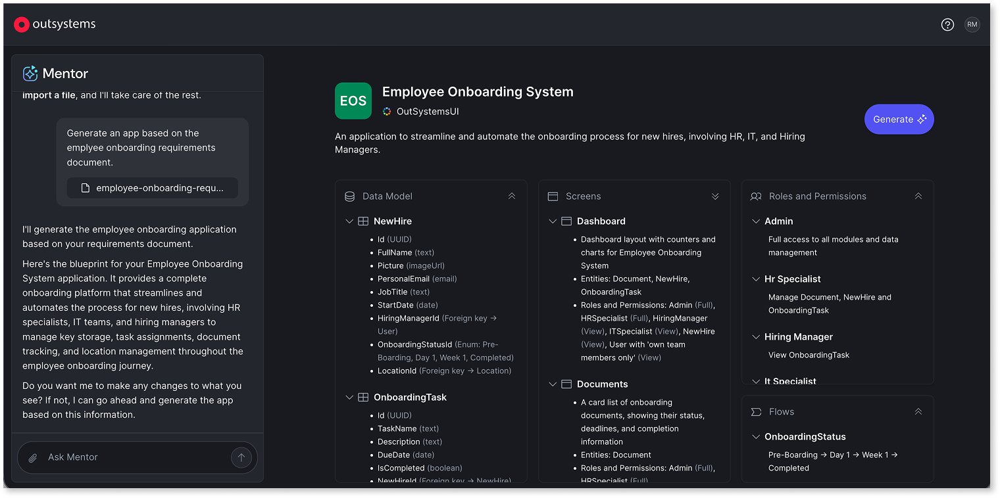
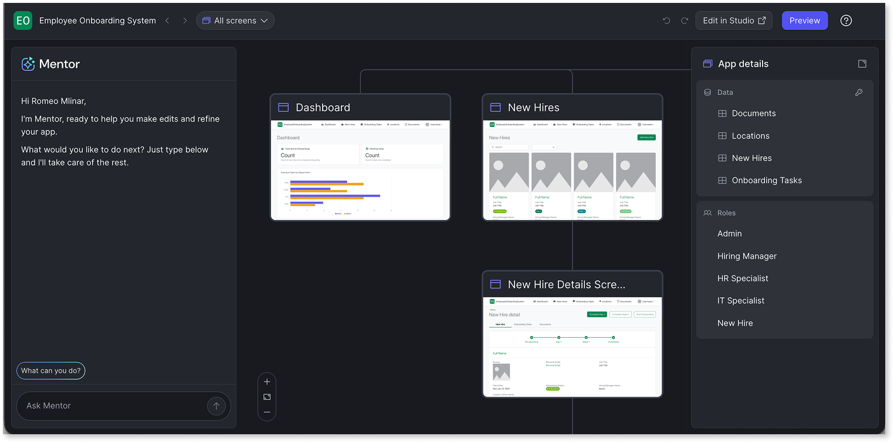
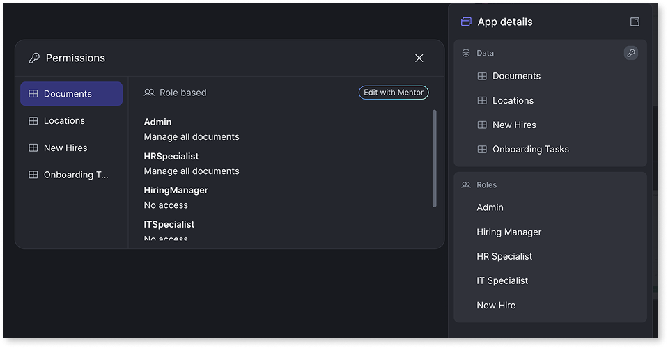

# AI app generation in Mentor Web

AI app generation in OutSystems follows a structured workflow that balances AI generation with human validation. The process transforms natural language requirements into working apps through iterative cycles of description, review, and refinement.

Use Mentor Web to turn requirements into a working app. To modify and extend an existing app, refer to [AI development in Mentor Studio](../mentor-studio/how-it-works.md).

The AI app generation workflow consists of five phases, each with validation checkpoints to catch issues before they compound:

1. [Provide input](#provide-input). Describe your app using a prompt or requirement document.
1. [Review the blueprint](#review-the-blueprint). Validate how the AI interpreted your requirements and refine before generation.
1. [Generate the app](#generate-the-app). Create and publish the app from the approved blueprint.
1. [Refine with prompts](#refine-with-prompts). Improve the generated app in the editor through iterative prompts.
1. [Continue in ODC Studio](#continue-in-odc-studio). Move to ODC Studio when development requires advanced capabilities.

## Provide input

The workflow begins with a description of the app to build. AI app generation accepts natural language prompts or structured requirement documents as input. Both methods produce the same outcome: Mentor Web interprets the input and creates a blueprint for review.

**Prompts** are natural language descriptions suited for straightforward apps or quick iterations. A prompt such as "Create an order management app with customers, orders, and products" provides enough context to generate a starting point. Prompts work well for quickly exploring ideas or when the app structure is straightforward.

**Requirement documents** are structured files that define data models, relationships, roles, and screen requirements explicitly. Requirement documents are suited for complex apps where precise control over the generated structure is needed. Documents reduce ambiguity by providing detailed specifications that ODC can interpret consistently. Supported formats include `.txt`, `.docx`, `.pdf`, and `.md`.

For prompt patterns, refer to [Prompts for Mentor Web](prompts.md). For document structure, refer to [Use requirement documents](requirements-doc.md).

Don't include personally identifiable information (PII) in prompts. Use placeholder or fictional data instead of real names, email addresses, phone numbers, or other sensitive data.

## Review the blueprint

Before generation, Mentor Web displays a blueprint of the proposed app structure. The blueprint is a visual representation of how the AI interpreted the requirements, showing entities, roles, screens, and relationships. You verify the interpretation and make corrections before committing to generation.

The blueprint displays:

* Entities with attributes and relationships
* User roles with permissions
* Proposed screens and layouts
* Stateflows for entities with lifecycle states

You refine the blueprint through prompts. Mentor Web applies the changes you describe in natural language. Making corrections at this stage requires less effort than modifying a generated app since you adjust the specifications rather than implementation.

For more information, refer to [The blueprint](blueprint.md).

## Generate the app

When the blueprint reflects the requirements, generation transforms the approved blueprint into a working ODC app with data model, screens, security roles, and basic logic. Mentor publishes the app to the development stage immediately after generation, so a data preview with sample data is ready the first time you open the app preview. The editor displays the generated screens for review before continuing.

The generated app includes:

* Data model with entities, attributes, and relationships
* Security roles with entity-level permissions
* Screens using patterns such as tables, card lists, and detail views
* Basic logic for CRUD operations, navigation, and authorization

The generated app follows the same ODC patterns and conventions as manually built apps. The underlying app model is identical to apps built in ODC Studio.

## Refine with prompts

After generation, the app can be improved through additional prompts in the editor. Each refinement applies changes incrementally to the existing app rather than regenerating from scratch. Each edit requires publishing to update the live app in the development stage. You can also reopen any existing app in Mentor Web later via **Portal** > **Apps** > right-click the app.

Common refinements include:

* Adding or modifying entities and attributes
* Adjusting roles and permissions
* Changing screen layouts and patterns
* Adding business logic
* Renaming the app or uploading a custom icon

This iterative approach produces better results than specifying everything in the initial input. Starting with a foundation that captures the core requirements, then refining through focused prompts that address one aspect at a time, improves outcomes. Evaluating results after each change before continuing enables informed decisions.

Refinement in the editor processes requests differently than initial generation. During generation, Mentor Web interprets requirements comprehensively to build the full app structure. During refinement, Mentor Web analyzes the existing app and applies targeted changes. This means some prompts that work well for generation may produce different results during refinement, and vice versa. During refinement, use focused prompts that address one change at a time rather than broad descriptions of the entire app.

## Continue in ODC Studio

After generation and refinement, open the app in ODC Studio when development requires capabilities beyond Mentor Web. Examples include complex business logic, external integrations, or advanced UI customization. ODC Studio provides full access to the OutSystems development environment. For a breakdown of what Mentor handles and what requires ODC Studio, refer to [When to use each tool](../intro.md#when-to-use-each-tool).

## Related resources

Each phase of the app generation workflow connects to deeper guidance on prompts, patterns, and architecture. The following resources help you get better results at each step.

* For prompt strategies that improve how Mentor interprets your requirements, refer to [Effective prompts for Mentor](../effective-prompts.md).
* For the validation step where you review and adjust the proposed app structure, refer to [The blueprint](blueprint.md).
* For the full list of UI patterns, dashboard types, and elements that Mentor Web generates, refer to [Capabilities and patterns for Mentor Web](capabilities.md).
* For modifying existing apps in ODC Studio, refer to [AI development in Mentor Studio](../mentor-studio/how-it-works.md).
* For step-by-step guidance on creating an app, refer to [Create an app with AI in ODC Portal](create-app.md).
* [Agentic development](https://www.outsystems.com/tk/redirect?g=eb9a16f2-f6b9-4903-9be8-122a0188f113) online course: a video walkthrough of the Mentor Web workflow.
