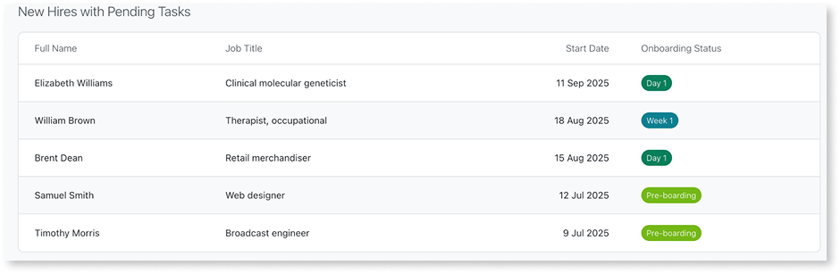
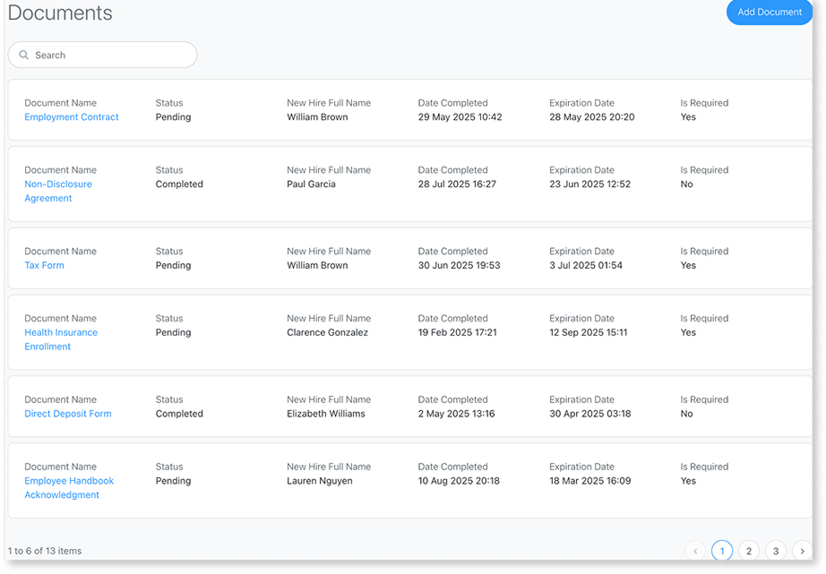
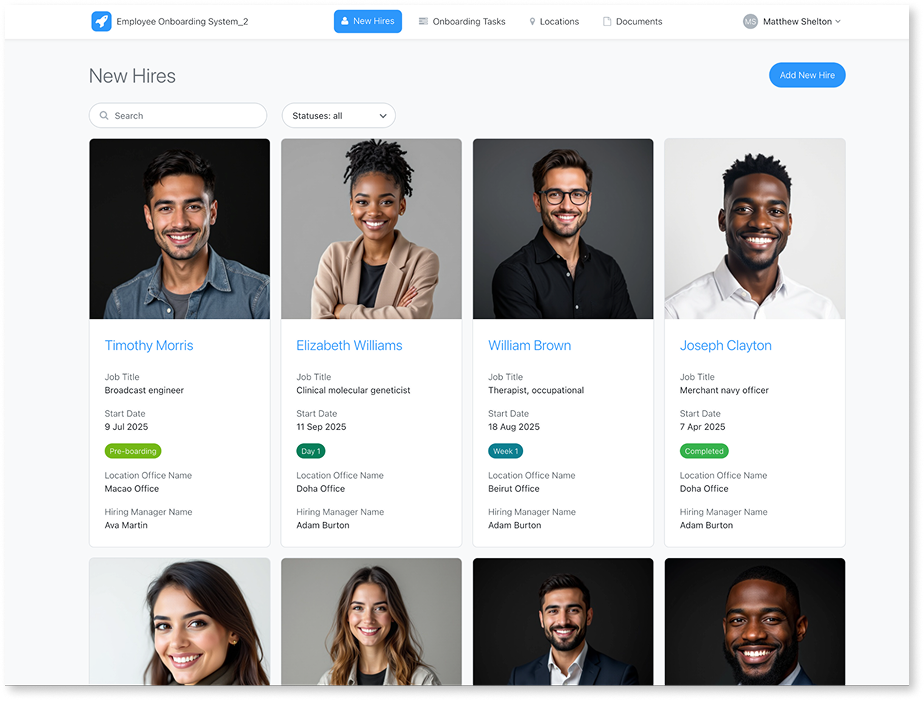
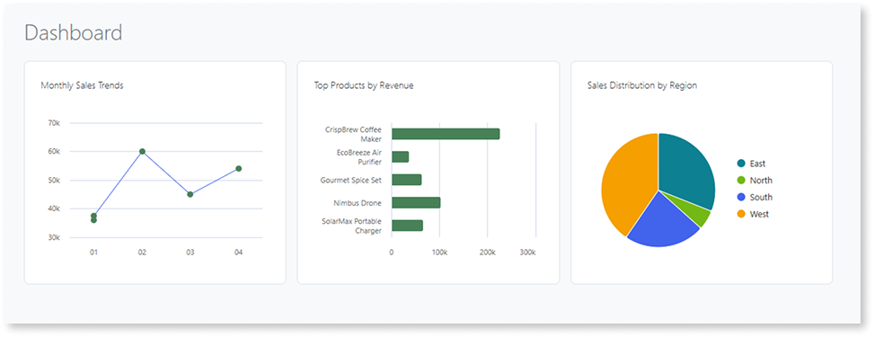
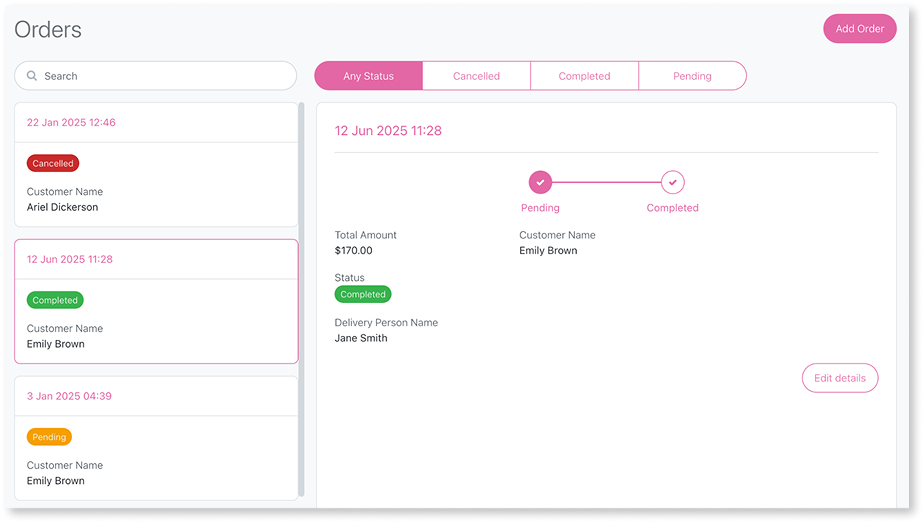
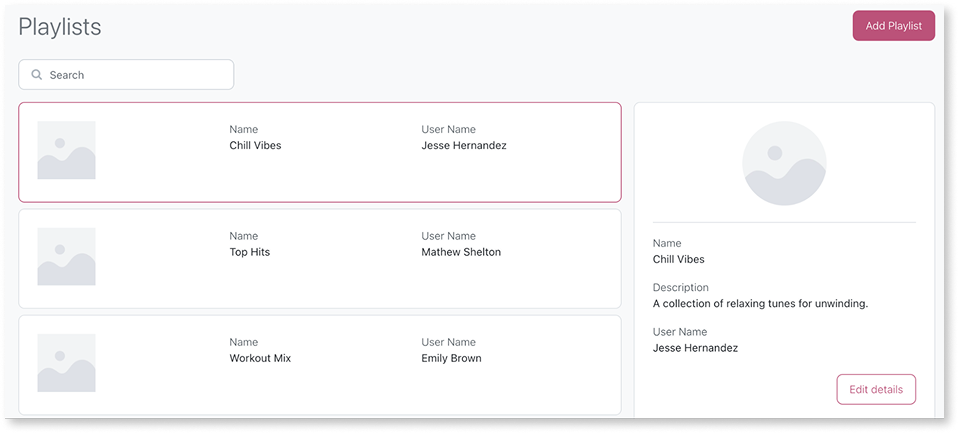
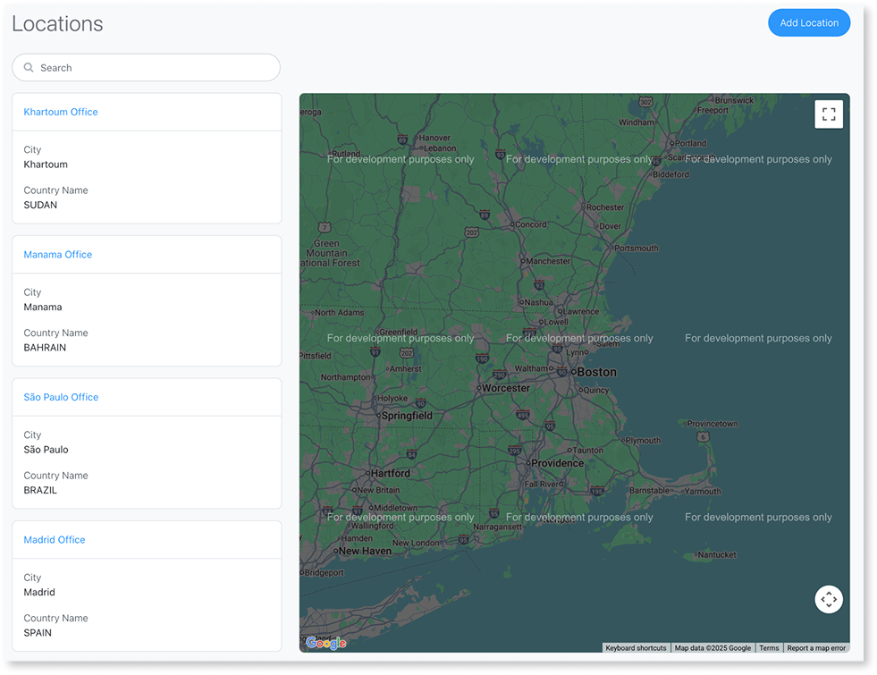

# Prompts for Mentor Web

This cookbook provides prompt examples for UI patterns, data model changes, and authorization in Mentor Web. For general prompting strategies that apply across all Mentor tools, refer to [Effective prompts for Mentor](../effective-prompts.md).

## Data model prompts

Use these prompts to manage entities and attributes:

* **Add entity**: Add entity "TicketStatus" to my app data
* **Add external entity**: Add entity "Customer" from the "Customers" Salesforce connection
* **Delete entity**: Delete the entity "TicketComment"
* **Add attribute**: Add attribute "priority" to my "SupportTickets" entity
* **Delete attribute**: Delete the attribute "priority"

## Authorization prompts

Use these prompts to manage roles and permissions:

* **Add role**: Add a role called Status Manager
* **Delete role**: Delete the role "Staff"
* **Edit permissions**: Remove access from the "viewer" role to the "Task" data and related screens

## Theme prompts

Use these prompts to apply or change themes during the blueprint phase. Specify the exact theme name as it appears in your ODC tenant. Mentor validates that the theme is compatible before applying it.

* **Set a theme in your initial prompt**: Create an Inventory app using the "Mentor" theme available in the ODC tenant.
* **Change the theme during blueprint review**: Change the theme to CorporateBrand.
* **In a requirement document**: Include a General app settings section with `"Use the 'CorporateBrand' theme available in the ODC tenant."`

After generation, you can't change the theme through Mentor. To switch themes after generation, change it in ODC Studio.

### Theme compatibility requirements

Mentor validates theme compatibility before applying it. For a theme to work with Mentor, it must meet the following requirements:

* The theme must have the layout block property set in ODC Studio.
* The layout must include these placeholders: Header, Breadcrumbs, Title, Actions, and MainContent.

## UI patterns cookbook

Mentor recognizes pattern keywords (table, card list, master detail, map) and associates them with entities and attributes you mention. Pattern names are flexible: "card list" or "cards list" both work.

### Select a pattern

Use this table to decide which UI pattern to request in your prompt. Each pattern suits certain dataset shapes and visual goals.

| Pattern | Use for | Avoid when | Common refinements |
| --------- | --------- | ------------ | -------------------- |
| Dashboard | High-level KPIs, metrics summary, and data visualization | Detailed record editing or browsing individual items | Add counter with aggregation function, add chart type, adjust column layout |
| Table | Dense tabular comparison; many columns | Visual summaries; mobile layouts | Add calculated column |
| Card list | Visual scanning of records with key attributes | Wide column comparison | Add tags, actions on each card |
| Gallery | Image-centric content (products, media) | Text-heavy data | Add category filter |
| Master detail | Browse and inspect a record (max 5 attributes in table view) | Very small datasets; entities with dependents | Add tabs, related lists, switch to card list for more attributes |
| Card list with detail on accordion | Compact browsing with expandable details (max 5 fields in detail) | More than 5 detail fields or multiple sections need to be open | Switch to sidebar pattern for multiple open items |
| List with popup | Entities with 5 or fewer non-ID attributes | Entities with more than 5 attributes or dependent entities | Switch to table layout |
| List with map | Location context alongside list | No location data | Add clustering, status tags |

### Pattern constraints

Mentor enforces constraints based on entity structure. When an entity exceeds a pattern's attribute limit, Mentor automatically switches to a compatible pattern.

* **Popup and accordion**: Max 5 non-ID attributes. Entities with more attributes use the table pattern instead.
* **Master detail table view**: Max 5 attributes in list portion.
* **Dashboard lists**: Max 5 records, no filters or pagination.
* **Entities with dependents**: Cannot use popup or master-detail patterns.

## Lists and tabular patterns

These patterns organize multiple records for browsing, comparison, or selection. Choose based on data density and visual emphasis needs.

### Table

Use when you need dense, side-by-side comparison of many records across consistent attributes.  
Avoid when you need strong visual emphasis, image-first layouts, or card metaphors.

#### Prompt progression

Start with basic prompts and add details as needed:

* Basic: List `Product` records in a table.
* Detailed: List `Product` records in a table with columns: `Name`, `SKU`, `Stock`, `Price`.

### Card list

Use when you want to scan records as compact cards with a few key fields and tags, rather than compare many columns.

#### Prompt progression

* Basic: Show `Employee` records as a card list.
* Detailed: Show `Employee` records as a card list with `Name`, `Department`, `Role`, and a colored tag for `Status`.

### Card gallery

Use when you have image or media-heavy datasets.

#### Prompt progression

* Basic: Show `Product` records as a card gallery with image and `Name`.
* Detailed: Show `Product` records as a gallery with image, `Name`, a category tag, and `Price`.

### List with popup

Use when you have entities with 5 or fewer non-ID attributes and want to edit or view records without navigating to a separate screen.

The popup pattern displays edit and view screens within modal dialogs that overlay the list.

#### Prompt progression

* Basic: List `Task` records with popup for editing.
* Detailed: List `Task` records in a table. Selecting a record opens a popup with `Title`, `DueDate`, `Priority`, and `Status` for editing.

## Dashboard patterns

Use dashboards to display high-level KPIs, metrics, and data summaries for quick insights. Dashboards combine multiple visual elements to provide at-a-glance understanding of key business data.

Avoid when you need detailed record editing or browsing individual items.

### Dashboard elements

Dashboards support counters, charts (bar, line, pie, donut), and lists. Use aggregation functions (Count, Sum, Avg, Min, Max) for counters and charts. For the full list of chart types and layout options, refer to [Capabilities](capabilities.md#dashboards).

#### Prompt progression

* Basic: Create a dashboard with total orders counter.
* Better: Create a dashboard with a counter for total orders (Count), a vertical bar chart for sales by month (Sum of `OrderValue`), and recent orders list.
* Advanced: Add a pie chart showing order distribution by category (Count of `Order` grouped by `Category`).

## Master detail and in-place detail patterns

These patterns let you browse a list and view or edit record details simultaneously. Choose based on screen space and editing frequency.

### Master detail

Use when browsing records and viewing details without leaving the list. When using table pattern for the list portion, limit to 5 attributes. For more attributes, use card list or gallery pattern.

#### Prompt progression

* Basic: Use a master detail layout for `Customer` records.
* Detailed: Master detail for `Customer` records with list on the left (`Name`, `Segment`) and right panel tabs: Profile, Orders, Notes.

### Card list with detail in sidebar

Use when you need frequent detail editing and the list context must remain.

#### Prompt progression

* Basic: Card list with detail in a sidebar for `Project` records.
* Detailed: Card list (`Name`, `Owner`, `Status` tag). Selecting a card opens a sidebar with `Description` and `DueDate`.

### Card list with detail on accordion

Use when you need compact browsing with expandable details that reveal in place. Only one accordion item expands at a time to avoid visual clutter.
Avoid when you have more than 5 detail fields or need multiple sections open simultaneously for comparison.

#### Prompt progression

* Basic: Card list with detail on accordion for `Order` records.
* Detailed: Card list with detail on accordion for `Order` records (`OrderNumber`, `Customer`, `Status` tag). Expanding shows `OrderDate`, `TotalAmount`, `ShippingAddress`, `Notes`.

## Spatial patterns

These patterns add location context to support geography-based decisions.

### Card list with map

Use when location information supports decision making.

#### Prompt progression

* Basic: Card list with map for `FieldWorkOrder` records.
* Detailed: Card list with map for `WorkOrder` records (`Title`, `AssignedUser`, `Status` tag, `Address`). Map uses markers at `Address`.

## Multi-pattern scenarios

Combine multiple patterns in a single prompt to create complete app experiences. These examples show common pattern combinations.

### Asset tracking scenario

Initial prompt: Create an Asset Tracking app with a dashboard (total assets, assets needing maintenance), a card list with map for `Asset` records, and side menu.

### Customer management scenario

Initial prompt: Create a master detail layout for `Customer` records with tabs Profile, Orders, Tickets. Include a dashboard with total customers and open tickets.

## Refinement strategies

Use these approaches to adjust patterns or add functionality without starting over.

If you chose the wrong pattern, request a replacement: Change the current layout to a master detail layout for `Customer` records.

Mentor suggestions support add operations. To modify existing elements, rephrase changes as additions. Note: Filters, sorting controls, and search inputs require manual configuration. The navigation layout (horizontal or side) applies to your entire app.

## Related resources

These prompt patterns work best when combined with general prompting strategies and an understanding of what Mentor Web supports. The following resources provide that broader context.

* For prompting strategies that apply across all Mentor tools, such as entity-first thinking and decomposition, refer to [Effective prompts for Mentor](../effective-prompts.md).
* For the full list of elements, UI patterns, and dashboard types that Mentor Web generates, refer to [Capabilities and patterns for Mentor Web](capabilities.md).
* For structured input that handles complex apps better than individual prompts, refer to [Use requirement documents](requirements-doc.md).
* For prompt examples specific to modifying apps in ODC Studio, refer to [Prompts for Mentor Studio](../mentor-studio/prompts.md).
