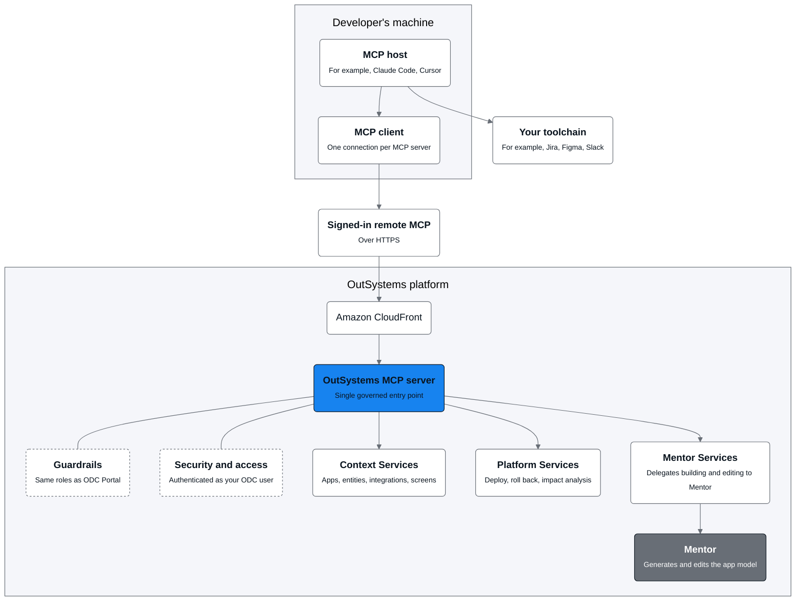

# OutSystems MCP request architecture

With OutSystems MCP, every request from your MCP host reaches OutSystems through a single governed entry point. The MCP host is the AI application you work in, such as Claude Code or Cursor. Inside it, an MCP client maintains a signed-in remote connection to the OutSystems MCP server. From there, OutSystems authenticates every request as your ODC user, applies that user's role permissions as in ODC Portal, and routes the work to the service that performs it.

This page describes that path end to end. It covers where the MCP host and its MCP client run, how requests enter the platform, and which services do the work. The following diagram shows how the parts fit together.

## MCP host on the developer's machine

Your MCP host runs on your machine, next to the other tools in your workflow. The MCP host runs the agent and creates one MCP client for each MCP server it connects to. The MCP client that the host creates for OutSystems connects to the OutSystems MCP server over a signed-in remote MCP connection across HTTPS.

The agent calls OutSystems tools and the tools of the other MCP servers that the host connects. This combination provides cross-toolchain workflows.

Claude Desktop connects through a local `mcp-remote` proxy. In that setup, the MCP client in Claude Desktop connects to the proxy on your machine, and the proxy maintains the remote connection to the OutSystems MCP server. For more information about setup, refer to [Connect MCP hosts to OutSystems MCP](connect-mcp-hosts.md).

## The governed entry point

Every tool call enters the platform through one place, the OutSystems MCP server, fronted by Amazon CloudFront. The following controls apply to every request that passes through the server:

* **Security and access:** OutSystems authenticates each request as your ODC user, derived from your signed-in identity.
* **Guardrails:** The same roles that govern your work in ODC Portal apply to every request.

Because every call goes through this single entry point, the same controls govern every operation, regardless of which MCP host started it.

## The three service sets

Behind the OutSystems MCP server, the work splits into three service sets:

* Context Services query your application estate: apps, entities, integrations, screens, and dependencies.
* Platform Services run lifecycle operations such as deploy, roll back, and impact analysis, and build external C# libraries.
* Mentor Services delegate app building and editing to Mentor.

## Mentor in the request path

Mentor Services delegate the building to Mentor, which generates and edits the app model on the server. The agent sequences the tool calls, and Mentor builds. For more information about how delegation works across a session, refer to [Delegation to Mentor](mentor-delegation.md).

## Capability scope

The diagram shows the architecture's full capability layer. The OutSystems MCP server exposes a subset of that layer. For more information about what you can do and what's out of scope, refer to [OutSystems MCP](outsystems-mcp-overview.md). For the tools grouped by service set, refer to [Tool reference](tool-reference.md).
