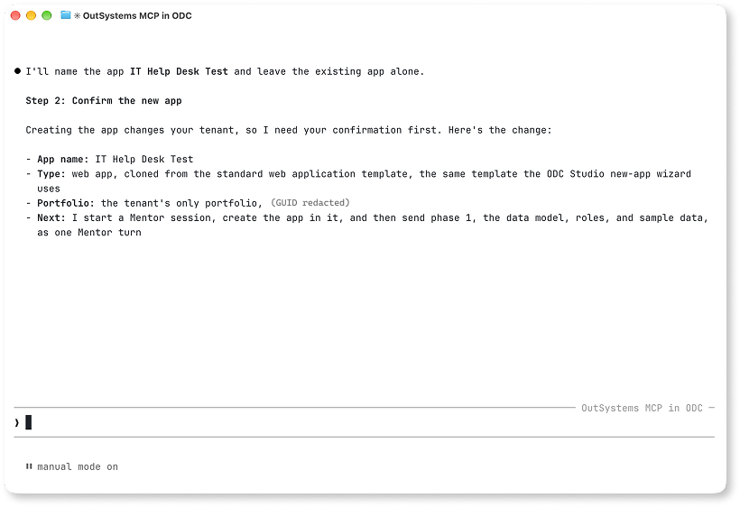
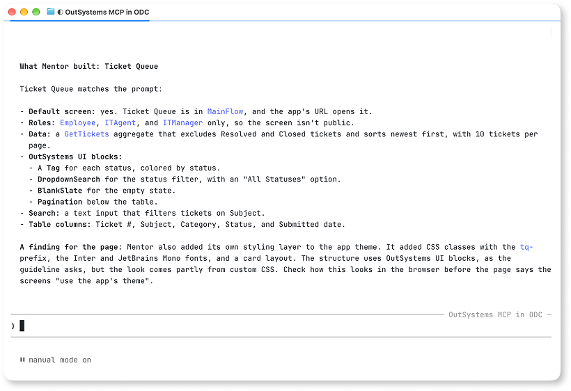
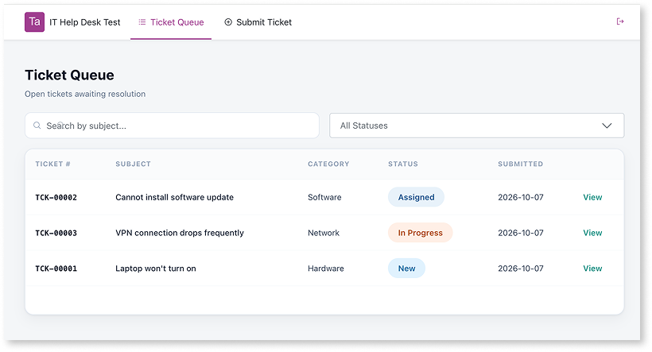

# Build your first app

This tutorial shows you how to use OutSystems MCP to build a first app from an empty tenant. You give the agent in your MCP host a sample prompt file, and the agent builds an IT help desk app. The app lets employees submit IT support tickets and lets the IT team track and resolve them.

The tutorial follows the request through each part of OutSystems MCP:

* **Agent:** Reads the prompt file, runs the steps in order, and asks you to confirm each change to your tenant.
* **Mentor:** Builds the data model and each screen in a Mentor session, one turn at a time.
* **ODC:** Compiles each published revision and runs it in your Development stage.
* **ODC Portal:** Stores the app's end-user roles. You assign yourself a role there to open the app.

The steps use Claude Code as the MCP host. The same prompt file works in any MCP host that connects to the OutSystems MCP server.

## Prerequisites

You need the following before you start:

* Claude Code connected to your tenant and signed in. Refer to [Get started with OutSystems MCP](get-started.md).
* The **Mentor** > **Use** permission, to build with Mentor. Refer to [Control who can use Mentor](../sdlc.md#control-who-can-use-mentor).
* The **Asset management** > **Create** and **Change** permissions, to create the app and publish it. Refer to [ODC permissions](../../user-management/roles.md#permissions-registry).
* The permission to assign end-user roles in ODC Portal, or someone who has it. You need an end-user role to open the app you build.
* The highest-tier model your MCP host offers for the session.

## Step 1: Give the agent the prompt file

The prompt file describes the app and the order to build it in. Phase 1 builds the data model, roles, and sample data. Phase 2 builds the screens, one screen per Mentor turn. The prompt file also gives Mentor guidelines for every turn, such as applying OutSystems UI to every screen and keeping every screen behind the app's roles.

1. Download the [IT help desk prompt file](resources/it-help-desk-prompt.txt) and save it in the folder where you run Claude Code.
1. Ask the agent:

    * "Build the app described in @it-help-desk-prompt.txt"

The agent reads your tenant's stages and checks that no app named IT Help Desk exists. These reads don't change your tenant, so the agent runs them without asking.

## Step 2: Confirm the new app

Creating an app changes your tenant, so the agent restates the change and waits for you. The agent names the app, the web template it starts from, and the portfolio it goes in.

Confirm when the details match what you expect. The agent then starts a Mentor session, creates the app, and reports the app's asset key. Use the asset key to refer to the app in later requests, because names can be edited and can collide.

The create request can report a timeout even when the app exists. If the agent reports a timeout, ask it to list your apps before it creates the app again.

## Step 3: Build the data model and sample data

The agent sends phase 1 of the prompt file to Mentor. Mentor builds the Ticket and Comment entities, the ticket status and category lists, and the Employee, IT Agent, and IT Manager roles. It also builds a timer that loads sample tickets.

Mentor can reply with a plan and ask whether to proceed before it changes the app. When the plan matches the prompt file, tell the agent to proceed. Mentor's changes stay in the Mentor session until you publish them.

The turn can take several minutes. The agent reports Mentor's progress as it goes, including the validation errors Mentor finds and fixes in its own changes. When the turn ends, the agent reports what Mentor built.

## Step 4: Publish the data model

Publishing the data model before you build screens saves a revision that the screen turns build on. If a later turn fails, the data model stays in the app.

Publishing changes your tenant, so the agent restates the publish and waits for you. After you confirm, the agent waits until the publish finishes.

After this publish, the app's URL shows the message "This application does not contain a default entry". The app has no screens yet, so this message is expected.

## Step 5: Build and publish the screens

The agent builds the screens from phase 2 one at a time. For each screen, the agent sends one Mentor turn, reports what Mentor built, and asks you to confirm a publish. Each publish saves a revision, so a turn that stalls costs one screen instead of the whole build.

The agent builds the screens in the following order, so each screen can link to the screens before it:

1. **Ticket Queue** lists open tickets, with a search on subject and a filter by status. Ticket Queue is the app's default screen.
1. **Ticket Details** shows a ticket and its comments, with a form to add a comment and dropdowns to assign the ticket and change its status. This turn also makes each row in Ticket Queue open Ticket Details.
1. **Submit Ticket** is a form that creates a ticket and generates its ticket number. This turn also adds the app's menu.

The prompt file's guidelines ask Mentor to build each screen with OutSystems UI blocks, such as a Tag for the ticket status. The guidelines also make each screen available only to the app's roles.

Each turn takes several minutes. Before you confirm each publish, compare the agent's summary to the prompt file. If Mentor built something differently, such as a screen's access, ask the agent to have Mentor correct it before you publish.

When the last publish finishes, the agent returns the app's URL, which is your Development stage's domain followed by `/ITHelpDesk`.

## Step 6: Give yourself access to the app

To open the app, your user needs one of the app's end-user roles in the stage where you test it. Member access to ODC Portal and ODC Studio is separate from the end-user roles of an app. The agent reminds you of this step, because you manage users in ODC Portal.

1. In ODC Portal, go to **Management** > **Govern** > **Users**, and open your user.
1. Assign yourself one or more of the IT Help Desk roles for the **Development** stage, and save.

For more information, refer to [Grant and revoke user roles](../../user-management/grant-and-revoke-user-roles.md#grant-roles-to-end-users). For more information about members and end-users, refer to [User management](../../user-management/intro.md#end-users).

## Verify the app

Open the app's URL and sign in. Ticket Queue opens as the default screen.

Test each feature from the prompt file: open a ticket, add a comment, change its status, and submit a new ticket. Mentor generates the app with AI, so its output varies between runs. A first version can have gaps, such as a screen with no data or an action that fails.

When something doesn't work, ask the agent to find the cause in the app's logs:

* "Check the IT Help Desk logs in Development for errors from the last hour."

The agent reads the app's runtime logs through the OutSystems MCP server and reports the errors, such as a failed database operation and the action that raised it. Then ask the agent to have Mentor fix the cause, and publish the fix.

## Tasks in ODC Portal and ODC Studio

A few parts of building an app run outside your MCP host:

* You assign end-user roles in ODC Portal. Refer to [Grant and revoke user roles](../../user-management/grant-and-revoke-user-roles.md).
* To refine the app's layout and styles by hand, open the app in ODC Studio. For more information about Mentor in ODC Studio, refer to [AI development in Mentor Studio](../mentor-studio/how-it-works.md).

## Next steps

The app is a first version that you change with more prompts.

* To change the app and deploy it to another stage, such as adding the dashboard from phase 3 of the prompt file, refer to [Evolve an existing app](evolve-app.md).
* To inspect what Mentor built, refer to [Inspect apps and their dependencies](introspect-app.md).
* To understand how the agent and Mentor divide the work, refer to [Delegation to Mentor](mentor-delegation.md).
