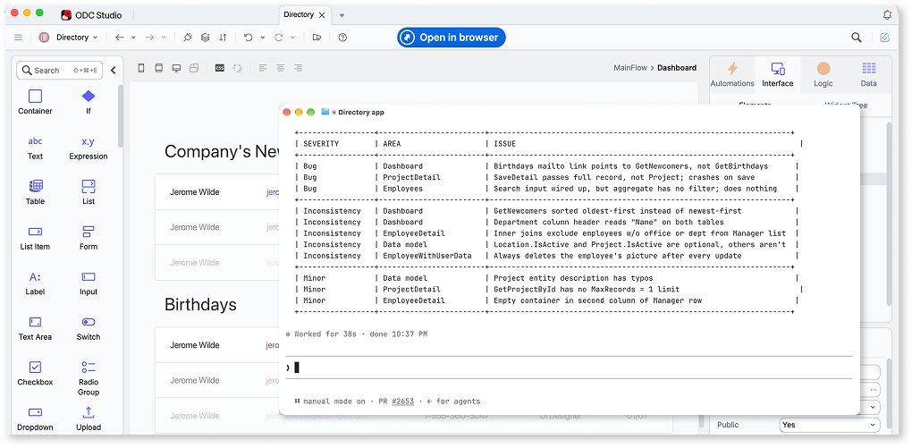

# Evolve an existing app

This page shows you how to use OutSystems MCP to change an existing OutSystems app from your MCP host. You inspect the app, delegate the change to Mentor, and then publish and deploy the result. The page also covers an optional impact analysis and deployment diagnostics.

Publishing and deploying are distinct operations. Publishing uploads the edited app model, builds it, and deploys the result to the development stage connected to your Mentor session, creating a new revision. Deploying promotes an already-built revision from one stage to another without rebuilding it.

This page uses these placeholders. Replace the following:

* `APP_NAME`: the app you change.
* `ENTITY_NAME`: the entity you add a field to.
* `SOURCE_STAGE`: the stage you deploy from, for example, Development.
* `TARGET_STAGE`: the stage you deploy to, for example, QA.

## Prerequisites

You need the following before you start:

* An MCP host connected to your tenant. Refer to [Get started with OutSystems MCP](get-started.md).
* An app you can change, and the role permissions for deploying to `TARGET_STAGE`. Deploy runs under the same access controls as ODC Portal. For more information, refer to [Governance in OutSystems MCP](governance.md).
* Work on one app in one session at a time.

## Inspect the app

Read the app's structure before you change it, so your prompt refers to real entities and screens.

Ask the agent:

* "Describe the `APP_NAME` app: its entities, screens, and actions."

The agent reads the context graph and reports the structure, including the app's asset key. Confirm that the entity you plan to change exists, and use the asset key for subsequent operations, because names can be edited and can collide across the tenant. If the context lookups return empty results, the index doesn't include the app yet. This is expected for newly published or rarely accessed apps. For more information about object types, scoping, and pagination, refer to [Inspect apps and their dependencies](introspect-app.md).

## Delegate the change to Mentor

Describe the change in natural language. The agent delegates the edit to Mentor, which changes the app model on the server, then returns a summary.

Ask the agent:

* "Use Mentor to add a Notes text field to the `ENTITY_NAME` entity in `APP_NAME`."

A Mentor turn takes a few minutes. Review the summary when the turn finishes. If the result is wrong or empty, ask the agent to start a new Mentor session and try again with a smaller, more specific request.

## Run an impact analysis

This step is optional. Before you deploy, run a deployment-impact analysis. The analysis reports which apps and dependencies the deploy affects.

Ask the agent:

* "Run a deployment impact analysis for `APP_NAME`."

Impact analysis leaves your apps unchanged, so the agent runs it to inform the deploy decision. Your MCP host can still ask you to approve the tool call before it starts. The analysis covers the app's latest deployed revision, so publish your change first to include it in the analysis. The app must be deployed to at least one stage. The analysis runs in the background and can take time on a large app. The agent polls until the analysis finishes, then reports the results.

Review the impact report before you proceed. Impact analysis is advisory. The report lists what the deploy affects and doesn't block the deploy.

## Publish a revision

Changes in a Mentor session stay in the session. Publish to persist the change as a revision in your running app.

Ask the agent:

* "Publish the change."

Publishing changes tenant state. The publish tool description instructs the agent to restate the operation and wait for your confirmation before it runs. Your MCP host can also ask you to approve the tool call. Confirm the operation against the app's asset key.

When the publish completes, the agent reports the publication key, status, revision number, and any messages. Confirm that the revision number increased. A failed publish stays failed until you publish again. Read the build messages, fix the cause, then publish.

Publish an app again only after its previous publish finishes. Two publishes of the same app that build at the same time can leave the app unable to publish, until you recover it in ODC Studio. When the agent reports a publish result as indeterminate, the publish can still be building. Ask the agent to check the publish status again instead of publishing again. Without changes through Mentor in the session, there's nothing new to publish. In that case, deploy an existing revision directly.

## Deploy to another stage

Deploy promotes the build that runs in the source stage, so you name the app and the two stages.

Ask the agent:

* "Deploy `APP_NAME` from `SOURCE_STAGE` to `TARGET_STAGE`."

Deploying changes tenant state, so confirm the operation when the agent restates it. Check the app's asset key and the stage identifiers. For more information, refer to [Confirmation of state-changing operations](governance.md#confirming-state-changing-operations).

The deploy tool supports the following operations:

* Promote a build. This is the default operation, and the example on this page uses it.
* Remove an app from a stage.
* Reapply settings without redeploying the build.

## Monitor and diagnose

After a deploy starts, the agent polls its status and reports when it finishes. If the operation takes longer than expected or you want to check on it later, ask for the status directly.

Ask the agent:

* "What is the status of the last deployment?"

If the deploy finishes with warnings or errors, read the diagnostic messages.

Ask the agent:

* "Show the messages from the last deployment."

The messages contain the same diagnostics that ODC Portal shows for the operation.

## Verify the change

Confirm that the platform applied and deployed the change.

Ask the agent:

* "Describe the `ENTITY_NAME` entity again."

Confirm that the new field is present. Then ask the agent:

* "Show me the deployed apps in `TARGET_STAGE`."

Confirm that the revision number in `TARGET_STAGE` matches what you published. The response includes the app's runtime URL in the target stage.

## Tasks in ODC Portal and ODC Studio

A few parts of this flow run in ODC Portal or ODC Studio instead of through your MCP host:

* Cross-stage permissions work the same as in ODC Portal. You need deploy permission in the target stage.
* Publishing through OutSystems MCP is tied to the Mentor editing flow. To publish without making changes through Mentor, use ODC Studio or ODC Portal.

## Related

The following pages support this workflow:

* [Inspect apps and their dependencies](introspect-app.md): the full introspection workflow, including all object types, scoping, and pagination.
* [Governance in OutSystems MCP](governance.md): the access controls that apply when you publish or deploy.
* [Tool reference](tool-reference.md): the deploy and publish tools, under Platform Services.
* [Delegation to Mentor](mentor-delegation.md): the delegation model and session mechanics.
