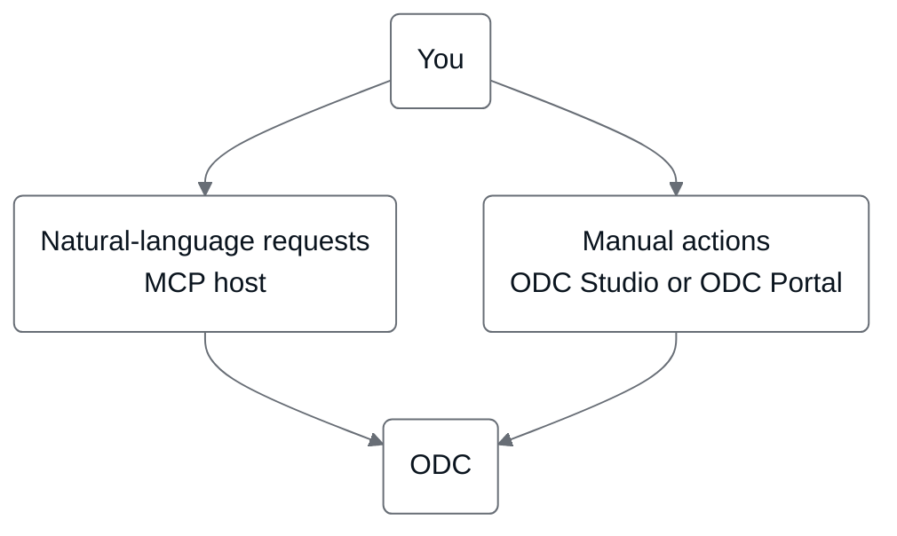

# ODC for developers new to OutSystems

This page introduces OutSystems Developer Cloud (ODC) to developers who build with AI tools and haven't used OutSystems before. Read it before you connect your MCP host to OutSystems MCP or run a workflow. For the terms these pages use, refer to [Agentic development terminology](../agentic-development-terminology.md).

With OutSystems MCP, the agent in your MCP host builds OutSystems apps, and ODC is the platform that builds, deploys, and runs the result. The MCP host is the AI application you work in, such as Claude Code or Cursor.

Every workflow on these pages also has a manual equivalent in ODC Portal or ODC Studio. Use your MCP host for natural-language requests to the agent. Open ODC directly to inspect what Mentor built, check details the agent doesn't report, or work by hand.

The following diagram shows that requests from your MCP host and manual actions in ODC reach the same platform.

## From prompt to running app

The following table maps each stage of a build to the equivalent action in your MCP host and in ODC.

| Stage | In your MCP host | In ODC |
| --- | --- | --- |
| Connect | Connect the MCP host to the OutSystems MCP server and sign in. Refer to [Connect MCP hosts to OutSystems MCP](connect-mcp-hosts.md) and [Get started with OutSystems MCP](get-started.md). | Nothing to set up manually. An administrator enables OutSystems MCP for the tenant once. |
| Create and build | Ask the agent to have Mentor create the app from a template, then describe changes in natural language. Refer to [OutSystems MCP](outsystems-mcp-overview.md) and [Delegation to Mentor](mentor-delegation.md). | Open the same app in ODC Studio. Inspect or refine what Mentor built, or build the change by hand. For Mentor's role inside ODC Studio, refer to [AI development in Mentor Studio](../mentor-studio/how-it-works.md). |
| Publish and deploy | Ask the agent to publish and deploy. Refer to [Evolve an existing app](evolve-app.md). | Publish and promote the same revision from ODC Portal. Refer to [Deploying assets](../../deploying-apps/deploy-apps.md). |
| Check the result | Ask the agent for the deployment status and messages, or for the app's logs, traces, and health. | Open the app's runtime URL directly, or check logs, traces, and health in ODC Portal. Refer to [Monitoring and troubleshooting apps](../../monitor-and-troubleshoot/monitor-apps.md). |

Before a publish, deploy, or rollback, the agent is instructed to restate the operation and wait for your confirmation. Refer to [Governance in OutSystems MCP](governance.md#confirming-state-changing-operations).

## Related

The following pages cover ODC governance and lifecycle in more depth.

* [Delegation to Mentor](mentor-delegation.md): the delegation model for every build step, and how the agent and Mentor divide the work.
* [Governance in OutSystems MCP](governance.md): identity, confirmation, and data residency.
* [Agentic development in the SDLC](../sdlc.md): how building with OutSystems MCP fits your existing development lifecycle.
