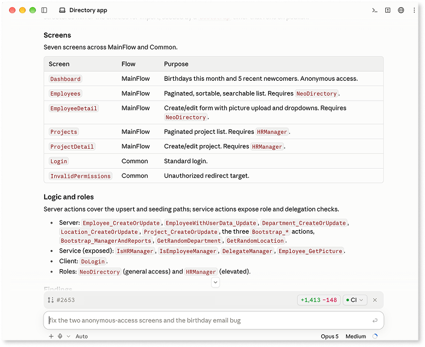
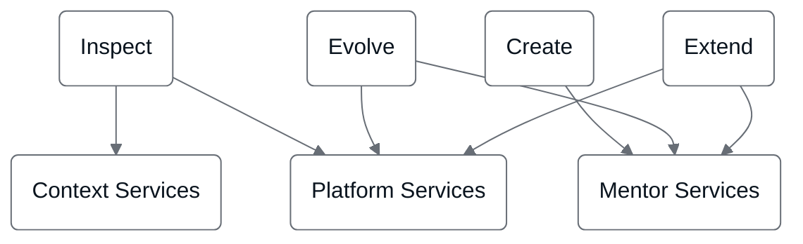

# OutSystems MCP

OutSystems MCP connects the AI application you work in, such as Claude Code, Cursor, or AWS Kiro, to OutSystems Developer Cloud (ODC). You ask the AI agent in that application to build, change, and deploy OutSystems apps. ODC compiles and runs those apps with the same standards and governance as any other OutSystems app.

OutSystems MCP uses the Model Context Protocol (MCP), an open protocol that connects AI applications to external tools. The following MCP terms describe your side of the connection:

* **MCP host:** The AI application you work in.
* **Agent:** The AI model in the MCP host. The agent interprets your requests and calls OutSystems tools.

OutSystems MCP has two parts:

* **OutSystems MCP server:** A remote MCP server that OutSystems hosts for your tenant. The server authenticates every request as your ODC user and applies the same role permissions as ODC Portal, whichever MCP host sends the request.
* **OutSystems skill:** Instructions that tell the agent how to use the OutSystems tools. Your MCP host loads the skill.

To have an AI agent in an app you build call an external MCP server, refer to [Use MCP servers](../../building-apps/build-ai-powered-apps/tools/mcp-connectors.md).

## Request flow across the parts

You describe the outcome you want in your MCP host. To reach that outcome, the agent sequences the OutSystems tools. The agent reads your tenant's context, delegates app changes to Mentor, and runs the publish and deploy steps. The OutSystems MCP server runs each tool call, and the platform builds and runs the result.

Because the agent delegates the build to Mentor, what you create becomes an OutSystems application model, the same representation ODC Portal and ODC Studio produce. The platform compiles, deploys, and runs that model. The standards, lifecycle controls, and certifications that apply to any OutSystems app apply to an app you build with OutSystems MCP, whichever MCP host you use.

## OutSystems MCP audiences

Developers build with OutSystems from the MCP host they prefer, in a range of roles:

* Pro-developers who build on OutSystems from their MCP host.
* OutSystems developers who map OutSystems MCP workflows to familiar ODC Portal actions.
* C# and .NET developers who extend apps with custom code.
* DevOps engineers and tech leads who run lifecycle operations.
* IT leaders and architects who confirm governance applies across origins.

## OutSystems MCP workflows

From a connected MCP host, you ask the agent to delegate work to OutSystems through tool calls, across the following workflows:

* Find apps across your tenant, inspect an app's screens, data model, logic, and roles, and map its dependencies and dependents.
* Create an app from a standard template, then build it with Mentor. For the asset types Mentor builds, refer to the scope in [Capabilities and patterns for Mentor Studio](../mentor-studio/capabilities.md#scope). For agentic apps, refer to [Agentic apps in ODC](../../building-apps/build-ai-powered-apps/agentic-apps.md).
* Evolve an existing app by delegating changes to Mentor, then publish and deploy.
* Extend an app with a custom C# external library.

The following diagram shows which service set runs each capability. A workflow can span more than one service set. For example, Evolve uses Mentor Services for the edit and Platform Services for publish and deploy.

## Workflows across your toolchain

Your MCP host can connect other MCP servers alongside the OutSystems MCP server, such as servers for Jira, Figma, or Slack. The agent then combines OutSystems operations with steps in those tools in one workflow. The following workflows are examples:

* Read requirements from Jira, query your estate, then build the feature.
* Turn a Figma design into wired screens in an existing app.
* Deploy a change, then run Playwright tests against the running app.
* Summarize what changed and post to Slack.

The specific integrations depend on which MCP servers your MCP host connects.

## Portfolio health in ODC Portal

The OutSystems MCP server reads app logs, traces, and health for one stage per request. For a portfolio health overview across all stages in the tenant, use ODC Portal. For more information, refer to [Monitoring and troubleshooting apps](../../monitor-and-troubleshoot/monitor-apps.md).

## Limits

OutSystems MCP builds apps through Mentor and runs them on ODC, so the limits of Mentor and of your tenant apply to the work you do from an MCP host. For those limits, refer to the following pages:

* [Platform limits](../../getting-started/system-requirements.md#platform-limits), including the sections for [Mentor](../../getting-started/system-requirements.md#mentor), [logs and traces](../../getting-started/system-requirements.md#logs-and-traces), and [custom code](../../getting-started/system-requirements.md#custom-code).
* [Known limitations](../ai-limitations.md) for agentic development.
* [Monitor ODC resource capacity](../../getting-started/capacity-limits.md) for your tenant's resources.

The following behaviors apply when you work from an MCP host:

* A Mentor session closes after a period of inactivity, and the session discards the edits you didn't publish. Publish before a long pause. For more information, refer to [Delegation to Mentor](mentor-delegation.md#session-expiry).
* Publishing an app again while its previous publish is still running can leave the app unable to publish. Wait for each publish to finish. For more information, refer to [Evolve an existing app](evolve-app.md#publish-a-revision).

## Supported MCP hosts

For example, OutSystems validates the following MCP hosts:

* Claude Code
* AWS Kiro
* Cursor

Any other MCP host that supports the MCP Streamable HTTP transport with OAuth connects to the same endpoint, without validated setup. For per-host setup, refer to [Connect MCP hosts to OutSystems MCP](connect-mcp-hosts.md).

## Next steps

Read the concepts before you run a workflow, because the delegation model determines how the tools behave.

* To understand how the agent and Mentor divide the work, refer to [Delegation to Mentor](mentor-delegation.md).
* To understand identity, confirmation, and data residency, refer to [Governance in OutSystems MCP](governance.md).
* To connect an MCP host and run a first request, refer to [Get started with OutSystems MCP](get-started.md).

## Related resources

The following pages cover OutSystems MCP topics in more depth:

* For developers new to OutSystems, refer to [ODC for developers new to OutSystems](odc-overview.md).
* For terms such as MCP client and OutSystems plugin, refer to [Agentic development terminology](../agentic-development-terminology.md).
* For the request path from your MCP host to ODC, refer to [OutSystems MCP request architecture](architecture.md).
* For per-host setup, refer to [Connect MCP hosts to OutSystems MCP](connect-mcp-hosts.md).
