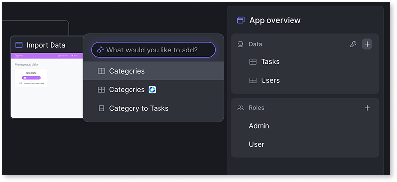

# Thinking with AI

Agentic development requires a different mindset than traditional development tools. Instead of navigating menus and clicking through configuration screens, you describe requirements in natural language while ODC generates the structure. This shift from explicit control to describing intent in natural language changes the approach to app creation.

## Understand the fundamental shift

Traditional development tools provide direct control through menus, forms, and drag-and-drop interfaces. Buttons add entities, widgets are dragged onto screens, and each property is configured explicitly. Agentic development inverts this model by describing intent while the AI handles implementation.

You describe intent, "Create a customer management app with contact details and role-based access," and ODC interprets that description to generate the structure. Large Language Models power this capability by understanding natural language and mapping requirements to OutSystems development patterns.

This shift changes what you need to know:

* **Your role**: articulate requirements clearly and understand recognized patterns.
* **ODC's role**: interpret intent, apply patterns, and generate app structures.

ODC functions as a partner that interprets and builds, rather than a canvas for direct control.

## How agentic development works

Agentic development functions as a specialized translator between natural language and the OutSystems app model. When given a prompt or requirement document, the AI identifies patterns, entities, relationships, user roles, UI layouts, and translates them into the OutSystems Model (the app model, not an AI model). Understanding how this translation works enables writing more effective prompts.

The app model is a high-level abstraction representing an app's structure, data, logic, and UI. Agentic development works at this level, not with raw code. After you generate or modify the app model, the OutSystems compiler translates it into actual app code following OutSystems standards for security, performance, and architecture.

The AI agents interpret input by matching it to recognized patterns. Descriptions that specify entities, roles, and relationships map directly to generated structures.

Agentic development is an accelerator, not a replacement. It handles repetitive scaffolding (creating entities, setting up screens, establishing basic authorization) so you can focus on unique requirements and complex logic that require human judgment.

## Partner with AI

Effective collaboration with agentic development requires understanding what each partner contributes. You provide clear specifications and intent. ODC provides pattern application and structure generation. Success depends on effective communication.

**Be explicit.** Clear statements of requirements work best. Specify entities and attributes, define user roles and permissions, and describe UI patterns. The AI cannot infer unstated requirements or fill in missing details like a human colleague.

**Provide structure.** When the data model is known, define it up front. Specify entity relationships explicitly, "Customer has many Orders (One-to-Many), Order has many Products (Many-to-Many)." Include static entities for status or category fields. More structure in the prompt enables more accurate generation.

**Iterate incrementally.** Start with a foundation and refine through focused prompts. Make one change at a time and evaluate results before continuing. This approach works better with LLMs than attempting to specify everything perfectly up front.

### Common mistakes

The following table illustrates common prompting mistakes and how to fix them.

| Ineffective prompt | Effective prompt | Why it works |
| -------------------- | ----------------- | -------------- |
| "Make a customer app" | "Create a customer management app with Customer entity (Name, Email, Phone, Company), card list view, Managers can edit all records, Sales Reps can view only" | Specifies data structure, UI pattern, and authorization rules |
| "Make it better" | "Add email validation to the Contact form and change the list to a card layout" | States a concrete goal with specific elements |
| "Add some security" | "Create Admin and Viewer roles. Admins can edit all records. Viewers have read-only access" | Defines roles and permissions explicitly |

## Adopt an iteration mindset

Working with AI follows a generate-review-refine cycle. LLMs interpret patterns probabilistically, meaning some variation in output is inherent to how they work. Refinement is part of the workflow, not a sign of failure. Plan for iteration from the start.

The iteration cycle follows three steps:

* **Start with a foundation.** Establish the core data model and main screens.
* **Review what Mentor generated.** Check whether entities, relationships, and layouts match the intent.
* **Refine incrementally.** Use focused prompts to adjust one aspect at a time: add an attribute, modify a role, change a layout.

Agentic development provides immediate visual feedback with sample data for evaluating each change before moving forward. This rapid iteration enables shaping the app toward requirements without writing code or navigating complex configuration screens.

Agentic development excels at structural changes: entities, data models, roles, standard UI patterns. Custom business logic, complex aggregates, external system integrations, or performance optimization require transitioning to ODC Studio. For a breakdown of when to transition, refer to [When to use each tool](intro.md#when-to-use-each-tool).

## Related resources

This article covers the conceptual shift to prompt-based development. The following resources put these concepts into practice with specific prompt techniques, tool workflows, and architecture details.

* For prompt strategies that improve AI responses across all Mentor tools, refer to [Effective prompts for Mentor](effective-prompts.md).
* For the technical architecture behind agentic development, including AI agents and the OutSystems Model, refer to [Architecture](architecture.md).
* For the app creation workflow in Mentor Web, including the blueprint validation step, refer to [How AI app generation works](mentor-web/how-it-works.md).
* For the app modification workflow in Mentor Studio, refer to [AI development in Mentor Studio](mentor-studio/how-it-works.md).
