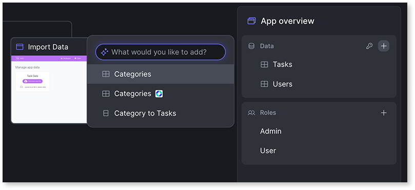

# Thinking with AI

Agentic development adds a layer on top of the development skills you already use. You describe requirements in natural language, and ODC generates the structure. The model you work with stays the same: entities, screens, aggregates, and logic on the OutSystems Model. What changes is the interface to it, from direct configuration to describing intent and reviewing the result. For what the platform guarantees and what you validate in this workflow, refer to [Platform guarantees and AI interpretation](odc-ai-and-platform.md).

## Understand the shift

ODC Studio gives you direct control over the app model. You add entities, drag widgets onto screens, set each property explicitly, and drop to custom code or integrations when you need them. Agentic development adds a layer above that control: you describe intent, and the AI proposes the implementation on the same model, which you then review.

You describe intent, "Create a customer management app with contact details and role-based access," and ODC interprets that description to generate the structure. Large Language Models provide this capability. They map natural-language requirements to OutSystems development patterns.

This shift adds to how you work:

* **Your role**: articulate requirements clearly and understand recognized patterns.
* **ODC's role**: interpret intent, apply patterns, and generate app structures.

ODC interprets your intent and builds the structure, alongside the visual editor you use for direct control.

## How agentic development works

Agentic development translates your natural language into the OutSystems Model. When you give a prompt or requirement document, the AI identifies patterns, entities, relationships, roles, and UI layouts, and expresses them in the model. It matches your input to recognized patterns, so descriptions that specify entities, roles, and relationships translate more reliably. Understanding this translation helps you write more effective prompts.

The platform applies the same compiler and standards to this output as to any app, and you validate the interpretation. For the guarantees the platform provides and the interpretation you validate, refer to [Platform guarantees and AI interpretation](odc-ai-and-platform.md). For the components behind the translation, refer to [Architecture](architecture.md).

Agentic development accelerates app creation. It generates the repetitive scaffolding, such as creating entities, setting up screens, and establishing basic authorization, so you can focus on the requirements and logic that need your judgment.

## Partner with AI

You and ODC each contribute to the result. You provide clear specifications and intent. ODC applies patterns and generates the structure. Clear, explicit prompts produce better results.

**Be explicit.** Clear statements of requirements work best. Specify entities and attributes, define user roles and permissions, and describe UI patterns. The AI builds only from what you state, so include the details it would otherwise have to assume.

**Provide structure.** When the data model is known, define it up front. Specify entity relationships explicitly, "Customer has many Orders (One-to-Many), Order has many Products (Many-to-Many)." Include static entities for status or category fields. More structure in the prompt produces more accurate generation.

**Iterate incrementally.** Start with a foundation and refine through focused prompts. Make one change at a time and evaluate results before continuing. This approach works better with LLMs than attempting to specify everything perfectly up front.

For concrete prompt examples and the mistakes to avoid, refer to [Effective prompts for Mentor](effective-prompts.md).

## Adopt an iteration mindset

Working with AI follows a generate-review-refine cycle. LLMs interpret patterns probabilistically, so some variation in output is expected. Refinement is a standard step in the workflow. Plan for iteration from the start.

The iteration cycle follows three steps:

* **Start with a foundation.** Establish the core data model and main screens.
* **Review what Mentor generated.** Check whether entities, relationships, and layouts match the intent.
* **Refine incrementally.** Use focused prompts to adjust one aspect at a time: add an attribute, modify a role, change a layout.

Agentic development provides immediate visual feedback with sample data, so you evaluate each change before continuing. Through this rapid iteration, you refine the app toward its requirements without writing code or configuring screens by hand.

Use agentic development for structural changes such as entities, data models, roles, and standard UI patterns. Build advanced logic, complex aggregates, and external integrations in ODC Studio, with Mentor Studio or manual development. For a breakdown of when to transition, refer to [When to use each tool](intro.md#when-to-use-each-tool).

## Match oversight to impact

The effort you spend reviewing a change scales with its complexity and reach.

A contained change, such as adding an attribute, affects a single element, and you verify it directly after Mentor Studio applies it. A change that spans multiple elements, dependencies, or workflows affects more of the app, and an incorrect assumption propagates further. For changes of this kind, the Mentor tools present their intended work for review before applying it: the blueprint in Mentor Web, and proposed changes in Mentor Studio. Reviewing and accepting a proposal before Mentor applies it keeps the change supervised and verifiable.

For the specific checks your development judgment maps to when you review a proposal, refer to [Review checks](odc-ai-and-platform.md#review-checks). For how this works when modifying apps, refer to [AI development in Mentor Studio](mentor-studio/how-it-works.md).

## Related resources

This article covers the mindset for prompt-based development. The following resources cover the prompt techniques, tool workflows, and architecture in detail.

* For prompt strategies that improve AI responses across all Mentor tools, refer to [Effective prompts for Mentor](effective-prompts.md).
* For the technical architecture behind agentic development, including AI agents and the OutSystems Model, refer to [Architecture](architecture.md).
* For the app creation workflow in Mentor Web, including the blueprint validation step, refer to [How AI app generation works](mentor-web/how-it-works.md).
* For the app modification workflow in Mentor Studio, refer to [AI development in Mentor Studio](mentor-studio/how-it-works.md).
