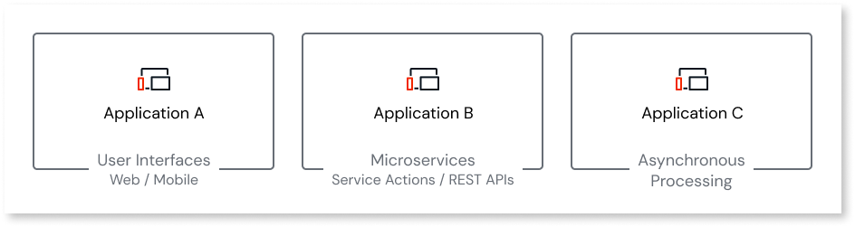
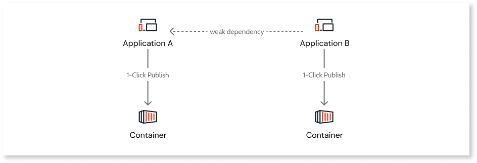
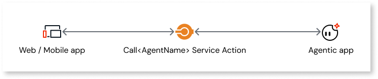
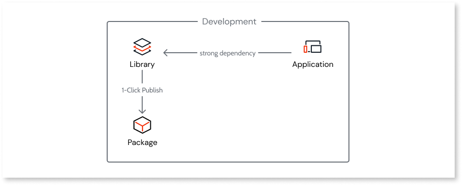
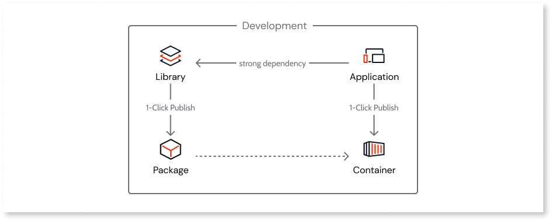
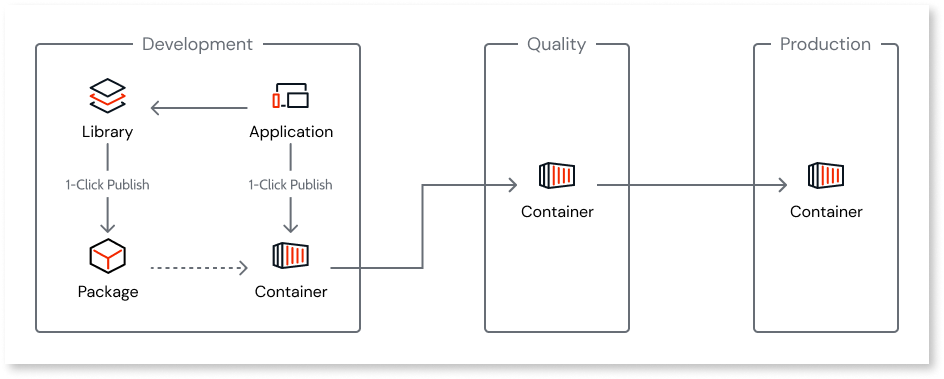

# App architecture

With OutSystems Developer Cloud (ODC), architects can design apps to solve business problems and automate business processes using a **cloud-native** approach to the architecture. In a cloud-native architecture, an app is decomposed into loosely coupled and independently deployable components or services.

In a cloud-native architecture, you can use a single app in ODC:

* To solve a specific business need with a single web or mobile user interface.
* As a microservice, exposing APIs that other apps or teams can use.
* As a standalone component to asynchronously process data if you have a high-volume use case requiring autonomous scaling without impacting the business app.

Apps scale independently, which reduces the time and cost associated with scaling all your apps. Independent app scaling is very useful, for example, when a single feature has a high load. It also helps to ensure life-cycle independence among teams.

## Apps in ODC

In ODC you can only have weak dependencies between apps. You create weak dependencies in an app by:

* Consuming service actions or entities from another app. For example, a service action from another app to read or write data in the database.

* Consuming data from another app using public entities.

In a multi-portfolio organization, you can reuse public elements from apps, such as service actions and entities, only within the same portfolio. Libraries and external libraries are reusable across portfolios.

When you publish an app, the runtime is packaged into a container.

### Containers

A container packages an app's code and its dependencies, allowing for quick and reliable deployment.

The runtime of each app is loosely coupled. Consuming services from other apps increases the app's life-cycle independence.

Containerization makes your apps highly scalable. Apps scale requests and users in an automated and transparent way. The app's database is also highly scalable. For more information, refer to [Cloud-native architecture of OutSystems Developer Cloud](../manage-platform-app-lifecycle/platform-architecture/intro.md#runtime-auto-scaling).

## AI-powered architecture { #aipowered }

ODC includes Agent Workbench, a capability that allows you to embed generative AI directly into your apps. This introduces an AI-powered layer to your app architecture, enabling you to build intelligent, interactive, and automated solutions.

Architecturally, agentic apps are distinct elements you create and configure within the ODC platform. They're then securely consumed by your web and mobile apps through a dedicated service action, `Call<AgentName>`. This design allows you to manage the agentic app's logic independently from your consumer app's core logic.

For a detailed explanation of how to create, configure, and integrate agentic apps, refer to [Agentic apps in ODC](../building-apps/build-ai-powered-apps/agentic-apps.md).

## Libraries in ODC { #libraries }

Libraries let you share code between apps. Libraries work similarly to packages such as NuGet in .NET or npm in JavaScript. Libraries keep the elements centralized, reducing maintenance cost and promoting ownership.

In a multi-portfolio organization and you need functionality available across portfolios, implement that functionality in a library. Apps and their public elements (including service actions and entities) are available only within the same portfolio, so cross-portfolio integration requires libraries or external libraries.

ODC supports the following types of libraries:

* **General-purpose libraries**: Provide reusable UI and logic elements for both web and mobile apps.

* **Mobile libraries**: Specialized libraries for mobile apps only. These libraries enable you to wrap native plugins such as Cordova and Capacitor plugins and create mobile-specific UI components. For detailed information, refer to [Mobile libraries](../building-apps/libraries/libraries.md#mobile-libraries-mobile-libraries).

Apps can reference libraries, and libraries can also reference other libraries. This creates a strong dependency. This means that if something in a library changes and an app is consuming it, the change can have an impact that leads to breaking changes.

Libraries are packaged with apps when an app is published. Each app consumes library packages and a library version in its container.

Versioning of libraries enables systematic updates and integration of your library's elements into apps and other libraries within your organization.

Learn more about the fundamentals of libraries and how versioning works in the [Libraries](../building-apps/libraries/libraries.md#libraries-versioning) article.

## How apps work with libraries

Apps can consume libraries through strong dependencies, which are packaged when published.

The packaged library is included in the generated container when you publish an app.

The container image is reused as you advance an app's deployment from development to QA or QA to production. Each stage's configurations are applied to the deployment process. In a multi-portfolio organization, each portfolio has its own set of stages with an independent delivery process.

Apps hold all the configuration values, even those implemented at the consumed libraries level. This enables developers to set different configurations for each stage.

Are you planning to build your first app? See recommendations for [building a well-architected app](recommended-architecture.md).

## Related resources

For more information about designing your architecture and understanding reuse, refer to:

* [Design a well-architected app](recommended-architecture.md)

* [Reuse elements across apps](reuse-elements.md)

* [Understand strong and weak dependencies](../building-apps/reuse/intro.md)

* [Asset portfolios](../manage-platform-app-lifecycle/portfolios/portfolios-overview.md)

For an online course that walks you through designing app architectures step by step, refer to:

* [Architecture Fundamentals in ODC](https://learn.outsystems.com/training/journeys/architecture-fundamentals-559) online course
