# Building a well-architected app

Before building apps in OutSystems Developer Cloud (ODC), understand the business problem you want to solve. To help you in that journey, look at an example of a home insurance portal.

Begin by asking some crucial questions. The answers become the rules you base decisions about designing and building a scalable architecture.

1. What are the business concepts in your use case?

1. What's the organizational structure?

1. How do you map your organizational structure to multiple portfolios? (Only applies to organizations with multiple portfolios.)

1. Who are the business owners and sponsors?

1. How are the business owners and sponsors related to the different business contexts?

1. How can you ensure your teams can work independently and deliver at the rate of business decisions?

1. What are your non-functional requirements (NFRs), reusable components, and integrations with external systems?

These questions and answers help you group business concepts into bounded contexts, which define business boundaries. Then map bounded contexts and the apps that implement them to the business sponsors, owners, and teams in your organization. In a multi-portfolio organization, refer to [App architecture with multiple portfolios](../manage-platform-app-lifecycle/portfolios/portfolios-app-architecture.md) for additional guidance on grouping apps into portfolios.

The answers to the sequenced questions listed earlier become the steps to help you better design an ODC app architecture. The following sections describe each step in more detail.

## Step 1 - Disclose the app business concepts

After you interview business stakeholders and end-users, list the business concepts you identified for the Home Insurance portal.

Use what you learn in workshops and interviews to capture enough business context to make design decisions.

Some concepts, such as **Customers**, **Claims**, and **Quotes** are easy to identify. But also think about data and external systems with data that might support other concepts. Are there concepts that might require further detailing, like **First Notice of Loss (FNOL)**, **Know your Customer (KYC)**, or **Payments**?

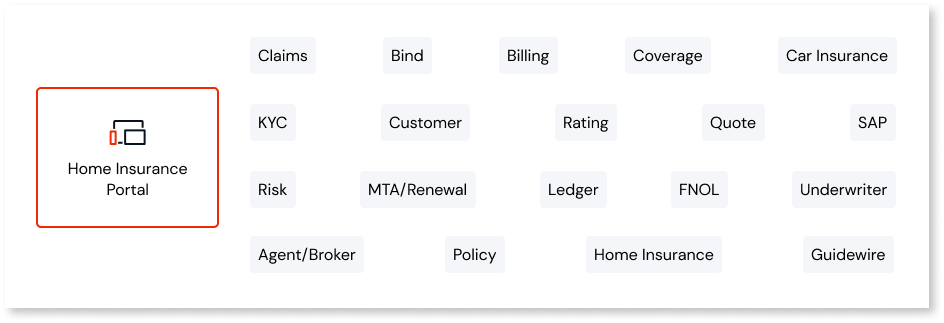

## Step 2 - Organize bounded contexts by grouping the business concepts

Now organize and group the business concepts into bounded contexts.

Bounded contexts group related business concepts. When you define bounded contexts, consider the following questions:

* What are the business domain experts' boundaries?

* What are the business processes, data flow, and ownerships?

* Is the concept's cohesion or clustering due to dependencies between concepts?

To avoid a lack of clear ownership and context segmentation, ensure you only have a few dependencies between bounded contexts. To avoid confusion, use a common language that everyone understands.

In the home insurance portal example, the bounded contexts are **Home Insurance**, **Risk Processing**, **Customer Relationship Management (CRM)**, **Claims**, **Billing**, and **Policy**.

Two bounded contexts include reusable components and integrations with external systems. The **CRM** context requires external integration with SAP. The **Billing** context requires integration with Guidewire, another external system.

In ODC, you integrate with external systems by consuming REST APIs. For more information, refer to [Consume REST APIs](../integration-with-systems/consume_rest/intro.md).

At this point, the bounded contexts are well identified. You can iterate on these contexts as you identify more information.

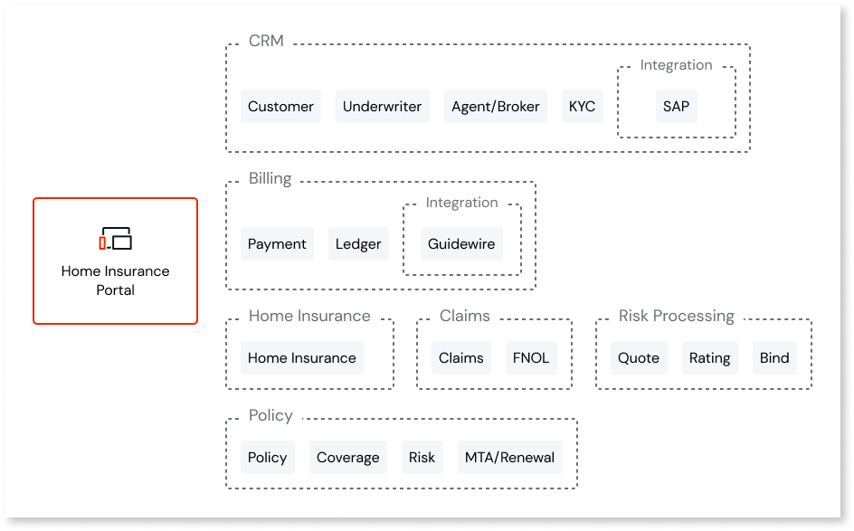

## Step 3 - Define clear ownership

Before you assemble your final architecture design, understand how your organizational structure affects your architecture decisions.

To keep app development running smoothly, define clear ownership so you avoid conflicting requests for the same business context from multiple business owners.

Clear ownership requires and means you have only one go-to person for each business context: the business owner.

### Best practices

Use these best practices to keep ownership clear as you split work across apps:

* **Assign one business owner** to the **Home Insurance** app.

    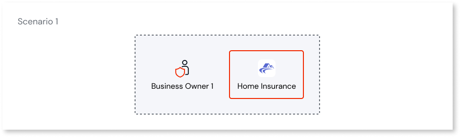

* Assign one business owner to the **Claims** app and one to the **Customer Portal** app.

    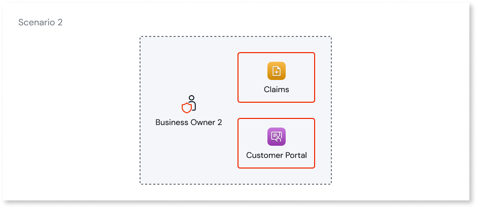

* **Avoid assigning two business owners** to one app.

    If you assign two business owners to the **Claims & Billing** app, you create:

    * Unclear responsibility and accountability
    * Risks, collisions, and conflicting priorities from concurrent work

    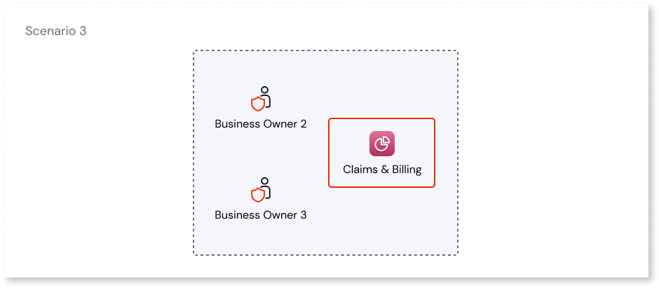

    If you need two business owners, split **Claims & Billing** into two apps.

    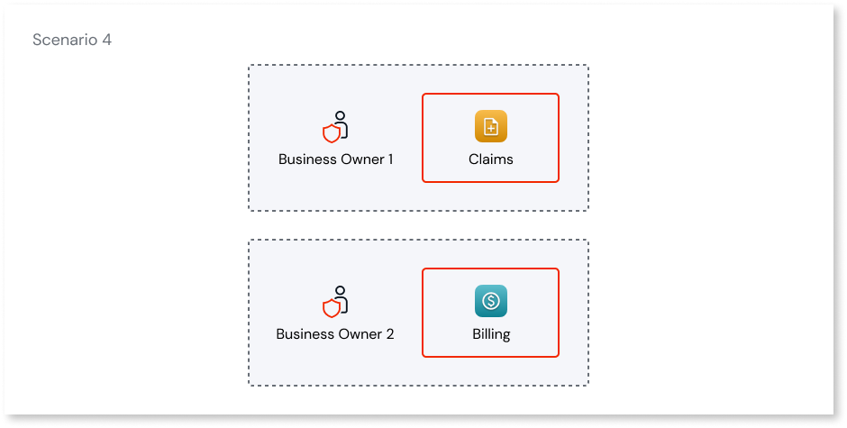

#### Independent release cycles

To ensure independent release cycles, business sponsors play a crucial role in the organization.

Business sponsors are usually accountable for the budget, so they have the power to prioritize the demand. Different sponsors might require different rates of change, so matching your architecture to the organizational structure helps ensure independent release cycles. In a multi-portfolio organization, each portfolio has its own CI/CD delivery process, which gives different groups of apps independent release cycles by default.

Follow the approach of starting simple. If needed, begin to add complexity over time.

Having one sponsor and one business owner for the **Home Insurance** app is OK.

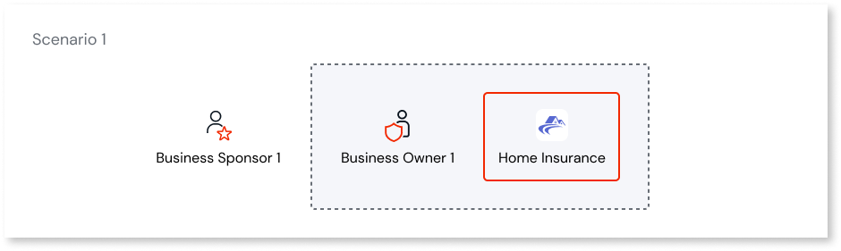

In this scenario, it's also OK to have two sponsors and only one business owner since each sponsor matches an app (**Claims** and **Customer Portal**).

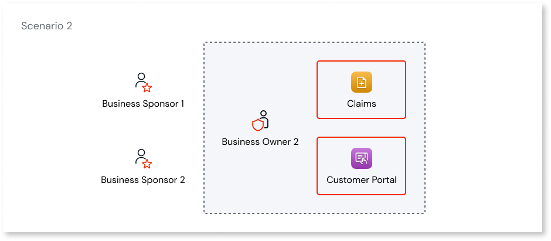

In this scenario, if two sponsors manage the **Claims & Billing** app, conflicting priorities arise when each sponsor's requests change simultaneously.

As a best practice, avoid this scenario.

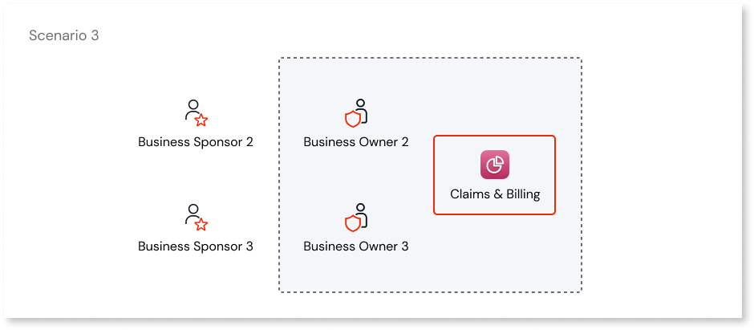

To ensure business sponsors can request changes at different rates, create two apps: one for **Claims** and one for **Billing**.

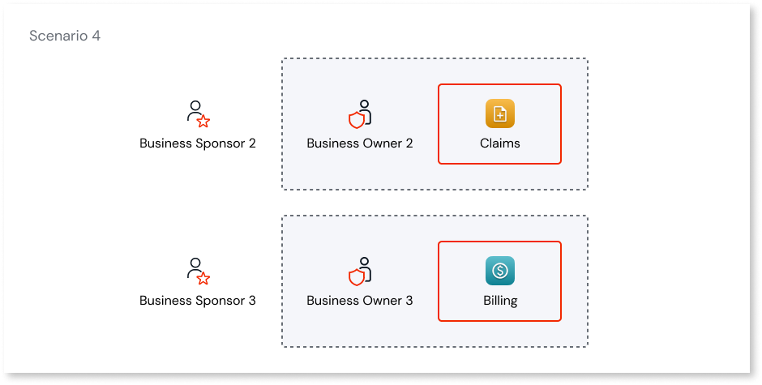

#### Team independence

Following these best practices helps development teams work independently. This supports independent release cycles and helps you scale ODC to many teams working across a large set of apps and libraries.

If you have one team, one business owner, and one sponsor, start with a simple approach and use one app to implement your bounded contexts. When you keep all business concepts and contexts in one app, you gain the benefits of:

* Low development effort

* Low architecture effort

With this simple approach, developers don't need to worry about exposing services from one app to another. They don't need to manage different permissions for other apps. They can also manage all the authentication and exceptions in the same app without worrying about centralizing the authentication in a single app.

This approach becomes harder to manage when different teams need to deliver features at different rates in the same app. Feature toggles can help, but they require additional development time.

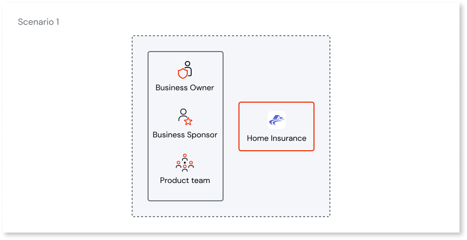

In this scenario, one team can own several apps if your organizational structure supports it. Having a good balance between the amount of code owned and the cognitive load necessary to understand is essential. If the apps don't connect, you can deploy independently and keep the advantages of the simplified approach.

However, if one app exposes or consumes a service from another, the architecture becomes more complex.

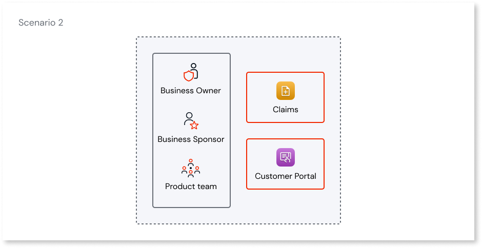

When more than one team works on the same app, teams lose independence and clear ownership. In this case, a more distributed approach helps you meet your business needs without blockers.

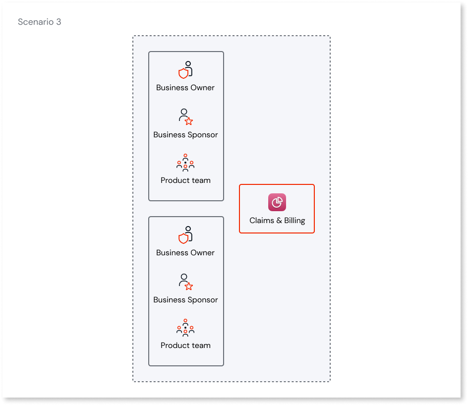

A more distributed approach addresses this scenario by splitting bounded contexts across multiple apps so teams can own and release apps independently. This increases architecture complexity because changes in one app can impact other apps that consume its services. Development best practices help you reduce that impact. In a multi-portfolio organization, refer to [App architecture with multiple portfolios](../manage-platform-app-lifecycle/portfolios/portfolios-app-architecture.md) for guidance on sharing across portfolio boundaries.

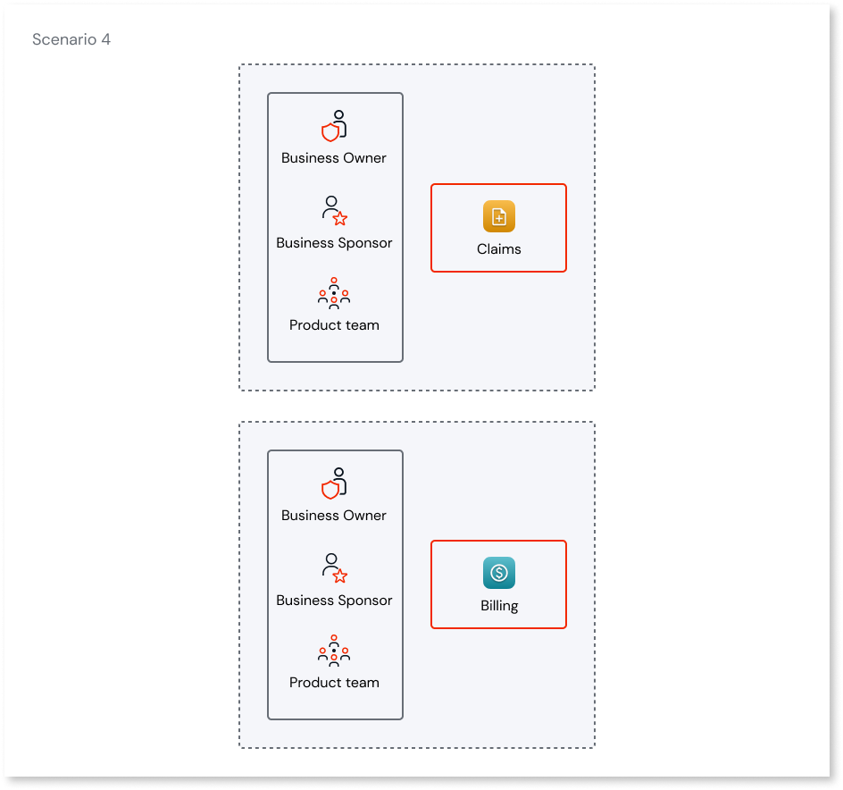

## Step 4 - Assemble the architecture

Now that you understand the best practices that support a proper development flow and release cycle, you can assemble your architecture.

Start by mapping your business owners and sponsors to your bounded contexts based on your organizational structure and what you learn from stakeholders. Then map bounded contexts to the apps and libraries that implement them. In a multi-portfolio organization, refer to [App architecture with multiple portfolios](../manage-platform-app-lifecycle/portfolios/portfolios-app-architecture.md) for guidance on mapping bounded contexts to portfolios and designing cross-portfolio reuse.

The goal is to ensure the right balance between cohesion and loose coupling. This helps you reduce development effort and architecture complexity while maintaining development lifecycle independence between apps and teams.

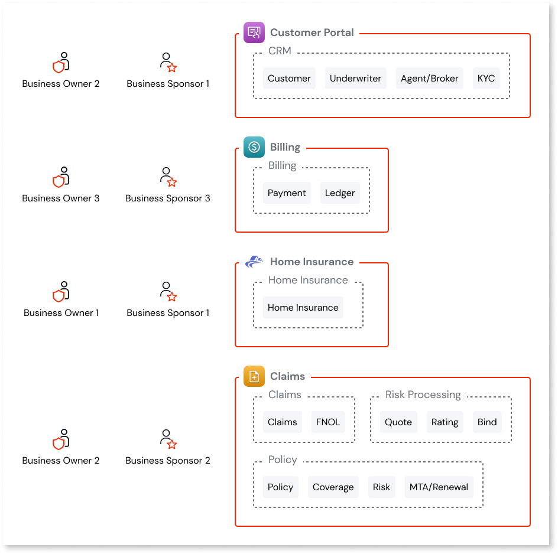

## The final architecture

The final architecture for this example includes the following apps:

* The **Home Insurance** app that provides the user interface, including screens, blocks, and styling.

* The **Customer Portal** app that manages customer information and exposes it to the **Home Insurance** app.

* The **Claims** app that implements risk processing policies and claims services, and exposes them to the **Home Insurance** app.

* The **Billing** app that handles payments and billing. In this example, it also includes services and a user interface where users pay pending bills.

The architecture also uses the following libraries:

* The **Lottie animations** library, available in Forge, that adds custom animations to the **Home Insurance** app.

* The **Guidewire connector** that supports your billing systems as an integration wrapper to process traditional and flat-rate agent commissions from a single interface.

You can use the [**SAP connector**](../integration-with-systems/external-databases/intro.md) in ODC to connect your customer's information from SAP and serve as a bridge to your customer portal.

In a multi-portfolio organization, all of these apps and libraries would typically belong to the same portfolio since they share the same business domain, NFRs, and delivery lifecycle.

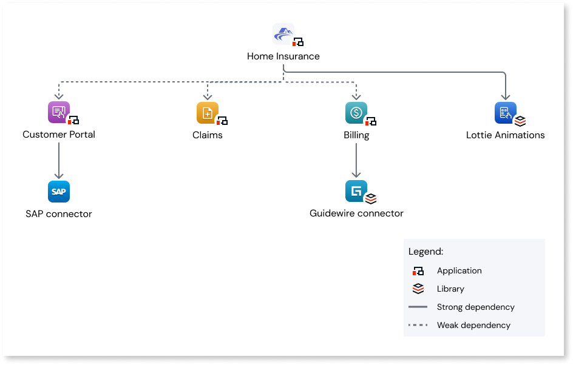

## Related resources

For more information about ODC architecture, reuse, and integrations, refer to:

* [App architecture](intro.md)

* [Cloud-native architecture of OutSystems Developer Cloud](../manage-platform-app-lifecycle/platform-architecture/intro.md)

* [Libraries](../building-apps/libraries/libraries.md)

* [Integration with external systems](../integration-with-systems/intro.md)

* [Asset portfolios](../manage-platform-app-lifecycle/portfolios/portfolios-overview.md)

* [App architecture with multiple portfolios](../manage-platform-app-lifecycle/portfolios/portfolios-app-architecture.md)

For an online course that walks you through designing app architectures step by step, refer to:

* [Architecture Fundamentals in ODC](https://learn.outsystems.com/training/journeys/architecture-fundamentals-559) online course
