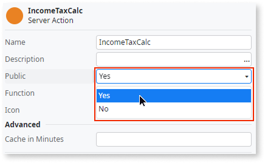
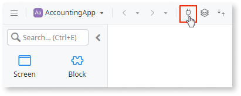
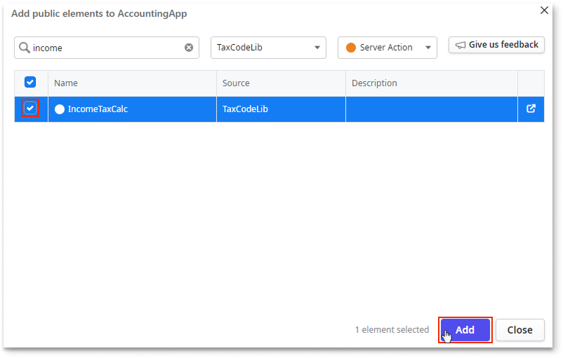
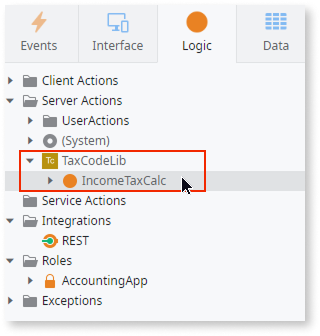

# Reuse elements across apps

You can share public elements across your assets to accelerate development and enable consistency. Reusing a public element creates a **dependency** between the two assets involved: one as the **producer** and the other as the **consumer**.

Dependencies are categorized into two types: **strong** and **weak**, based on the nature of the assets involved.

* **Strong dependencies**: Strong dependencies are created when elements are shared between assets that aren't deployed independently. These non-deployable assets include all types of libraries and connections. Examples of strong dependencies include:

    * Two Libraries sharing elements

    * A Library sharing elements with an app (web, mobile or agentic apps)

* **Weak dependencies:** Weak dependencies are created between assets that are deployed independently. For example, a weak dependency occurs when:

    * One app reuses an element from another app. This includes web and mobile apps interacting with agentic apps (in either direction).

    * A Workflow reuses an element from an app

    * An app reuses elements from a connection

For more information about dependencies, refer to [Understand strong and weak dependencies.](../building-apps/reuse/intro.md)

## Public elements { #public-elements }

To expose and share a public element for reuse, you set its **Public** property to **Yes**.

However, you can't share some elements, and in such cases, the element's **Public** property is either not visible, or set to **No** and can't be changed.

The following table lists elements that can be made public in at least one asset type.

| Element type | Can be public in web and mobile apps? | Can be public in libraries? | Can be public in agentic apps? |
| --------------- | ------------------------------- | ------------------------------------ | ------------------------------------ |
| Blocks | No | Yes | Not applicable |
| Client actions | No | Yes | Not applicable |
| Entities | Yes | Not applicable | Yes |
| Images | No | Yes | Not applicable |
| Events | Yes | Not applicable | Yes |
| Roles | Yes | Not applicable | Yes |
| Screens | Yes, only in web apps | Not applicable | Not applicable |
| Server actions | No | Yes | No |
| Service actions | Yes | Not applicable | Yes |
| Static entities | Yes | Yes | Yes |
| Structures | Yes, only if you use them as parameters in service actions. | Yes, only if you use them as parameters in public actions or public blocks. | Yes, only if you use them as parameters in service actions. |
| Themes | No | Yes | Not applicable |

In addition to the element types detailed in the table, other components can also become public for reuse:

* **Data fabric connections**: When you define or select entities and actions within a data fabric connection, they automatically become public elements. This allows you to reuse them in other assets such as web and mobile apps.

* **AI models**: You can consume actions exposed by AI models as public elements, enabling their integration into various apps.

While you can't directly make a server action public within an app, you can expose it for reuse by right-clicking it and selecting **Expose as Service Action**. This action creates a service action that invokes the original server action and inherits its properties, effectively making it public.

## Consuming public elements

When you want to use a public element from a different asset you must first add them to your current asset, establishing the relationship of Producer and Consumer. Learn more about this type of relationship in [Understand strong and weak dependencies](../building-apps/reuse/intro.md).

Follow these steps on how to add public elements to your asset.

1. Open the **Add public elements** window.

    

1. Use the filter and search options to find the elements you want to consume, and select them.

1. Click **Add**.

    

    If you want to consume a public element from a library, make sure [the library has been released](../building-apps/libraries/libraries.md#release-library).

    

    

The elements are now available to use in your asset.

## Validating consumers and producers in the ODC Portal

In the ODC Portal, the asset detail page lists producers and consumers. Understanding your asset's consumers is crucial for communicating changes, such as a bug fix in a service action, to the development team. Similarly, it's important to know the producers from which you reuse elements for your asset's functionality.

The **Producers** tab displays the complete hierarchy of direct and indirect producers contributing to delivering your assets' functionality. When you select a producer,  the elements that the direct consumer of this producer is reusing are displayed. For each producer, the version (or revision) that is being used is also displayed.

The platform determines the versions (or revisions) being used in an asset based on the type of dependency:

* **For weak dependencies**: The revision used is the one currently deployed in the same stage where the consumer app is running.

* **For strong dependencies**: The platform uses the revision that is directly referenced by the asset itself (direct dependencies). If not directly referenced, it uses the revision in use by the closest producer in the dependency tree.
