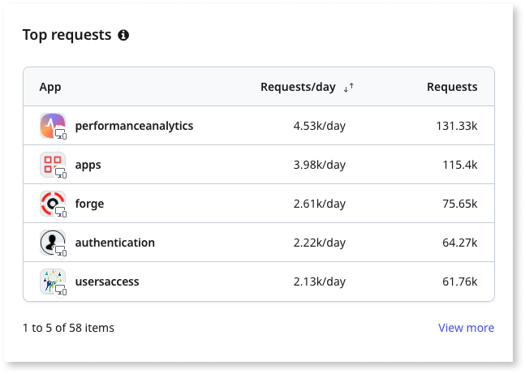
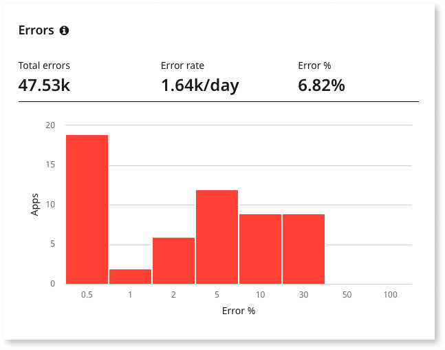
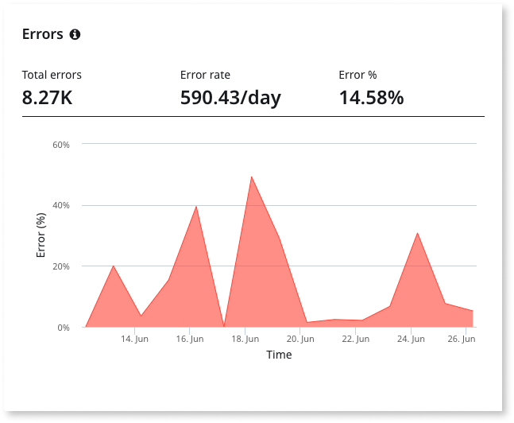
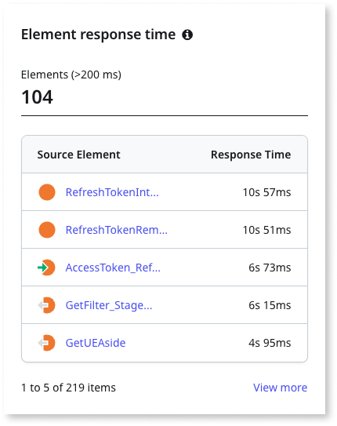
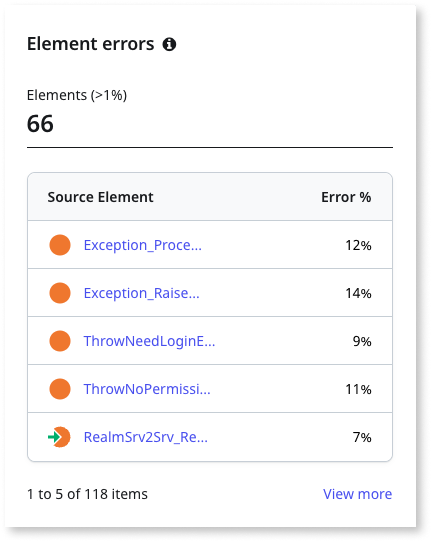

# Monitor app health in ODC Portal

OutSystems Developer Cloud (ODC) provides an **App health** dashboard that monitors application health, based on performance and errors.

The dashboard allows you to analyze key metrics, such as the [health score](#health-score), [requests](#requests),  [errors](#errors), and [response time](#response-time) of your apps and its elements over a period of time. The App health dashboard provides an overview of the application health of a selected stage, for up to 30 days.

Based on the health score, the dashboard organizes the apps into **Critical**, **Moderate**, and **Good** categories allowing you to focus on the apps that are performing poorly. The dashboard also shows the applications, categorized by requests, errors, and response time.

From the dashboard, you can identify and debug potential issues by drilling down into the app's historical trend of key metrics. 

Drilling down into an app also allows you to get an overview of the app’s elements based on the number of times they were invoked as part of the app requests, their 99th percentile duration, and the number of times they resulted in an error.

You can drill further down into an element and view the historical trends of the metrics. Once you identify the elements  that are causing the app issues, the logs and traces for the period that the errors occurred can also help identify and locate the problem. For more information about logs and traces, refer to [Monitor and troubleshoot apps](monitor-apps.md) article.

## Metrics

To help you understand how your apps are performing, the App health dashboard summarizes the following metrics.

### Health score {#health-score}

An app's health score is expressed as a numerical score from 1 to 100 and is based on the app's response time and errors during the selected period of time (maximum 30 days, minimum 5 minutes). There are 3 health score categories:

* **Critical** (0-70) 

* **Moderate** (70-85)

* **Good** (85-100)

### Requests {#requests}

Requests are the number of application interactions done using screens, APIs, or timers. There are 2 request metrics:

* **Total requests** - The total number of requests made to an application. 

* **Request rate** - The rate at which the requests are sent to an application.

### Errors {#errors}

Errors are the issues that occur when requests are made to an application, which causes it to malfunction or crash. There are 3 error metrics:

* **Total errors** - The total number of errors occurred when requests are made to an app.

* **Error rate** - The rate at which errors occur when requests are made to an app.

* **Error percentage** - The percentage of requests that resulted in errors

### Response time {#response-time}

Response time is the amount of time taken to complete a request. The nth percentile response time is the time duration, under which n% of requests are completed. There are 3 response time metrics:

* **P90** - 90th percentile response time

* **P95** - 95th percentile response time

* **P99** - 99th percentile response time
