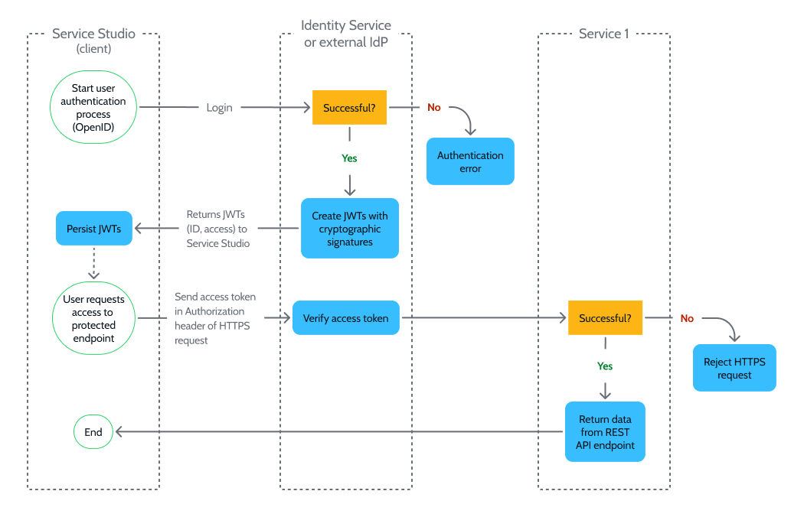

# Architecture of authentication and authorization mechanism

Project Neo documentation is under construction. It's frequently updated and expanded.

This article provides an overview of architecture of the Identity Service of Project Neo.

The Identity Service is the identity provider (IdP) of Project Neo. It's the IdP of both the Platform and the Runtime. It verifies each HTTPS request to both the Platform services and your apps come from an authenticated and authorized user. 

## Authentication and authorization

**Authentication** is the process of verifying a user's identity. Once authenticated, **authorization** is the process of verifying what a user has access to. 

Your organization's developers, DevOps engineers and architects are granted **organization permissions** to use Service Studio and the Project Neo Portal to access the Platform services.

Users of your apps are given **app permissions** to access secured screens. Developers create app permissions in Service Studio and assign them to Project Neo Portal users. These permissions protect individual screens, meaning a user can only access a protected screen if they have the required permission.

Go to [Manage users](../configuration-management/manage-users.md) for more information on user permissions and how to create them.

## Secure endpoints

The Platform uses microservices based on REST API. When Service Studio and the Project Neo Portal send **HTTPS requests**, the requests reach the **secure endpoints** the Platform exposes. An example of a request is when a developer clicks the 1-Click Publish button in Service Studio. The request accesses a secure endpoint in Build Service.

Apps run in containers in the Runtime and expose secure REST API endpoints. For example, when a user submits a form in an app it's sent as a HTTPS request to the corresponding endpoint.

## Token technology

The Identity Service is built on JSON Web Token (JWT) technology, an open standard the Identity Service uses to define identity information as a JSON object. The key benefits of this technology include: 

* JWTs are cryptographically signed using a public/private key pair which safeguards them from being modified by an attacker and ensures their authenticity.
* JWTs are self-contained, meaning they're quick to verify as they don't require a server database lookup. This means quick access to the Platform services and apps.

The Identity Service follows the OpenID Connect (OIDC) standard, an identity layer built on top of the OAuth 2 protocol.

## User flow

The following diagram shows an example of a user authentication and authorization flow. It shows a user using **Service Studio** (client) to access a REST API endpoint exposed by **Service 1** (a Platform service).

The Identity Service checks the following conditions to **verify access token**:

1. User information is valid.
1. Client information is valid.
1. Token hasn't expired.
1. Current time is after the token's valid from time.
1. Issue time of the token is in the past.
1. Cryptographic signature is valid.
1. User has correct permission.

If any of the conditions (1)-(6) fail, the Identity Service **rejects the HTTPS request** and revokes the ID and access tokens. The user must authenticate again by logging in to the client again. If condition (7) fails, the Identity Service **rejects the HTTPS request** and an authorization error is returned.

The **ID** token contains information about the identity of the authenticated user, such as name and email. The **access** token contains information about the user's permissions. Transfer of JWTs between the client and Identity Service is over the OAuth 2 protocol.

In the diagram, a user using Project Neo Portal to access another REST API endpoint in another Platform service is a valid example. As is a user using a browser to access a REST API endpoint on a protected screen in an app.
