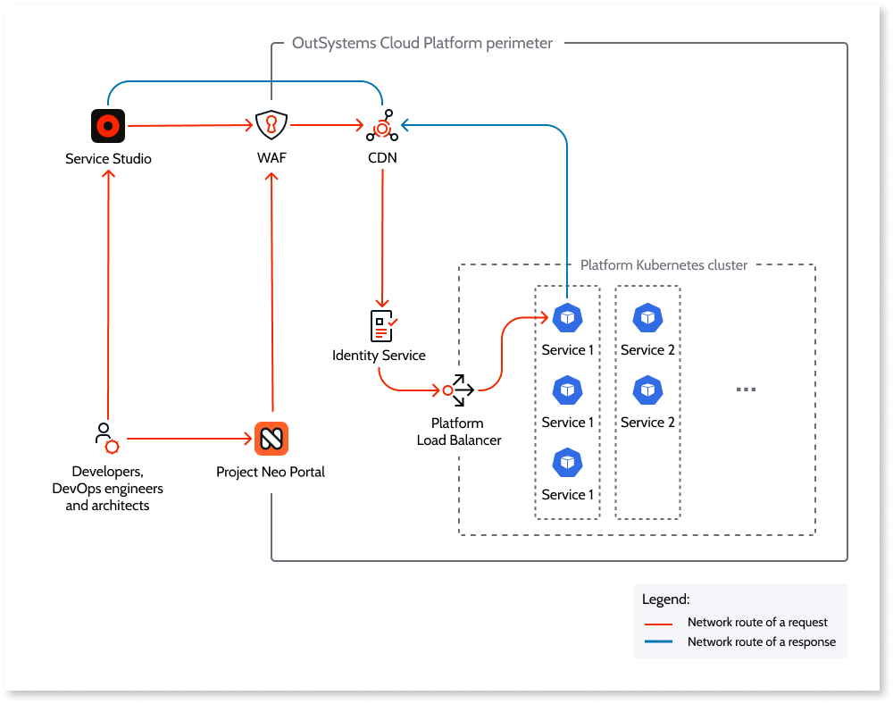
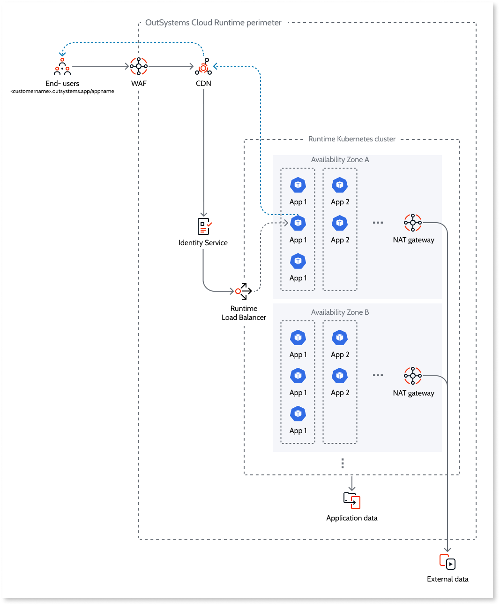

# Network and security of Project Neo

Project Neo documentation is under construction. It's frequently updated and expanded. Leave your feedback and help us build the most useful content.

This article provides an overview of Project Neo cloud-native network architecture and security.

Project Neo is cloud-native. This means that the infrastructure of both the development Platform, for building and deploying applications, and the independent Runtime, for hosting and running the deployed applications, live in the cloud. See [Cloud-native architecture of Project Neo](intro.md) to learn more.

The cloud-native architecture is connected by a secure cloud-native network. The network architecture of the Development, Test and Production stages of the Runtime are identical.

## Key technologies

The following is an overview of the cloud technologies that Project Neo uses for networking and network security.

### CDN

A globally distributed set of servers, CDN ensures a low network latency for routing requests. The CDN verifies the public key certificate attached to the request, `outsystems.dev` for the Platform and `outsystems.app` for the Runtime.

#### WAF

The WAF runs on the CDN and protects the Platform and the Runtime against common web exploits and bots. It has policies in place to protect against:

* Known malicious accesses or patterns.
* Denial-of-Service (DoS) and Distributed-Denial-of-Service (DDoS) attacks.
* Brute-force attacks.

The OutSystems Security Office defines the policies.

### NATS

All internal requests between the Platform and Runtime stages get made through NATS, a secure messaging system. This protects private endpoints from external access.

### Identity Service

The Identity Service verifies that each request comes from an [authorized and authenticated user](../manage-users.md).

### Load Balancer

When the Platform Load Balancer receives a request, it routes it to the target endpoint of the target multi-tenant Platform service. The Load Balancer directs the request to a service container replica using the round-robin method.

When the Runtime Load Balancer receives a request, it routes it to the target endpoint of the target application container. The Load Balancer directs the request to a application container replica in a given AZ using the round-robin method.

## Request route

Requests to both the Platform and Runtime first go through a Web Application Firewall (WAF), which filters malicious requests. The firewall runs on a Content Deployment Network (CDN), responsible for routing the request. In the case of a Platform request, the request gets routed to the target endpoint of the target multi-tenant Platform service. In the case of a Runtime request, the request gets routed to the target endpoint of the target application. The intermediaries between the CDN and the endpoint are the Identity Service, responsible for user identity authentication and authorization, and Load Balancer.
 
As a request is sent over HTTPS, each step is fully encrypted using Transport Layer Security (TLS).

In the network architecture, the data of both the Platform and Runtime for each customer is network isolated. Each Kubernetes cluster running in each Runtime stage is namespace-isolated, meaning each customer's application containers are network isolated.

Requests to external data (available via REST API) get routed through a NAT gateway, one per Availability Zone (AZ), each with a public IP address.

### Platform

The Platform uses microservices based on REST API. When Service Studio and the Project Neo Portal send HTTPS requests, the requests reach the secure endpoints that the Platform exposes. The requests use the smallest network bandwidth for the data transfer.

An example of an HTTPS request is when a developer clicks the 1-Click Publish button in Service Studio. The request accesses a secure endpoint in Build Service.

The platform is available at `<customername>.outsystems.dev`.

Legend: gray line - network route of a request; dotted blue line - network route of a response.

### Runtime

Apps run as application containers in the Runtime that have secure REST API endpoints. HTTPS secures the communication between the client and the browser. 

An example of an HTTPS request is when a user submits a form in an app. The request accesses a secure endpoint that the application container exposes.

The applications are available at `<customername>.outsystems.app/appname`.

 

Legend: gray line - network route of a request; dotted blue line - network route of a response.
