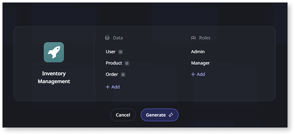

# Build apps with AI

OutSystems Mentor is a suite of generative AI capabilities for the application development lifecycle. Mentor addresses common challenges such as time-consuming prototyping and converting requirements into functional code.

This content covers Mentor for app generation in ODC. For technical debt management in OutSystems 11, see [AI Mentor Studio](https://success.outsystems.com/documentation/11/monitoring_and_troubleshooting_apps/manage_technical_debt/).

* **Mentor App Generator** transforms ideas into an OutSystems app. It uses natural language prompts or requirement documents and grounds its suggestions with your existing enterprise data for contextual relevance.

* **Mentor App Editor** lets you visually iterate on the generated app using AI-powered suggestions, providing a workflow from initial idea to deployment.

Mentor supports app creation while maintaining development standards.

* **For professional developers**: Accelerates initial app scaffolding. Focus on complex logic and requirements sooner instead of spending time on repetitive setup tasks.

* **For new developers**: Lowers the technical barrier to creating apps. You can generate app foundations by describing requirements, without needing deep knowledge of platform architecture.

* **For teams**: Enables prototyping and requirement validation. Product requirements convert into functional code, data models, business logic, and UI for stakeholder review.

## Understand AI-assisted development

Mentor represents a shift from traditional UI-driven development to a prompt-based workflow. Instead of navigating menus and clicking buttons to configure screens and data structures, you describe your requirements in natural language, and Mentor generates the app foundation.

To understand the conceptual shift for AI-assisted development, see [Thinking with AI](thinking-with-ai.md).

### Think in patterns

Mentor is a pattern-matching system that requires explicit instructions. Unlike a human colleague who can infer intent from context, Mentor interprets your prompts literally and applies recognized patterns to generate OutSystems apps. To work with Mentor:

* **Be explicit**: Clearly state what you want the app to do, what data it needs, and how users interact with it
* **Provide structure**: Define entities, attributes, relationships, and roles when you know them
* **Iterate**: Start with a foundation and refine it through the App Editor using incremental prompts

### Address three common gaps

When moving from traditional development to AI-assisted development, you may encounter three challenges:

* **Capability gap**: Understanding what Mentor can create and its current limitations.
* **Instruction gap**: Learning how to phrase requirements so Mentor interprets them correctly. The [Prompts cookbook](prompts.md) provides examples and patterns.
* **Intentionality gap**: Defining specific requirements before generation. [Requirement documents](requirements-doc.md) help structure complex app specifications.

Mentor works with the OutSystems Model, a high-level abstraction of your app. The OutSystems compiler then generates the final code according to platform standards. This model-driven approach ensures generated apps follow security, performance, and architecture requirements.

For details on how Mentor processes your input and fits into the ODC development paradigm, see [How Mentor works](mentor.md). To understand how Mentor integrates into your complete development workflow, see [Mentor and the software development lifecycle](sdlc.md).

## Get started with Mentor

Mentor starts from your natural language description instead of blank screens and configuration steps. It interprets your requirements and generates an app with data models, user interfaces, security roles, and business logic. After generation, refine the app through Mentor App Editor or continue development in ODC Studio.

### Learn prompt basics

Working with Mentor requires learning prompt engineering: how to describe requirements clearly so the AI interprets them correctly. Like learning any development skill, this takes practice. Start simple, review the [Prompts cookbook](prompts.md) for examples, and iterate on your prompts based on the results.

The workflow is iterative:

1. **Generate**: Create an initial app from a prompt or requirement document
1. **Review**: Evaluate the generated data model, screens, and roles
1. **Refine**: Make incremental changes through the App Editor using focused prompts
1. **Publish**: When the app meets your requirements, publish it for use or continue development in ODC Studio

Mentor uses the Data Platform, which may process data outside your ODC organization region. For more information, see [Data Platform](../../manage-platform-app-lifecycle/platform-architecture/intro.md#data-platform).

### Create an app with Mentor

To create an app with Mentor:

1. Go to **Portal** > **Apps** > **Create** > **Web app** > **Generate with Mentor**.
1. In the **Create app** screen, enter your prompt or upload your requirements file, or select an example prompt. Confirm to view the suggested data and roles.

    

1. Edit the data model and roles if needed. Click **Generate** to create the app and open it in the App Editor.

    

1. Use the App Editor to fine-tune the app with prompts. When the app meets your needs, click **Publish**.

    

## Security and data privacy

Mentor is designed with security and data handling policies to protect apps and data.

* **Model-driven generation**: AI modifies the OutSystems Model, not raw code. The OutSystems compiler generates code that meets established standards  
* **Data privacy**: Prompts and requirement documents are isolated and not used to train third-party models. Data is encrypted with tenant-specific keys  
* **Compliance**: The platform is SOC 2 compliant and adheres to GDPR standards

For technical limitations, see [OutSystems system requirements for ODC](../../getting-started/system-requirements.md#ai-mentor).

## Related

* [Prompting guide](prompts.md)
* [Use requirement documents](requirements-doc.md)
* [AI tools for working with Mentor](ai-tools.md)
