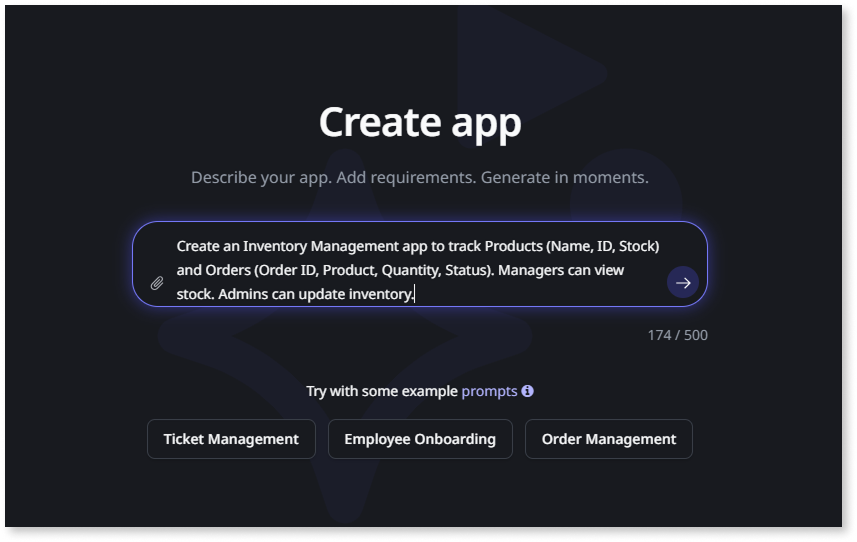
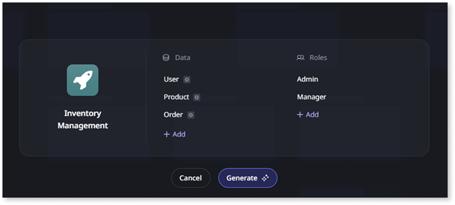
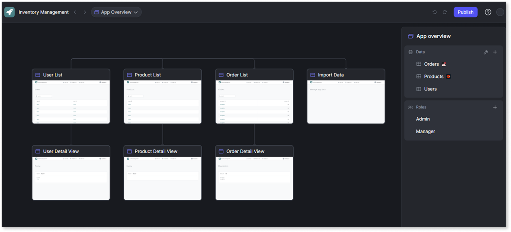
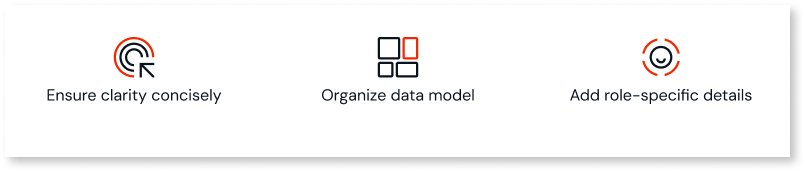
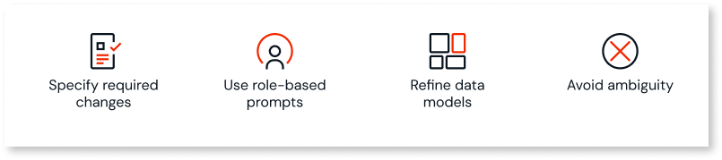

# About Mentor App Generator and Editor

OutSystems Mentor is a suite of GenAI capabilities that accelerates the application development lifecycle. Mentor addresses common challenges such as time-consuming prototyping and converting requirements into functional code.

The **Mentor App Generator** transforms ideas into an OutSystems application. The App Generator uses natural language prompts or requirement documents and grounds its suggestions with your existing enterprise data for contextual relevance.

The **Mentor App Editor** helps you visually iterate on the generated application using AI-powered suggestions. For supported patterns, the App Editor is bi-directionally interoperable with ODC Studio, providing a workflow from initial idea to deployment. Supported patterns will expand over time.

OutSystems Mentor App Generator and App Editor accelerate app creation while maintaining development standards. Benefits include:

* Creates initial designs and validates app prototypes quickly
* Converts product requirements into functional code, data models, business logic, and UI
* Streamlines early-stage app work so teams can focus on higher-value tasks instead of repetitive coding

## Getting started with AI Mentor

OutSystems Mentor starts from your natural language description instead of blank screens and configuration steps. Mentor interprets your requirements and generates an app with data models, user interfaces, security roles, and business logic. After generation, refine the app through the visual App Editor or enhance it further in ODC Studio. This approach helps you move from concept to working prototype while focusing on what the application should accomplish rather than technical complexities.

This functionality uses the Data Platform, which may process data outside your ODC organization region. For more information, see [Data Platform](../../manage-platform-app-lifecycle/platform-architecture/intro.md#data-platform).

To create an app with AI Mentor:

1. Go to **Portal** > **Apps** > **Create** > **Web app** > **Generate with Mentor**.
1. In the **Create app** screen, enter your prompt or upload your requirements file, or select an example prompt. Confirm to view the suggested data and roles.

    

1. Edit the data model and roles if needed. Click **Generate** to create the app and open it in the App Editor.

    

1. Use the App Editor to fine-tune the app with prompts. When the app meets your needs, click **Publish**.

    

## How Mentor works

These core concepts describe how Mentor works.

### From prompt to application

Mentor turns a prompt or document into an OutSystems app through three stages:

1. **Prompt or document input**: Provide application requirements using natural language or a document.  
1. **Model generation**: Mentor generates and modifies the OutSystems Model, a high-level abstraction of the application.  
1. **Code compilation**: The OutSystems compiler generates application code that meets security, performance, and architecture standards.

## Capabilities and patterns

Mentor recognizes and generates several application components and patterns.

### Mentor App Generator

The App Generator applies patterns to build an application from your initial input.

* **Data integration**: Integrates with Data Fabric and public entities with read/write support  
* **Entity editing**: Edit entities before generation by adding, changing, or removing suggested entities  
* **Predefined roles**: Includes a predefined set of roles that you can modify before generation  
* **Authorization rules**: Supports medium-complexity rules related to the logged-in user, such as viewing or editing their own records or records associated with their team or department. Also supports entity-level authorization controlling which entities can be read or edited by available roles  
* **Static entity detection**: Detects static entities and related records and displays them as tags in the UI for status or task management use cases  
* **Dashboard generation**: Respects instructions about including a dashboard, assigns section titles, and selects a table, gallery, or chart  
* **Data management**: Download existing data or upload new data to replace sample data  
* **UI generation and themes**: Randomly assigns a header color (white or primary) and applies a specified public theme if referenced in the prompt or requirements document  
* **Context-aware screen layouts**: Generates layouts based on data context (for example, a list with map view for entities containing addresses, or a card layout for personal attributes)  
* **AI-suggested icons**: Suggests and applies Font Awesome icons for each menu item and the app logo

### Mentor App Editor

After an app is generated, the App Editor provides tools and AI-powered suggestions to refine and evolve it.

The following high-level changes suggested in the App Editor can affect multiple areas of the app. Colored indicators show where changes apply.

* **AI-powered suggestions**: Analyzes the app and suggests adding entities, modifying attributes, adjusting security roles, and changing static entity enumerations. Supports complex structures, including many-to-many relationships, and can mix local and external entities  
* **Entity management**: Add or delete entities and attributes. AI generates attributes (including static entities or records), screens, menu items, and relationships  
* **Security adjustments**: Add and delete roles and adjust logged-in user authorizations  
* **Data model refinements**: Add new attributes to existing entities  
* **Business logic**: Add actions or workflows through prompts  
* **WYSIWYG refinement**: Explore screens and data models. Applied suggestions appear immediately in screen previews with sample data  
* **Bi-directional interoperability with ODC Studio**: For supported patterns, switch to ODC Studio for advanced development. Changes sync back to the App Editor. Supported patterns will expand over time  
* **Centralized authorization management**: Manage authorization levels for individual entities in a dedicated panel  
* **Direct app customization**: Customize the app name and icon within the editor

**Current limitations:** Suggestions only support **add** operations. **Change** and **rename** operations aren't yet supported.

## Best practices

Follow these best practices for input to get accurate and relevant results from the Mentor App Generator.

AI Mentor is designed to support English. You can enter prompts and requirement documents in other languages, but for the most accurate results, English is recommended.

### Natural language prompts

When providing a text prompt, clarity and structure help produce better results.

* **Be clear and concise**: Include the app name, purpose, and main functionality in one to two sentences  
    * Example: Create an Employee Onboarding app that tracks employee details, onboarding steps, and status. It should have list and edit screens and roles for HR and Managers.
* **Structure the data model**: Mention entities and attributes if you know them  
    * Example: The app should have entities for Employees (Name, ID, Department, Role) and Onboarding Steps (Step Name, Status, Due Date).
* **Add role-specific details**: Mention roles and permissions if you know them  
    * Example: Managers can update onboarding steps. HR can add and edit employee records.
* **Include styling preferences**: Mention themes, colors, or visual requirements  
    * Example: The app should use the "Corporate" theme with blue primary color and display data in card format.
* **Specify data sources and integrations**: Mention external systems or data sources when relevant  
    * Example: Customer data comes from Salesforce and product information from SAP.

Example prompt following these practices:

"Create an Inventory Management app to track Products (Name, ID, Stock) and Orders (Order ID, Product, Quantity, Status). Managers can view stock. Administrators can update inventory. Use the 'Professional' theme available in the tenant. Integrate customer data from Salesforce and product catalog from SAP."

### Requirement document

For more complex applications, a structured requirement document can define needs more clearly.

* **Use supported formats**: Supported formats: `.txt`, `.docx`, `.pdf` (max 5 MB)  
* **Organize requirements logically**: Separate sections for purpose, entities and attributes, and roles and permissions  
* **Include application settings and themes**: Specify styling requirements, themes, or branding  
    * Example: "The application must use the 'Mentor' theme available in the ODC tenant."
* **Specify external system integrations**: Identify data sources and external systems  
    * Example: "Customer data is sourced from Salesforce" or "Documents use DocuSign integration."
* **Avoid excessive detail**: Focus on functional requirements, not implementation details  
* **Avoid irrelevant content**: Omit screenshots or tables; they aren't processed and may hamper generation

Sample requirement documents:

* [Employee Onboarding Requirements Document](resources/employee-onboarding-requirements.docx): HR application example covering employee data management, onboarding workflows, and role-based access for HR teams and managers
* [Order Management System Requirements Document](resources/order-management-system-requirements.docx): E-commerce example including order processing, customer management, product catalog integration, and multi-role permissions
* [IT Service Management Requirements Document](resources/it-service-management-requirements.docx): Help desk example covering ticket management, comment systems, role-based access, and status tracking workflows

## Mentor App Editor best practices

Follow these practices for effective keyword prompting:

* **Be specific about changes**: Use short prompts to add data  
    * Example: Add validation rules to the email field
* **Use role-based prompts**: Include roles explicitly to enhance security  
    * Example: Add a new role: Manager
* **Focus on data model refinements**: Specify exactly what to add  
    * Example: Add salary to Employee
* **Avoid ambiguity**: Avoid vague prompts such as "Make the app better"  
    * Example: Instead of "improve the app," use "add email validation to the contact form"

## Security and data privacy

Mentor is designed with security and data handling policies to protect applications and data.

* **Model-driven generation**: AI modifies the OutSystems Model, not raw code. The OutSystems compiler generates code that meets established standards  
* **Data privacy**: Prompts and requirement documents are isolated and not used to train third-party models. Data is encrypted with tenant-specific keys  
* **Compliance**: The platform is SOC 2 compliant and adheres to GDPR standards

For technical limitations, see [OutSystems system requirements for ODC](../../getting-started/system-requirements.md#ai-mentor).
