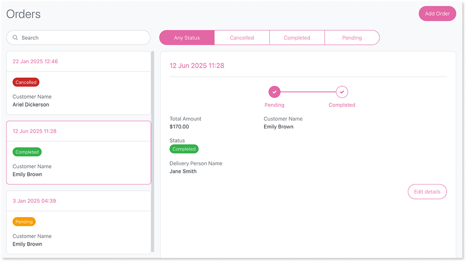

# Prompting guide

Use this guide to compose clear prompts for layouts and UI patterns Mentor can generate or refine. It covers general best practices for interacting with Mentor and provides a cookbook of specific UI patterns.

Mentor is designed to support English. You can enter prompts and requirement documents in other languages, but English is recommended.

## Natural language prompts

When providing a text prompt to the App Generator, use clear and structured language.

* **Be clear and concise**: Include the app name, purpose, and main functionality in one to two sentences  
    * Example: Create an Employee Onboarding app that tracks employee details, onboarding steps, and status. It should have list and edit screens and roles for HR and Managers.
* **Structure the data model**: Mention entities and attributes if you know them  
    * Example: The app should have entities for Employees (Name, ID, Department, Role) and Onboarding Steps (Step Name, Status, Due Date).
* **Add role-specific details**: Mention roles and permissions if you know them  
    * Example: Managers can update onboarding steps. HR can add and edit employee records.
* **Include styling preferences**: Mention themes, colors, or visual requirements  
    * Example: The app should use the "Corporate" theme with blue primary color and display data in card format.
* **Specify data sources and integrations**: Mention external systems or data sources when relevant  
    * Example: Customer data comes from Salesforce and product information from SAP.

Example prompt following these practices:

"Create an Inventory Management app to track Products (Name, ID, Stock) and Orders (Order ID, Product, Quantity, Status). Managers can view stock. Administrators can update inventory. Use the 'Professional' theme available in the tenant. Integrate customer data from Salesforce and product catalog from SAP."

## App Editor prompt best practices

Follow these practices when using keyword prompts in the App Editor:

* **Be specific about changes**: Use short prompts to add data  
    * Example: Add validation rules to the email field
* **Use role-based prompts**: Include roles explicitly to enhance security  
    * Example: Add a new role: Manager
* **Focus on data model refinements**: Specify exactly what to add  
    * Example: Add salary to Employee
* **Avoid ambiguity**: Avoid vague prompts such as "Make the app better"  
    * Example: Instead of "improve the app," use "add email validation to the contact form"

### Data model prompt examples

Use these prompts to manage entities and attributes:

* **Add entity**: Add entity "TicketStatus" to my app data
* **Add external entity**: Add entity "Customer" from the "Customers" Salesforce connection
* **Delete entity**: Delete the entity "TicketComment"
* **Add attribute**: Add attribute "priority" to my "SupportTickets" entity
* **Delete attribute**: Delete the attribute "priority"

### Authorization prompt examples

Use these prompts to manage roles and permissions:

* **Add role**: Add a role called Status Manager
* **Delete role**: Delete the role "Staff"
* **Edit permissions**: Remove access from the "viewer" role to the "Task" data and related screens

## Prompts cookbook

The cookbook section focuses on UI expression: turning layout intent, entity structure, static values, roles, and refinement steps into model updates. Mentor interprets pattern keywords (table, card list, master detail, map), associates them with the entities and attributes you mention, and updates screens without raw code. Use incremental refinement prompts over broad restatements.

### Use this cookbook

This guide covers three areas:

* **Pick an appropriate pattern** - Use the Pattern selection quick guide to match your data and use case.
* **Combine layout intent with entities, roles, and actions** - Structure prompts with specific details rather than vague descriptions.
* **Iterate with refinement prompts** - Add or adjust features incrementally instead of regenerating from scratch.

Pattern names are recognized flexibly. You can say "card list" or "cards list". Focus on intent and data.

### Select a pattern

Use this table to choose a UI pattern based on your dataset shape, visual emphasis, and refinement needs.

| Pattern | Use for | Avoid when | Common refinements |
| --------- | --------- | ------------ | -------------------- |
| Dashboard | High-level KPIs, metrics summary, and data visualization | Detailed record editing or browsing individual items | Add counter with aggregation function, add chart type, adjust column layout |
| Table | Dense tabular comparison; many columns | Visual summaries; mobile layouts | Add calculated column |
| Card list | Visual scanning of records with key attributes | Wide column comparison | Add tags, actions on each card |
| Gallery | Image-centric content (products, media) | Text-heavy data | Add category filter |
| Master detail | Browse and inspect a record (max 5 attributes in table view) | Very small datasets; entities with dependents | Add tabs, related lists, switch to card list for more attributes |
| List with popup | Simple entities with 5 or fewer non-ID attributes | Entities with more than 5 attributes or dependent entities | Switch to table layout |
| List with map | Location context alongside list | No location data | Add clustering, status tags |

### How to structure prompts

Include the following when relevant:

* Entity or dataset name
* Fields to show (prioritize key ones)
* Actions or permissions
* Layout/pattern keyword
* Optional: tabs, status tags, map usage, theme

Avoid vague phrases like "make it nicer". Be explicit about the change.

### Understand pattern constraints

Mentor enforces constraints based on entity structure and relationships. Patterns convert automatically when constraints apply.

* **Popup pattern**: Available only for entities with 5 or fewer non-ID attributes. Entities exceeding this limit convert to table pattern
* **Master detail with table**: Limited to 5 attributes in the list portion. For more attributes, use card list or gallery pattern
* **Map pattern**: List portion always uses vertical card list pattern
* **Dashboard lists**: Display maximum 5 records. Filters, pagination, and navigation to edit or view screens are not available
* **Entities with dependents**: Cannot use popup or master-detail patterns. Dependent entities are those with a single foreign key reference to the target entity

## Lists and tabular patterns

These patterns organize multiple records for browsing, comparison, or selection. Choose based on data density and visual emphasis needs.

### Table

Use when users need dense, side-by-side comparison of many records across consistent attributes.  
Avoid when you need strong visual emphasis, image-first layouts, or card metaphors.

#### Prompt progression

Start with basic prompts and add details as needed:

* Basic: List `Product` records in a table.
* Detailed: List `Product` records in a table with columns: `Name`, `SKU`, `Stock`, `Price`.

### Card list

Use when users should scan records as compact cards with a few key fields and tags, rather than compare many columns.

#### Prompt progression

* Basic: Show `Employee` records as a card list.
* Detailed: Show `Employee` records as a card list with `Name`, `Department`, `Role`, and a colored tag for `Status`.

### Card gallery

Use when you have image or media-heavy datasets.

#### Prompt progression

* Basic: Show `Product` records as a card gallery with image and `Name`.
* Detailed: Show `Product` records as a gallery with image, `Name`, a category tag, and `Price`.

### List with popup

Use when you have simple entities with 5 or fewer non-ID attributes and want to edit or view records without navigating to a separate screen.

The popup pattern displays edit and view screens within modal dialogs that overlay the list.

#### Prompt progression

* Basic: List `Task` records with popup for editing.
* Detailed: List `Task` records in a table. Selecting a record opens a popup with `Title`, `DueDate`, `Priority`, and `Status` for editing.

## Dashboard patterns

Use dashboards to display high-level KPIs, metrics, and data summaries for quick insights. Dashboards combine multiple visual elements to provide at-a-glance understanding of key business data.

Avoid when you need detailed record editing or browsing individual items.

### Supported patterns

* **Counters**: Highlight key metrics in a prominent visual format.
* **Charts**: Visualize data trends and distributions. Supported chart types include:
    * Vertical bar chart
    * Horizontal bar chart
    * Line chart
    * Pie chart
    * Donut chart
* **Lists**: Display top elements, most recent records, or latest items.

### Supported aggregation functions

Dashboards support the following aggregation functions on counters and charts:

* **Count**: Total number of records.
* **Sum**: Total of a numeric field across records.
* **Avg**: Average value of a numeric field.
* **Max**: Maximum value of a numeric field.
* **Min**: Minimum value of a numeric field.

### Column layouts

Dashboards support multiple column arrangements:

* **Equal columns**: 2 to 6 columns with equal width for symmetrical layouts
* **Asymmetric layouts**: 2:1 ratio (two-thirds and one-third) or 3:1 ratio (three-quarters and one-quarter). The narrow column cannot contain list sections
* **Row structure**: Each section element creates a new row unless wrapped in a column layout

#### Prompt progression

* Basic: Create a dashboard with total orders counter.
* Better: Create a dashboard with a counter for total orders (Count), a vertical bar chart for sales by month (Sum of `OrderValue`), and recent orders list.
* Advanced: Add a pie chart showing order distribution by category (Count of `Order` grouped by `Category`).

## Master detail and in-place detail patterns

These patterns let users browse a list and view or edit record details simultaneously. Choose based on screen space and editing frequency.

### Master detail

Use when browsing records and viewing details without navigating away from the list. When using table pattern for the list portion, limit to 5 attributes. For more attributes, use card list or gallery pattern.

#### Prompt progression

* Basic: Use a master detail layout for `Customer` records.
* Detailed: Master detail for `Customer` records with list on the left (`Name`, `Segment`) and right panel tabs: Profile, Orders, Notes.

### Card list with detail in sidebar

Use when you need frequent detail editing and the list context must remain.

#### Prompt progression

* Basic: Card list with detail in a sidebar for `Project` records.
* Detailed: Card list (`Name`, `Owner`, `Status` tag). Selecting a card opens a sidebar with `Description` and `DueDate`.

## Spatial patterns

These patterns add location context to help users make geography-based decisions.

### Card list with map

Use when location information supports decision making.

#### Prompt progression

* Basic: Card list with map for `FieldWorkOrder` records.
* Detailed: Card list with map for `WorkOrder` records (`Title`, `AssignedUser`, `Status` tag, `Address`). Map uses markers at `Address`.

## Multi-pattern scenarios

Combine multiple patterns in a single prompt to create complete app experiences. These examples show common pattern combinations.

### Asset tracking scenario

Initial prompt: Create an Asset Tracking app with a dashboard (total assets, assets needing maintenance), a card list with map for `Asset` records, and side menu.

### Customer management scenario

Initial prompt: Create a master detail layout for `Customer` records with tabs Profile, Orders, Tickets. Include a dashboard with total customers and open tickets.

## Refinement strategies

Use these approaches to adjust patterns or add functionality without starting over.

If you chose the wrong pattern, request a replacement: Change the current layout to a master detail layout for `Customer` records.

Mentor suggestions support add operations. To modify existing elements, rephrase changes as additions. Note: Filters, sorting controls, and search inputs require manual configuration. The navigation layout (horizontal or side) applies to your entire app.

## Related

* Learn about [Build apps with AI](intro.md).
