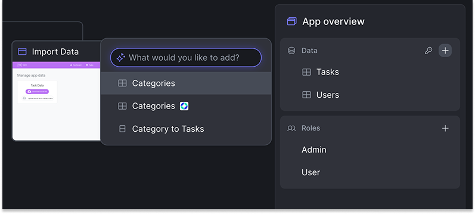

# Think with AI

Mentor requires a different mindset than traditional development tools. Instead of navigating menus and clicking through configuration screens, developers describe requirements in natural language, and the AI generates the structure. This shift from explicit control to conversational collaboration changes the approach to app creation.

## Understand the fundamental shift

Traditional development tools provide direct control. Developers click buttons to add entities, drag widgets onto screens, and configure each property through forms. The interface shows every available option, requiring explicit choices at each step.

AI-assisted development with Mentor inverts this model. Developers describe intent—"Create a customer management app with contact details and role-based access"—and Mentor interprets that description to generate the structure. Large Language Models (LLMs) power this capability by understanding natural language and mapping requirements to OutSystems development patterns.

This shift requires different thinking. Success depends on articulating requirements clearly rather than knowing where to click, and understanding recognized patterns rather than exploring options through menus. The tool functions as a partner that interprets and builds, rather than a canvas for direct control.

## Mentor fundamentals

Mentor uses LLMs to function as a specialized translator between natural language and OutSystems structures. When given a prompt or requirement document, the AI identifies patterns—entities, relationships, user roles, UI layouts—and translates them into the OutSystems Model.

The OutSystems Model is a high-level abstraction representing an app's structure, data, logic, and UI. Mentor works at this model level, not with raw code. After the model is generated or modified, the OutSystems compiler translates it into actual app code following platform standards for security, performance, and architecture.

Mentor is not a mind reader. It's a pattern-recognition system trained on development practices. The system interprets input based on learned patterns and generates structures accordingly. Clear descriptions that match recognized patterns produce accurate results. Vague descriptions or unfamiliar terms may lead to unexpected interpretations.

Mentor functions as an accelerator, not a replacement. The system handles repetitive scaffolding—creating entities, setting up screens, establishing basic authorization—enabling focus on unique requirements and complex logic that require human judgment. Advanced development needs require transitioning to ODC Studio while maintaining the foundation Mentor built.

## Partner with Mentor

Effective collaboration with Mentor requires understanding what each partner contributes. Developers provide clear specifications and intent. Mentor provides pattern application and structure generation. Success depends on effective communication.

**Be explicit.** Clear statements of requirements work best. Specify entities and attributes, define user roles and permissions, and describe UI patterns. The AI cannot infer unstated requirements or fill in missing details like a human colleague.

**Provide structure.** When the data model is known, define it upfront. Specify entity relationships explicitly—"Customer has many Orders (One-to-Many), Order has many Products (Many-to-Many)." Include static entities for status or category fields. More structure enables more accurate generation.

**Iterate incrementally.** Start with a foundation and refine through focused prompts. Make one change at a time and evaluate results before continuing. This approach works better with LLMs than attempting to specify everything perfectly upfront.

Common mistakes to avoid: treating the AI like a human colleague who infers context from conversation, expecting perfection in the first generation, or being either too vague ("make it nice") or overwhelming with detail in a single prompt.

Consider this contrast:

**Ineffective**: "Make a customer app"

**Effective**: "Create a customer management app with Customer entity (Name, Email, Phone, Company), card list view, Managers can edit all records, Sales Reps can view only"

The effective prompt specifies the data structure, UI pattern, and authorization rules, providing enough information to generate an accurate foundation.

## Adopt an iteration mindset

The generate → review → refine cycle is normal and expected when working with AI. LLMs interpret patterns probabilistically, meaning some variation in output is inherent to how they work. Refinement is part of the workflow, not a sign of failure.

Start with a foundation that establishes the core data model and main screens. Review what Mentor generated, checking whether entities, relationships, and layouts match the intent. Then refine incrementally through the App Editor, using focused prompts to adjust one aspect at a time—add an attribute, modify a role, change a layout.

The App Editor provides immediate visual feedback with sample data for evaluating each change before moving forward. This rapid iteration enables shaping the app toward requirements without writing code or navigating complex configuration screens.

Mentor App Editor excels at structural changes—entities, data models, roles, standard UI patterns. Custom business logic, complex aggregates, external system integrations, or performance optimization require transitioning to ODC Studio. For supported patterns, changes sync bi-directionally, providing flexibility to use the right tool for each task.

Success with AI-assisted development depends on understanding collaboration with a pattern-recognition system rather than instructing a traditional tool. Clear communication, structured thinking, and iterative refinement are core skills.

## Related

* [How Mentor works](mentor.md) explains the three-stage generation process and how Mentor fits into ODC
* [Prompting guide](prompts.md) provides proven patterns for different UI layouts and data structures
* [Mentor in the software development lifecycle](sdlc.md) shows how AI-generated apps progress from initial creation through production deployment
