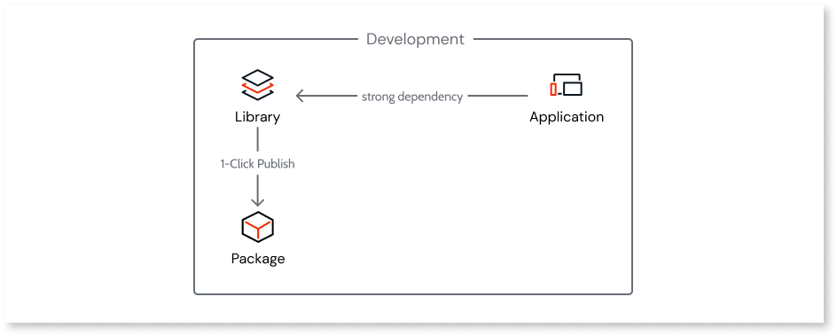

# App architecture

With OutSystems Developer Cloud (ODC), architects can design apps to solve business problems and automate business processes using a **cloud-native** approach to the architecture. In a cloud-native architecture, an app is decomposed into loosely coupled and independently deployable components or services.

In a cloud-native architecture, you can use a single app in ODC:

* To solve a specific business need with a single web or mobile user interface. 
* As a microservice, exposing APIs that other apps or teams can use.
* As a standalone component to asynchronously process data if you have a high-volume use case requiring autonomous scaling without impacting the business app.

Apps scale independently, which reduces the time and cost associated with scaling all your apps. Independent app scaling is very useful, for example, when a single feature has a high load. It also helps to ensure life-cycle independence among teams.

## Apps in ODC

In ODC you can only have weak dependencies between apps. You create weak dependencies in an app by:

* Consuming service actions or entities from another app. For example, a service action from another app to read or write data in the database.
* Consuming  data from another app using public entities.

When you publish an app, the runtime is packaged into a container.

### Containers

A container packages the code and all an app's dependencies so you can quickly and reliably deploy it.

The runtime of each app is loosely coupled. Consuming services from other apps increases the app's life-cycle independence.

Containerization makes your apps highly scalable. Apps scale requests and users in an automated and transparent way. The app's database is also highly scalable. To learn more [click here](../../architecture/intro.md#auto-scaling-1).

## Libraries in ODC { #libraries}

Libraries let you share code between apps. Libraries work similarly to packages such as NuGet in .NET or npm in JavaScript. Libraries keep the elements centralized, reducing maintenance cost and promoting ownership.

Apps can reference libraries, and libraries can also reference other libraries. This creates a strong dependency. This means that if something in a library changes and an app is consuming it can have an impact that leads to breaking changes.

Libraries are packaged with apps when an app is published, and each app consumes library packages and a library version in its container.

Versioning of libraries enables systematic updates and integration of your library's elements into apps and other libraries within your organization.

Learn more about the fundamentals of libraries and how versioning works in the [Libraries](../libraries.md#libraries-versioning) article.

## How apps work with libraries

Apps can consume libraries through strong dependencies, which are packaged when published.

The packaged library is included in the generated container when you publish an app.

The container image is reused as you advance an app's deployment from Development to QA or QA to Production. Each stage's configurations are applied to the deployment process.

Apps hold all the configuration values, even those implemented at the consumed libraries level. This enables developers to set different configurations for each stage.

Are you planning to build your first app? See recommendations for [building a well-architected app](recommended-architecture.md).
