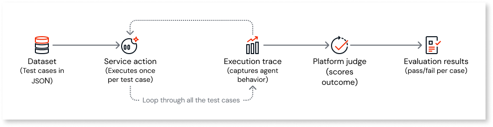

# Agent evaluations

**Agent evaluations** run a **service action** against a fixed set of test cases from a **dataset**, capture an **execution trace** for each case, and score outcomes with the **platform judge**. The main benefit is repeatability: after you change prompts, tools, or grounding logic, you can run the same benchmark again and see which cases still pass, which fail, and how scores moved without re-evaluating every scenario by hand.

You exercise the full path where **system prompts** and **grounding** are built inside logic (not typed into the dataset), so each run reflects how your agent behaves for that service action.

## Prerequisites

Before you can run evaluations against your target agentic apps, they must be republished at least once after agent evaluations are enabled for your organization.

## Data retention

The platform keeps **evaluation summaries** (total test cases, overall evaluation score, score from each judge criterion, and similar metadata) indefinitely. **Evaluation details** (per-test-case pass/fail results, agent actual input and output, judge rationale for each test case, and similar granular data) are retained for **30 days** and then automatically removed.

## The black box methodology

OutSystems uses a **black box** methodology for agent evaluations. In this approach, the evaluation targets a service action as the executable unit. That service action wraps everything the run needs: logic that builds the **system prompt**, **grounding data**, the **agent** element, and **tool** definitions. Prompts usually live in actions inside that flow. Changing them updates the same service action you evaluate rather than the dataset.

Because the platform treats the **service action** as a black box, it measures run inputs and outputs (and the trace they produce), not every intermediate step inside the flow. You still get full detail inside the **execution trace** after the run so you can debug tools, tokens, and messages.

## How an evaluation run works

An evaluation run moves from the **dataset** through the **service action**, into a captured trace, through scoring, and into per-case results you can compare across runs.

### Dataset

You upload a **dataset** as JSON. Each row is a **test case**: inputs that map to your service action interface, plus **expected** references the judge uses (for example, expected final output and expected tool calls). For more information about authoring JSON and uploading it, refer to [Construct the dataset](construct-dataset.md).

### Service action

The run executes your service action once per test case. That action already holds how the **system prompt** and **grounding** are built, how the **agent** is called, and which **tools** are in scope. The dataset does not inject prompts. It supplies inputs and expected references. The run uses the same service action entry point your application calls, so behavior matches what you deploy for that action.

### Execution trace

For every test case, the platform captures an **execution trace**. It records what actually happened: **agent inputs** (resolved **system prompt** and **user message**), each **tool** call with arguments and count, **token** usage, **final output**, and **guardrail** activity when guardrails are enabled. That trace is what you inspect when a case fails or when you're tuning cost and latency.

### Platform judge

After execution, the **platform judge** scores the trace and outputs against your dataset. It applies the **judge criteria** your organization configured for that run (for example, how strictly outputs must match expectations and how tool use is validated). You don't supply a separate LLM as the judge; scoring runs automatically on every evaluation. For more information about judge criteria, refer to [Run your first evaluation](run-your-first-evaluation.md#judge-criteria).

### Evaluation results

Each evaluation run records, for every test case, a **pass** or **fail** outcome, a **quality score** when the judge supplies one, the **full trace** (tools, tokens, latency), and run history so you can **compare runs** before and after a change. For more information about starting a run and opening results, refer to [Run your first evaluation](run-your-first-evaluation.md#review-evaluation-results).

## Benefits

* **Regression signal**: One run covers every row in the dataset, so a prompt or tool change surfaces all affected cases in one place instead of ad hoc manual checks.
* **Less time to diagnose**: The **execution trace** ties a failure to concrete tool calls, arguments, and model inputs, which narrows what to change in logic or expectations.
* **Comparable history**: Stored runs and scores give you a record of how the same benchmark behaved after each publish or experiment.

## Example: Regression evaluating

A developer changes the **system prompt** on a **service action** that handles customer email. They keep a dataset of fifty representative messages. After the change, they run an evaluation: forty-seven cases pass and three fail because the agent mixes up refund and exchange intent. They adjust the prompt, re-run until those cases pass, then continue with their release process.
