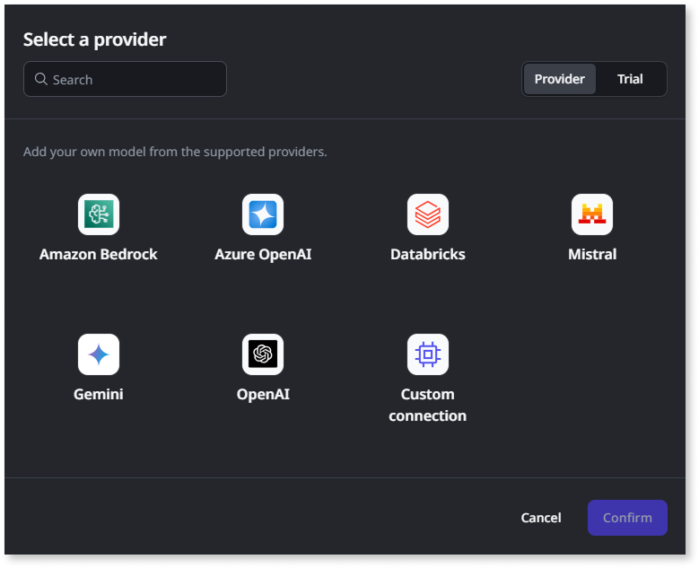
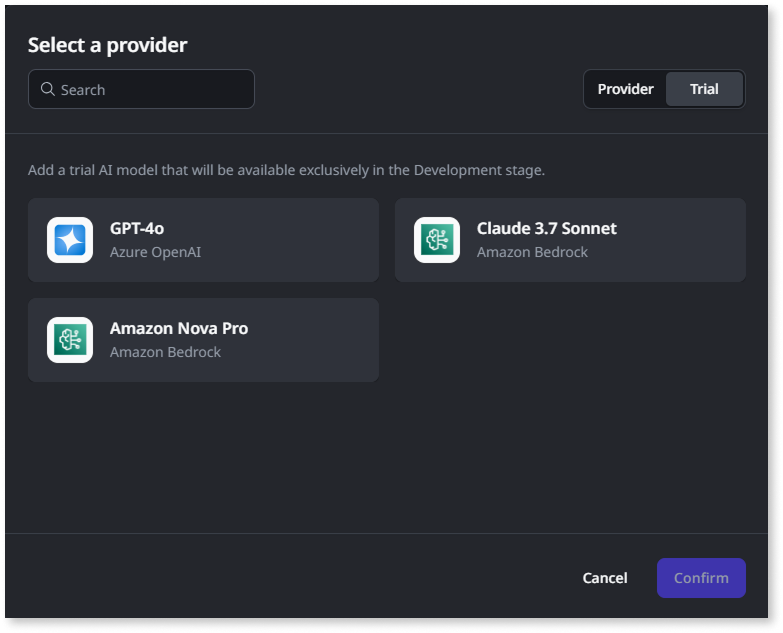

# Adding AI models

ODC lets you connect your OutSystems apps to external large language models, often called LLMs, from various providers or use pre-configured ODC trial models for experimentation. This enables you to integrate AI capabilities directly into your app.

## Supported providers and ODC trial models

ODC supports connections to AI models from multiple providers, offering flexibility in choosing the right model for your use case:

**Natively supported providers:**

* **Amazon Bedrock** - Compatible with the [Bedrock Converse API](https://docs.aws.amazon.com/bedrock/latest/userguide/conversation-inference-supported-models-features.html)
* **Azure OpenAI** - Microsoft's OpenAI service
* **Databricks** - AI models from Databricks platform
* **Gemini** - Google's AI models
* **Mistral** - Mistral AI models
* **OpenAI** - Direct OpenAI API integration

**Custom connections:**

Using the [ODC API contract](ai-models.md#custom-model-connections), you can add connections to your provisioned models through **Custom connections**. This allows you to integrate with LLMs from various providers or your own private models that are not natively supported by ODC.

**ODC trial models:**

For quick testing and exploration in the development stage, ODC provides ready-to-use trial models. These include GPT-4o via Azure OpenAI and Claude 3.7 Sonnet via Amazon Bedrock. Trial models via Azure OpenAI allow only 100 calls per tenant while trial models via Amazon Bedrock allow up to 1000 and serve for initial evaluation before you set up your own configured connection.

## Prerequisites

Before adding a configured connection to your model provider:

* Set up, deploy, and ensure the external AI service is accessible on the provider's platform. Note that an administrator or DevOps team typically performs this external setup, which is not covered here.
* Obtain the necessary access credentials and details the specific provider requires, such as API keys, endpoint URLs, deployment names, model IDs, and access or secret keys. Refer to the [AI model parameters](#ai-model-parameters) section below for details.
* Ensure you have the required permissions within ODC to manage AI models. Note that managing AI models utilizes the same permissions as managing connections within the ODC Portal.

These prerequisites don't apply when adding an ODC trial model.

## Add AI models { #add-ai-models }

Follow these steps to add an AI model connection or an ODC trial model in the ODC Portal:

1. Navigate to the **INTEGRATE** > **AI models** section.

1. Click **Add AI model**. The **Add AI model** dialog opens.

1. Choose the type of model you want to add by selecting the appropriate tab:
    * **Provider tab**: Select this tab to configure your own AI model from a supported provider or a custom connection.

    

    * **Trial tab**: Select this tab to add a ready-to-use ODC trial model, for example, GPT or Claude Sonnet.

    

1. **For Provider tab**: Select your desired provider from the available options and click **Confirm** to proceed to the configuration details.

1. **For Trial tab**: Select your desired trial model and click **Confirm**. ODC adds the trial model directly to your list, completing the setup. You can skip the remaining steps for trial models.

1. **For configured provider models only**: On the model configuration page that appears, enter a unique **Name** and an optional **Description** for this AI model connection.

1. **For configured provider models only**: In the **Endpoints** section, click **+ Add** to open the **Add endpoint** dialog.
  

1. **For configured provider models only**: Enter the required endpoint details for the provider you selected. Set the **Priority** for this endpoint. For details about the fields, refer to the [AI model parameters](#ai-model-parameters) section. Click **Save**.
  

1. **For configured provider models only**: Optionally, add more endpoints if you have them available for different stages, such as development and production. More endpoints also enable load balancing. Ensure all endpoints under one connection use the same underlying AI model and version.

1. **For configured provider models only**: Optionally, in the **Usage limit** section, set a daily token limit to control the model consumption.

1. **For configured provider models only**: If you added multiple endpoints, adjust their priority order on the main model configuration page using the edit icon next to each endpoint.

1. **For configured provider models only**: Click **Save** to confirm.

After you complete the steps, ODC redirects you to the main AI models page. You can now use the newly added model connection or ODC trial model within your apps in ODC Studio.

## AI model parameters { #ai-model-parameters }

Use the following parameters when configuring endpoints for the supported AI model providers in the ODC Portal. The specific parameters required will depend on the provider you choose.

### Azure OpenAI parameters

Use the following parameters when configuring Azure OpenAI model endpoints.

| Parameter | Description | Notes |
| :---- | :---- | :---- |
| Name | User-defined, identifiable name for the endpoint instance. | Differentiates between multiple endpoints for the same Azure OpenAI model connection. |
| Deployment name | The name of your model deployment within the Azure OpenAI service. | Obtain from the Azure portal. |
| API key | The authentication key required to access the Azure OpenAI service. | Obtain from the Azure portal. Treat this securely. |
| URL | The endpoint URL for the Azure OpenAI service. | Obtain from the Azure portal. |
| Priority | Determines the order of endpoints, with one being the highest. Lower-priority endpoints act as fallbacks. | You can adjust priorities if multiple endpoints exist. |

### Amazon Bedrock parameters

Use these parameters when configuring Amazon Bedrock model endpoints.

| Parameter | Description | Notes |
| :---- | :---- | :---- |
| Name | User-defined, identifiable name for the endpoint instance. | Differentiates between multiple endpoints for the same Bedrock model connection. |
| Model ID | The unique identifier for the specific Amazon Bedrock foundation model or its Amazon Resource Name (ARN). | For example, anthropic.claude-3-sonnet-20240229-v1:0. Refer to [AWS documentation](https://docs.aws.amazon.com/bedrock/latest/userguide/models-supported.html) for model IDs. |
| Access key | The authentication access key ID for your AWS IAM user or role with permissions for Bedrock. | Obtain from the AWS console or security credentials. |
| Secret key | The secret access key associated with the Access key for AWS authentication. | Obtain from the AWS console or security credentials. Treat this securely. |
| URL | The Invoke URL for Amazon Bedrock. | Ensure the AWS region matches your model's region; the URL typically follows the format runtime.bedrock.\[aws-region\].amazonaws.com. |
| Priority | Determines the order of endpoints, with one being the highest. Lower-priority endpoints act as fallbacks. | ODC assigns Priority 1 to the first endpoint by default. You can adjust priorities if multiple endpoints exist. |

### Custom AI model parameters

Use these parameters when configuring custom connection AI models and their endpoints in the ODC Portal.

| Parameter   | Description | Notes |
| :---------- | :-------------------------------------- | :----------------------------------- |
| Name        | User-defined, identifiable name for the endpoint instance. |  Differentiates between multiple endpoints for the same custom AI model connection. |
| Model ID    | The identifier for the specific custom model being used. | |
| URL         | The endpoint URL for the custom AI service or model API.| Enter the base URL provided by the custom model service.                                                                                                                                           |
| Priority    | Determines the order endpoints are used where one is the highest. Lower-priority endpoints act as fallbacks. | The first endpoint added will be assigned Priority 1 by default. You can adjust priorities if multiple endpoints exist.                                                                             |
| Headers     | A set of HTTP headers required by the custom API (authentication, content type, etc.).  | For the endpoint dialog to add necessary key-value pairs (for example, `Content-Type`, `Authorization`). These are specific to the API you are connecting to.                         |

### Databricks parameters

Use these parameters when configuring Databricks AI model endpoints.

| Parameter | Description | Notes |
| :---- | :---- | :---- |
| Name | User-defined, identifiable name for the endpoint instance. | Differentiates between multiple endpoints for the same Databricks model connection. |
| Serving endpoint name | The identifier for the specific Databricks model being used. | Obtain from your Databricks workspace. |
| Personal access token (PAT) | The authentication token required to access the Databricks API. | Obtain from your Databricks workspace. Treat this securely. |
| URL | The endpoint URL for the Databricks model API. | Obtain from your Databricks workspace configuration. URL should follow this format: [Databricks instance name]/serving-endpoints|
| Priority | Determines the order of endpoints, with one being the highest. Lower-priority endpoints act as fallbacks. | You can adjust priorities if multiple endpoints exist. |

### Gemini parameters

Use these parameters when configuring Google Gemini model endpoints.

| Parameter | Description | Notes |
| :---- | :---- | :---- |
| Name | User-defined, identifiable name for the endpoint instance. | Differentiates between multiple endpoints for the same Gemini model connection. |
| Model ID | The identifier for the specific Gemini model being used. | For example, gemini-1.5-pro or gemini-1.5-flash. |
| API key | The authentication key required to access the Gemini API. | Obtain from Google AI Studio or Google Cloud Console. Treat this securely. |
| URL | The endpoint URL for the Gemini API. | Typically follows the format generativelanguage.googleapis.com. |
| Priority | Determines the order of endpoints, with one being the highest. Lower-priority endpoints act as fallbacks. | You can adjust priorities if multiple endpoints exist. |

### Mistral parameters

Use these parameters when configuring Mistral AI model endpoints.

| Parameter | Description | Notes |
| :---- | :---- | :---- |
| Name | User-defined, identifiable name for the endpoint instance. | Differentiates between multiple endpoints for the same Mistral connection. |
| Model ID | The identifier for the specific Mistral model being used. | For example, mistral-large-latest or mistral-small-latest. |
| API key | The authentication key required to access the Mistral API. | Obtain from your Mistral AI account. Treat this securely. |
| URL | The endpoint URL for the Mistral API. | Typically follows the format api.mistral.ai. |
| Priority | Determines the order of endpoints, with one being the highest. Lower-priority endpoints act as fallbacks. | You can adjust priorities if multiple endpoints exist. |

### OpenAI parameters

Use these parameters when configuring OpenAI model endpoints (direct OpenAI API, not Azure OpenAI).

| Parameter | Description | Notes |
| :---- | :---- | :---- |
| Name | User-defined, identifiable name for the endpoint instance. | Differentiates between multiple endpoints for the same OpenAI model connection. |
| Model ID | The identifier for the specific OpenAI model being used. | For example, gpt-4o, gpt-4-turbo, or gpt-3.5-turbo. |
| API key | The authentication key required to access the OpenAI API. | Obtain from your OpenAI account. Treat this securely. |
| URL | The endpoint URL for the OpenAI API. | Typically api.openai.com/v1. |
| Priority | Determines the order of endpoints, with one being the highest. Lower-priority endpoints act as fallbacks. | You can adjust priorities if multiple endpoints exist. |

## Next steps

[Integrating AI models and search services](integrate-ai-models-logic-rag.md)
