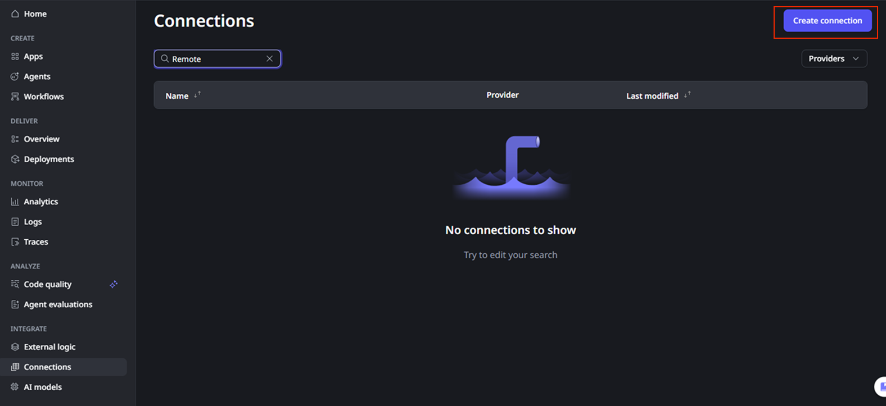
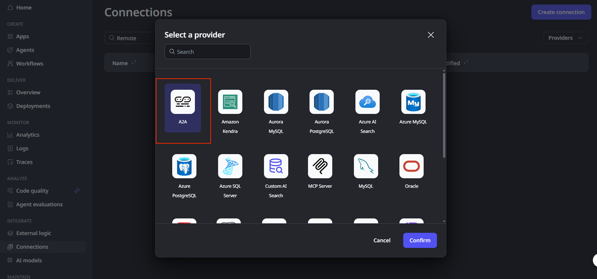
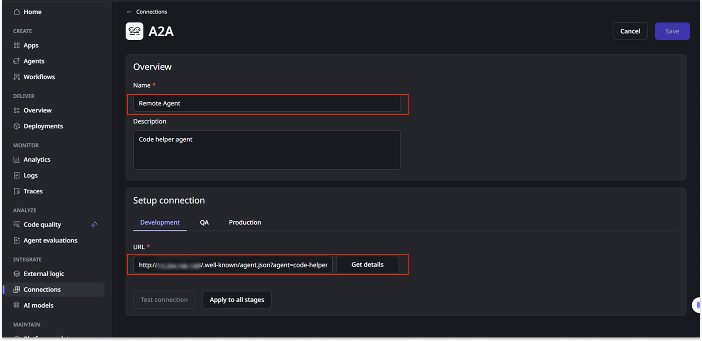
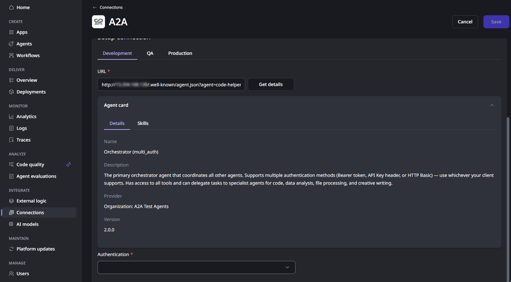
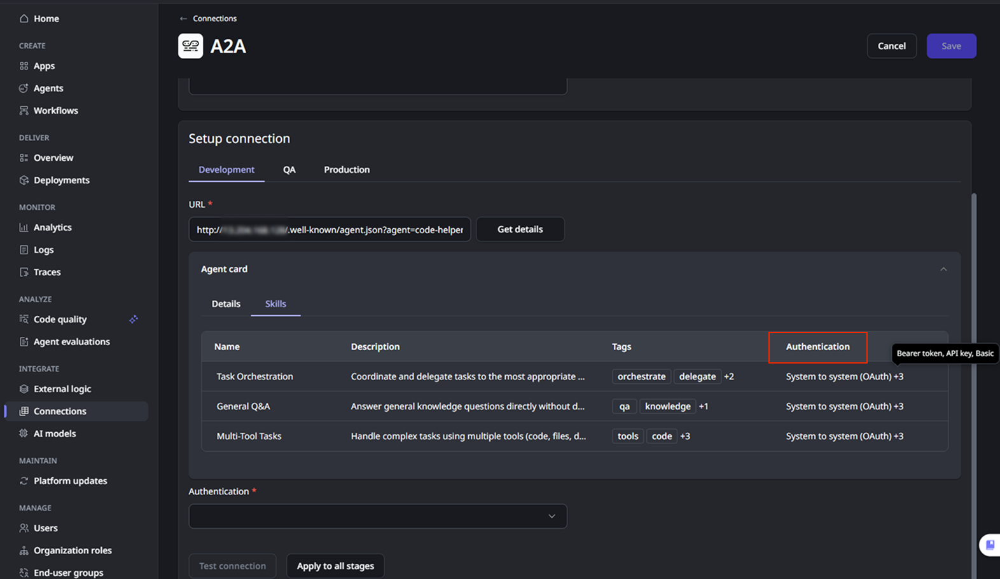
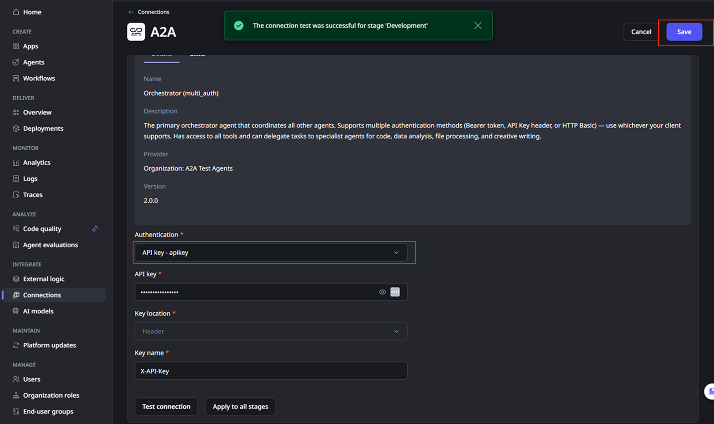
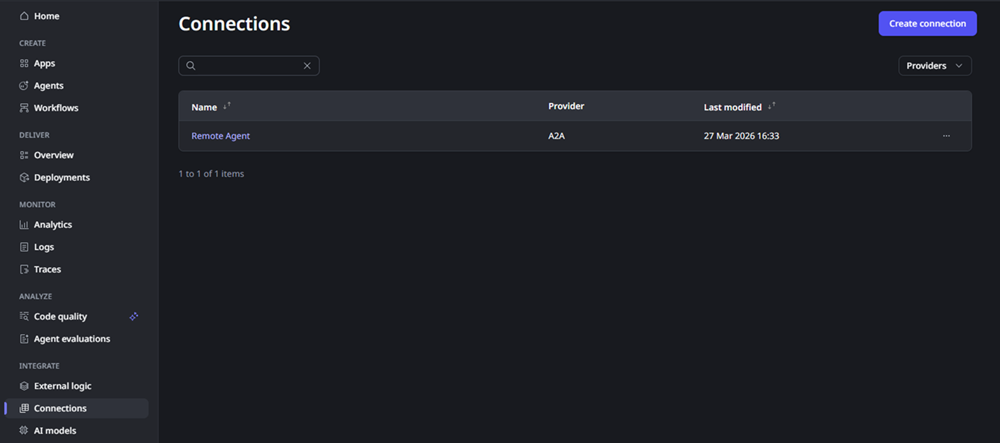
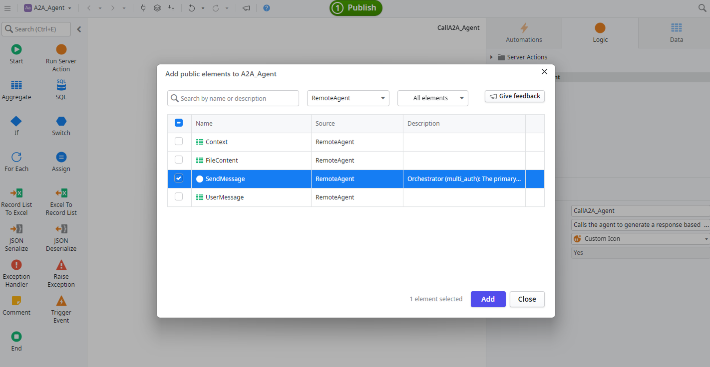
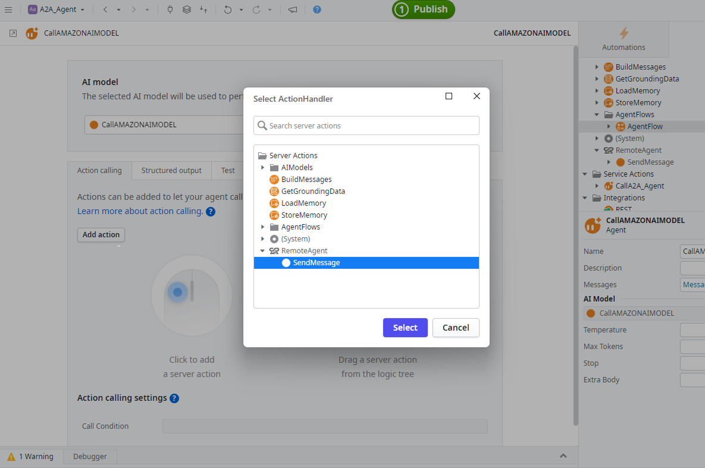
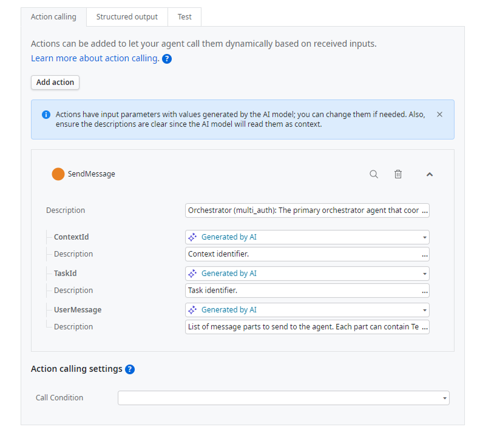

# Adding external agents in the ODC portal using A2A

This article provides a step-by-step guide on how to add connections to external agents in the ODC portal using the Agent-to-Agent (A2A) communication protocol. **Please note that ODC A2A connector supports only A2A 0.3.0 protocol version.**

To add connections to external agents in the ODC portal using A2A:

1. Go to the ODC portal and navigate to the **Integrate** section and select **Connections**.

    

1. Click on **Create connection** and select **A2A**.

    

1. Give a **Name** to your connection and provide the **URL** of the agent you want to connect to. This should be the base URL of the agent's A2A endpoint.

    

1. Click on **Get details** to fetch the agent card. The agent card is a JSON document that describes the agent's capabilities, skills, and how to interact with it.

    

1. Review the details to ensure they match your expectations and select the **Skills** tab to check the agent skills and authentication requirements.

    

1. Select the appropriate authentication mechanism from the drop-down and provide the necessary credentials or tokens as specified in the agent card. The supported authentication mechanisms are:

    * **System to System (OAuth)**. This mechanism requires a server token URL, a Client ID, and a Client Secret to obtain an access token for authenticating requests to the agent.

    * **Bearer token**. This mechanism requires a static token, included in the Authorization header of each request to the agent.

    * **API Key** This mechanism requires an API key, included in the request headers or query parameters as specified by the agent card and a Key name to identify the header or query parameter where the API key should be included.

    * **Basic.** This mechanism requires a username and password, encoded and included in the Authorization header of each request to the agent.

    

    Note that the dropdown shows both the OutSystems supported authentication methods and the authentication methods declared in the agent card. If the agent card declares an authentication method that is not currently supported by OutSystems, you won't be able to select it in the dropdown.

    

1. Once you have provided the necessary information and credentials, click on **Test connection** to establish the connection to the external agent.

1. If the connection is successful you can define the connection individually for the other stages of your tenant or  you can click **Apply to all stages** to propagate the connection to all stages in your tenant.

1. Then click on **Save** to save the connection.

    

1. The external agent is added to your connections lists and it's now available for use in your ODC applications and workflows, allowing you to leverage its capabilities through the A2A protocol.

    

If an agent card is updated, edit the connection, click **Get details** again, click **Test connection**, and then click **Save** to apply the updated agent card.

When you create the A2A connection, a `SendMessage` server action is automatically created for you to send messages to the remote agent. You can use this action in your ODC agentic apps to communicate with the remote agent and leverage its capabilities in your applications.
This server action's description comes from the remote agent-card JSON file. It should include the remote agent's name, description, and skills, so the ODC agent knows how to delegate requests to the right remote agent using this action as a tool.
A2A protocol support sending the message with multiple parts and each part can be of TextPart, FilePart, and DataPart types.

## Using an external agent in your ODC applications

To use the external agent in your ODC applications:

1. In your client agentic app add the `SendMessage` action from your A2A connection as a public element.

    

1. Inside your client agentic app logic flow, open the call Agent action.

1. Inside the call agent details, click **Add action** on the Action calling tab and select the SendMessage action from your A2A connection.

    

1. Then, provide the necessary input parameters for the SendMessage action, such as the Task ID, Message content, and any required metadata. The Task ID should be unique for each task you want to create with the remote agent.

    

## Guidance for agents that receive/send files

When working with agents that receive or send files, using the right model is crucial to ensure proper handling of file data. Make sure to test with different models to find the one that best suits your needs.

Also, it's recommend that you enrich the system message with clear instructions on how the agent should handle file inputs and outputs.
For example, add to the system message `Each UserMessage, must include exactly one of textContent, fileContent, or dataContent.`
