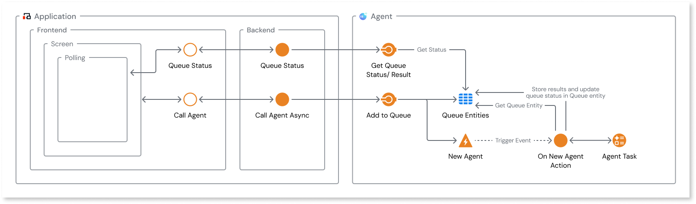

# Dealing with timeouts on AI agent calls

Sometimes when you create an agent you can get a timeout as the AI Model takes a long time to answer. This is common for very complex prompts, reasoning models and other scenarios where AI Models take a long time to reply.

To overcome this in ODC Agents you can:

1. raise the timeout limit of your agentic apps or actions.
1. for more complex cases, create logic that manage the AI agent responses.

## Raise the timeout limit of you Agentic apps or actions

A first measure you can do to mitigate timeout issues is increase the timeout time of your app or of your agent calls.

To do this:

1. In ODC Studio go to your [App Properties](https://success.outsystems.com/documentation/outsystems_developer_cloud/building_apps/libraries/edit_app_and_library_properties/#access-app-and-library-properties)

1. In the tab Properties define your **Server Request Timeout** property to **60** seconds.

1. Alternatively, when you use the Call Agent action, you can define the **Server Request Timeout** property to **60** seconds, individually on each action.

## Create logic to manage requests to AI models asynchronously

If you need to increase even further the time beyond the 60 seconds, you need to create logic to manage your calls to AI models asynchronously.

To do it, please follow the following diagram and instructions.

On your app side:

1. you need to create two client actions, one for your Agent call and another one to get your Agent call status and retrieve the answer when ready (polling).

1. These two actions call two different server actions. One to call the agent asynchronously, the other one to check the agent answer status.

On your Agentic app side:

1. you need to create a service action that creates an entry on a Queue entity, an entry on a Request entity and triggers an event with the queue Id of your agent call.

1. This event then:

    * Retrieves the queue entry by ID of your request from the Queue Entity
    * Updates the state of your request on the queue
    * Calls the Agent. Here you must create:
        * The agent message.  
        * The call to the AI Model.
        * An entity to store the response on an Entity.
    * Updates the status of your AI Model call.
    * Does the error handling in case there's any issue in your call.

1. Also, you need to create a second service action. This action reads the status of your call from the Queue entity and retrieves the status. Also, retrieves the response from the Response entity and sends it to your app.

1. Finally, you need to create a timer to create a job to clean up the Queue for the items that were already completed.

To see the details of this implementation, download the [Async Summarizer App sample](resources/AsyncSummarizerApp.oml), and the [Async Summarizer Agent sample](resources/AsyncSummarizerAgent.oml), or look for the same apps on your tenant Forge.

