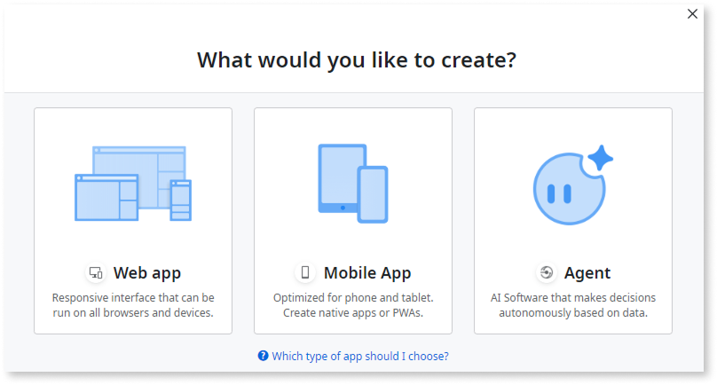

# Agentic apps in ODC

Agentic app creation is available through the Early Access Program. If you don’t see this option, apply [here](https://www.outsystems.com/low-code-platform/agentic-ai-workbench/eap-agent-workbench/).

In ODC Studio, you have the power to integrate AI capabilities into your apps directly using AI models or orchestrating them through AI agents. Understanding when to choose each approach helps build efficient and intelligent apps.

An **agentic app** is a type of app that uses AI agents to perform tasks, automate workflows, or engage in complex, multi-step interactions. Unlike traditional apps that primarily rely on direct user input, agentic apps act autonomously or semi-autonomously, making decisions and taking actions. They are the apps that consume the capabilities exposed by AI agents.

## AI models

In ODC, an AI model represents a pre-trained algorithm or deployed machine learning service, providing AI intelligence. You can directly invoke these models using a `Call<AIModelName>` Server Action in your app. For more information about AI models in ODC, refer to [AI models and search services in ODC](https://success.outsystems.com/documentation/outsystems_developer_cloud/building_apps/build_ai_powered_apps/ai_models_and_search_services_in_odc/). 

## AI agents

AI agents in ODC are a unique app type designed for autonomous, background operations rather than direct user interaction, and they lack a user interface. Building upon AI models, agents act as intelligent orchestrators, adding layers of autonomy and decision-making to your apps. An agent app serves as an intermediary, consuming AI model capabilities via a `Call<AIModelName>` Server Action and exposing its logic through a `Call<AgentName>` Service Action to an agentic app. For more information about AI agents, refer to [Build AI-powered apps](intro.md) 

### The relationship 

An AI model is a tool for specific AI tasks, while an AI agent is the architect that executes a series of tasks to achieve a larger goal. Agents provide the context and operational framework that transforms AI capabilities into practical, automated solutions within your ODC apps

## AI agent fundamentals

Some critical AI fundamentals come into play to ensure AI models within an agent operate effectively and align with your app's goals: **grounding**, **system prompts**, and **state persistence**. 

### Grounding { #grounding }

Grounding refers to providing an AI model with relevant, factual, real-world context and data specific to the task. AI models are powerful but generic. Without proper grounding, their responses might be abstract, irrelevant, or incorrect for your particular use case.

* **Why it's crucial for agents:** Agents often deal with dynamic, business-specific information. Grounding ensures that the AI model integrated into an agent operates within your app's data and rules. For instance, if an agent is processing customer orders, grounding would involve feeding the AI model details like current inventory levels, customer history, or specific product specifications.  
* **How it works in ODC agents:** In ODC, the `GetGroundingData` action (as part of the AgentTask logic) is specifically designed to retrieve and prepare this contextual information. This data then forms part of the input provided to the AI model, allowing it to make more informed and accurate decisions or generate more relevant outputs. For more information about the `GetGroundingData` action, refer to [Creating an AI agent in ODC Studio](create-agent.md).   
* **Benefits:** Grounding significantly improves the accuracy, relevance, and reliability of the AI model's outputs. It prevents the AI from providing generic responses by tethering its understanding to your app's reality.

### System Prompts { #system-prompts }

A system prompt, also known as a system instruction or system message, is a set of instructions or a persona given to an AI model at the beginning of a conversation or task. It defines the AI's role, behavior, constraints, and overall objective. Unlike user prompts, which are dynamic inputs from the user, the system prompt sets the foundational guidelines for the AI's responses.

* **Why it's crucial for agents:** Within an agent, a system prompt guides the AI model's reasoning and output generation to align with the agent's predefined purpose. For example, if an agent acts as a "customer support specialist," the system prompt instructs the AI to be helpful and only provide information from approved sources.  
* **How it works in ODC agents:** The `BuildMessages` action in an ODC agent's logic typically constructs the full prompt for the AI model, injecting the system prompt here. It sets the stage before adding any specific user input or task-related data. For more information about the `BuildMessages` action, refer to [Creating an AI agent in ODC Studio](create-agent.md).   
* **Benefits:** System prompts are essential for controlling the AI's tone, style, and scope of operation. They ensure that the AI model consistently performs its role as intended by the agent's design, preventing it from deviating into unintended behaviors or topics. This is vital for maintaining control and predictability over the agent's actions.

### State persistence { #state-persistance }

State persistence refers to the ability of an AI agent to retain and recall information from past interactions, decisions, or observations over time. Unlike single-shot AI model calls, which are stateless, memory allows an agent to build a continuous understanding of a situation, user, or ongoing process.

* **Why it's crucial for agents:** For an agent to perform complex, multi-step tasks or engage in extended interactions, it must remember what has occurred. Without memory, each interaction treats as an isolated event, leading to repetitive questions, incoherent responses, or an inability to complete processes that span multiple steps or sessions. Memory enables personalization, context retention, and learning over time for the agent.  
* **How it works in ODC agents:** In ODC, the `StoreMemory` action, a key component of the AgentTask logic, serves this purpose. This action allows developers to explicitly save relevant data, such as previous user queries, AI model outputs, intermediate decisions, or system states, that the agent might need to recall in future interactions or steps. You can then retrieve and integrate this stored memory into subsequent prompts or decision-making processes. For more information about the `StoreMemory` action, refer to [Creating an AI agent in ODC Studio](create-agent.md).  
* **Benefits:** Memory significantly enhances the agent's intelligence and utility by enabling it to:  
    * Maintain conversational context across multiple turns.  
    * Learn from past interactions to improve future performance.  
    * Execute multi-stage workflows without losing track of progress.  
    * Provide personalized experiences based on historical data.

By applying grounding, system prompts, and state persistence, ODC developers can use AI models within their agents, creating reliable and intelligent automation solutions.

## Next steps 

For more information about how to create an AI agent in ODC Studio, refer to [Creating an AI agent in ODC Studio](create-agent.md).
