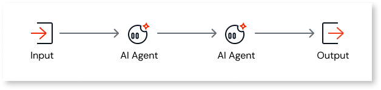
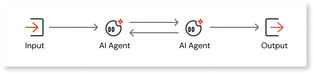
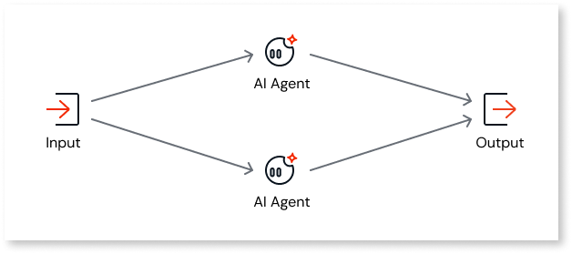
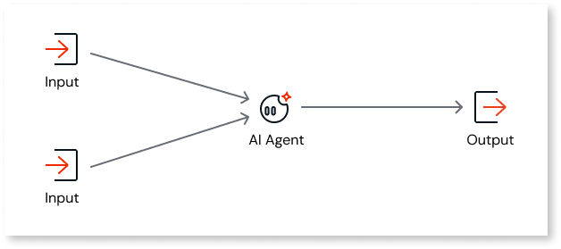
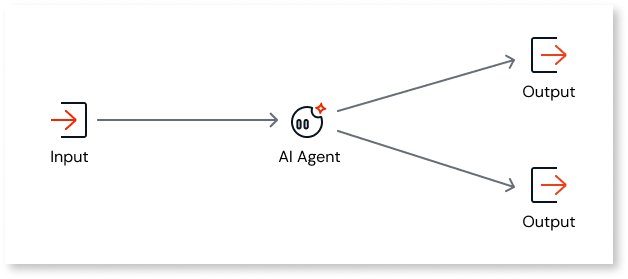
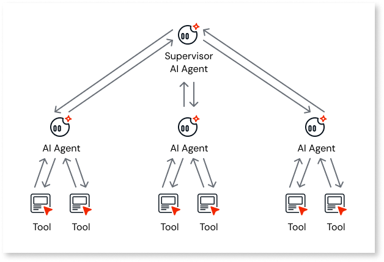
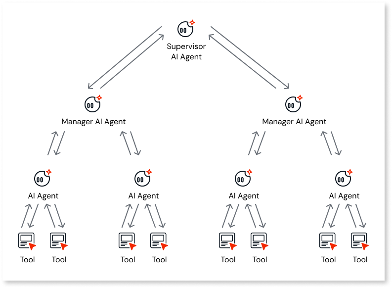
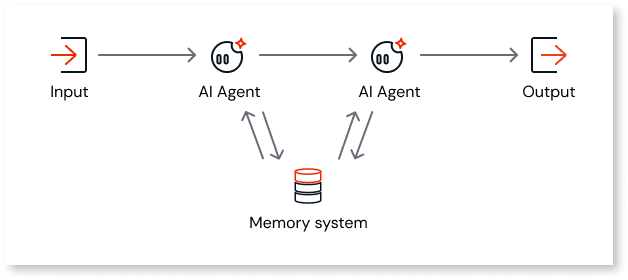
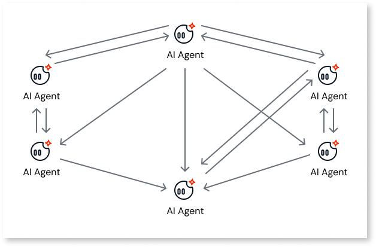
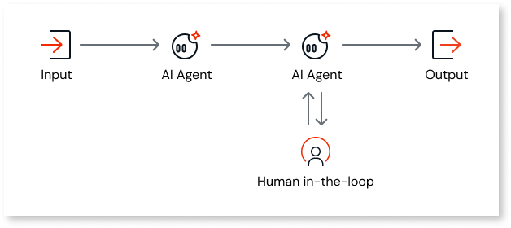

# Agentic patterns

Agentic patterns are structural blueprints for designing AI systems where multiple agents collaborate to achieve complex goals. These patterns help you organize specialized agents to handle tasks that require coordination, dynamic decomposition, and specific communication flows.

Understanding these patterns helps you choose the right architecture for your [agentic app in ODC](agentic-apps.md).

## Standard flow patterns

These patterns define the basic sequence and flow of tasks between agents.

### Sequential agent pattern

In a sequential pattern, a complex task is broken down into smaller steps, and a dedicated, specialized agent is assigned to handle each step in a specific order.

The output from one agent becomes the direct input for the next agent in the sequence. This pattern makes the system highly modular, as each agent is an expert at its specific job.

Use this pattern to automate a **New vendor contract review**, where data collection precedes legal review, and finally, a third agent assesses financial risk.

### Loop agent pattern

In a loop pattern, a team of specialized agents collaborates on a shared task or workspace, such as a document or plan. They interact in a continuous cycle of contribution and refinement.

This process follows these steps:

1. An agent makes an initial contribution to the shared context.
1. Other agents review, critique, add to, or modify that contribution based on their roles.
1. The loop continues until a termination condition is met, such as a manager's approval or a specific quality threshold.

Use this pattern for a **Report reviewer agent** that evaluates a generated contract report and loops back to improve the content until a confidence score of 90% is reached.

## Parallel and aggregation patterns

These patterns focus on efficiency and synthesizing information from multiple sources.

### Parallel agent pattern

The parallel agent pattern enables multiple agents to run concurrently, thereby speeding up processes. This pattern is ideal when a large workload can be broken down into independent sub-tasks that don't rely on each other.

This pattern typically works as follows:

1. A central **Dispatcher agent** breaks down the main problem.
1. The dispatcher assigns the independent segments to various specialized **Worker agents**.
1. The worker agents process these segments simultaneously.
1. An **Aggregator agent** gathers the individual results to assemble the final solution.

Use this pattern for processing a **Vendor contract** where **Legal**, **Financial**, and **Security agents** review the same document simultaneously to generate insights faster.

### Aggregator agent pattern

An aggregator agent gathers and consolidates information from multiple sources or other agents to produce a unified, single output. It acts as the opposite of a dispatcher because it collects rather than distributes.

The aggregator typically sits at the end of a parallel operation and follows this logic:

1. **Receive:** It waits for multiple worker agents to complete their individual tasks.
1. **Collect:** It gathers the individual pieces of information from each agent.
1. **Synthesize:** It applies logic to merge, rank, filter, and combine the pieces into a final response.

Use this pattern for a **Vendor report agent** that compiles separate legal, financial, and security reviews into a single comprehensive risk report.

## Routing and orchestration patterns

These patterns manage decision-making and control flow within the system.

### Router agent pattern

A router agent is a single agent that analyzes incoming requests to determine their intent. It then directs the request to the correct downstream agent or system best equipped to handle that specific task.

The router follows an analyze-and-delegate logic:

1. **Receive:** It accepts a query from the user.
1. **Classify intent:** It analyzes the query to understand the user's purpose. For example, "Is this a math problem?" or "Is this a request for data?"
1. **Route:** Based on the classification, it selects the most suitable specialist from a pool of available agents and forwards the request.

Use this pattern for an **Inquiry classifier agent** in customer support that analyzes incoming messages and routes them to either a **Policies agent** or an **Order shipment agent** based on the topic.

### Supervisor agent pattern

A supervisor agent serves as a central orchestrator, managing a complex process. Unlike a simple router, the supervisor is involved in the entire lifecycle of the task.

The supervisor performs the following actions:

* **Plan:** Analyzes a complex request and creates a sequence of steps.
* **Delegate:** Assigns each step to the best specialist worker agent.
* **Monitor:** Actively tracks the status of each worker to check for completion or failure.
* **Assemble:** Gathers the results once all steps are complete to produce the final output.

Use this pattern to orchestrate a multi-step **Onboarding workflow** where the supervisor ensures IT setup, HR documentation, and team introductions are all completed by their respective agents before finalizing the process.

### Hierarchical agent pattern

The hierarchical agent pattern is a scalable version of the supervisor pattern, creating a multi-level organizational chart.

Instead of a single manager, high-level managers delegate to mid-level managers, who then delegate to front-line workers. This solves complex problems through recursive decomposition and aggregation.

Use this pattern for managing a large-scale **Software development** project where a **Chief architect agent** delegates to **Team lead agents**, who then assign specific coding tasks to **Developer agents**.

## Collaborative and network patterns

These patterns define how agents share information and interact in unstructured environments.

### Shared memory pattern

In a shared memory pattern, the operation centers on a common data repository, often referred to as a **blackboard** or **workspace**.

All participating agents have permission to read from and write to this shared memory. Agents communicate implicitly by modifying the shared state rather than sending explicit messages to one another.

Use this pattern for a **Contract review system** where multiple agents (legal and financial) read document data from a shared database entity and write their findings back to the same record for others to see.

### Network agent pattern

A network agent pattern consists of a collection of autonomous agents operating in a shared environment without a central controller.

The system's overall behavior emerges from local, peer-to-peer interactions. Agents communicate directly with one another in a dynamic, graph-like structure to negotiate, cooperate, or compete based on predefined rules.

Use this pattern to simulate a **Market economy** where independent **Buyer** and **Seller agents** interact and negotiate prices directly with one another to determine market equilibrium.

### Human-in-the-loop pattern

A human-in-the-loop system intentionally pauses the AI process at a critical or low-confidence juncture to request input from a human user.

This process is designed around specific intervention points:

1. **Automated processing:** The agent performs its task autonomously.
1. **Trigger point:** The system reaches a predefined trigger, such as a low confidence score or a high-stakes financial transaction.
1. **Human intervention:** The system stops and alerts a human user to provide verification or a decision before proceeding.

Use this pattern for a **Vendor approval workflow** where the AI pauses after generating a risk report, requiring a human manager to explicitly click **Approve** or **Reject** before the vendor is finalized.

For more information, refer to [Build Your First Agentic-Powered App](https://www.outsystems.com/tk/redirect?g=5aea506d-d757-4e57-970f-511b611f6c7b) to learn to build a multi-agent system, implementing human-in-the-loop (HITL) processes, and orchestrate an end-to-end workflow to activate the entire business process.

For more information about how to combine the power of agents with ODC workflows to orchestrate complex, multi-step business processes, refer to [Building agentic workflows](../workflows/agentic-workflows.md).

## Next steps

To learn how to create an agent in ODC Studio, refer to [Create an AI agent in ODC Studio](create-agent.md). For related topics:

* [Build AI-powered apps](intro.md)  
* [Consuming AI agents in apps](consumer-app.md)
* [AI agent actions](function-calling.md)
