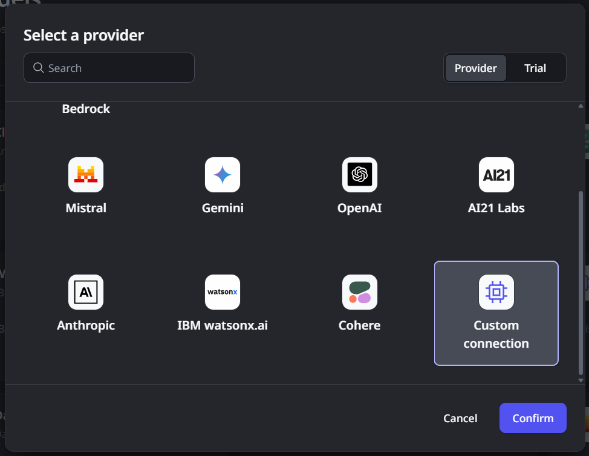

# AI models and search services in ODC

OutSystems Developer Cloud (ODC) lets you connect your OutSystems apps to large language models (LLMs). This enables you to power up apps with AI capabilities using models from various providers. ODC provides native support for connections to Azure OpenAI and Amazon Bedrock, and also supports connecting to other providers or private models through a custom API contract. All connections utilize your API keys (BYOK) to interact with the model services.

You manage your AI model connections within ODC. This includes adding new connections for supported providers or custom models. For each connection, you can configure multiple endpoints.

Once an AI model connection is configured, you can create logic in ODC Studio to call the model. These calls can range from text prompts to complex input parameter interactions. This includes using features like tools associated with the LLM or specific parameters defined in the contract for custom model connections.

In addition to directly interacting with AI models, ODC enables you to connect to AI search services like Azure AI Search, Amazon Kendra, or custom search providers. These services let you index your organization's specific knowledge base. By retrieving relevant information from this indexed content, you can provide context to AI models, enhancing the quality and grounding of their responses through a pattern known as Retrieval-Augmented Generation (RAG).

## Use trial models

To help you quickly experiment with AI features without immediately setting up your model connection, ODC offers pre-configured trial models (provided via Azure OpenAI and Amazon Bedrock). You can add these models directly within ODC and call them from your apps running in the Development stage. Note that each trial model is limited to 100 calls per ODC tenant and is intended for initial testing or proof-of-value exploration before configuring your persistent AI model connection.

## Custom model connections { #Custom model connections}

Beyond native support for Azure OpenAI and Amazon Bedrock, ODC allows you to connect to other LLMs, such as those from different providers or your private models. This is achieved using the **Custom connection** option. To use this option, you must provide an intermediary web service called a connector that bridges ODC and your target LLM. This connector service must implement a specific API contract defined by OutSystems, which involves exposing a synchronous REST endpoint using the POST method for chat completions.

When building your connector service, implement a supported authentication scheme and ensure its endpoint is accessible to ODC, potentially using a private gateway for non-public endpoints. The connector must process requests and format responses, including handling standard parameters like messages and temperature, according to the OutSystems API contract details. Your service should also return standard HTTP status codes for errors. Once your connector service is deployed and accessible, add it to the ODC Portal by selecting **Custom connection** as the provider type during the **Add AI model** process and entering your connector's URL and authentication details.

For more information, download and inspect the [Swagger file](resources/swagger.json). Note that property names should use camelCase.

## Search services connections

ODC lets you connect your apps to external knowledge bases using AI search services. This capability enables your apps to retrieve information from Azure AI Search, AWS Kendra, or custom data sources that conform to an API contract. You manage these connections within ODC. The main purpose is to facilitate (RAG) patterns within your app's logic; you retrieve relevant context from a knowledge base and then provide that context alongside your prompt to an AI model (LLM) call, leading to more accurate responses.

To retrieve information from a configured knowledge base connection, you call a specific service action provided by ODC from your app. This action fetches data based on your query. You typically use this retrieved data within your app logic by passing it as the context in a subsequent call to a configured AI model, effectively implementing the RAG pattern.

## Next steps

To start adding AI features to your apps, continue with the following:

* [Adding AI models](add-ai-models.md)
* [Adding search services](add-ai-search-services.md)
* [Integrating AI models and search services in your app logic](integrate-ai-models-logic-rag.md)
