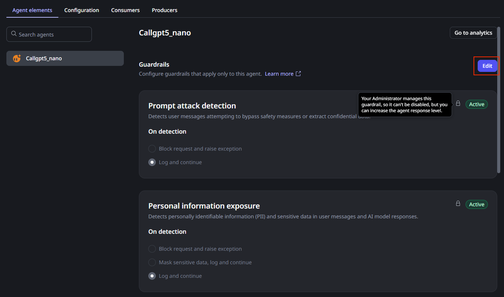
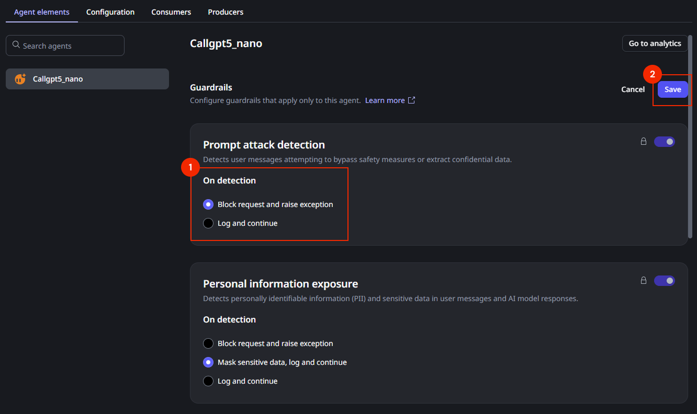
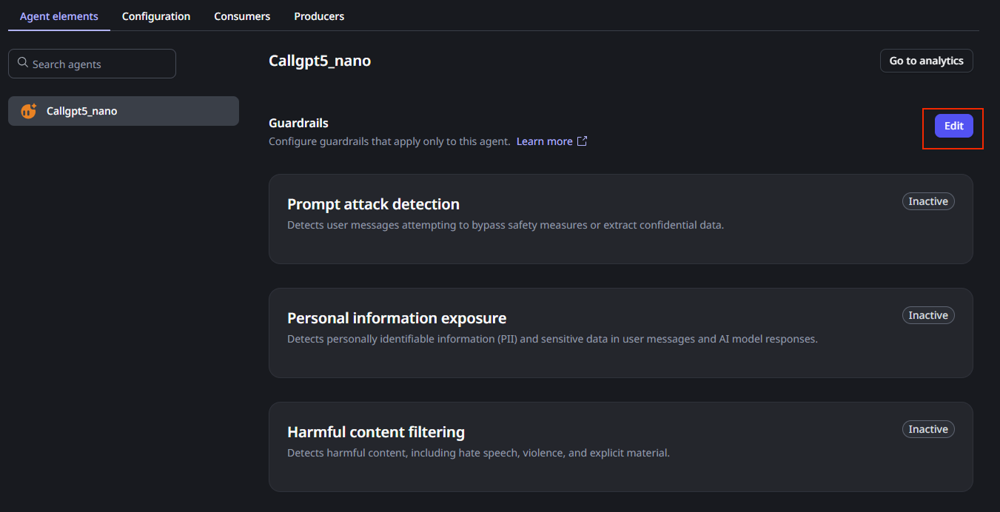
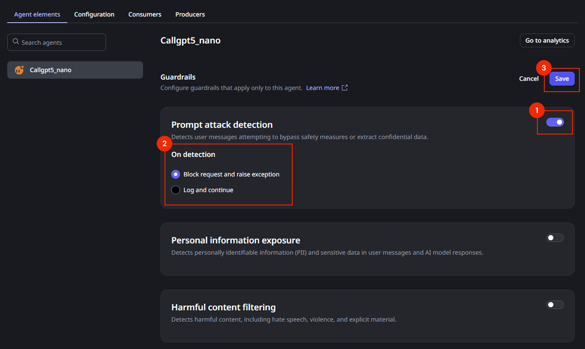

# Configure agent guardrails

This article explains how to configure agent guardrails in the ODC Portal. You can establish high-level safety policies at the stage level and then enable them for specific agents.

For an overview of agent guardrail concepts and filter types, refer to [Agent guardrails](guardrails.md).

## Prerequisites

Before you configure agent guardrails, ensure that you have:

* **Required permissions**: The **Manage agent guardrails** permission at the organization level. For more information about permissions, refer to [Roles and permissions for members](../../user-management/roles.md).

* **ODC Portal access**: Administrative access to the ODC Portal with your organization credentials.

* **AI agents**: At least one AI agent created in your organization. If you need to create agents first, refer to [Creating an agent](create-agent.md).

## Configure baseline guardrails

Baseline configuration allows you to set safety standards appropriate for each stage in your development lifecycle. For example, you can choose strict blocking rules for **Production** while allowing logging-only rules in **Development**.

To configure baseline guardrails for a stage:

1. In the ODC Portal, navigate to **Management** > **CONFIGURE** > **Agent guardrails**.

1. Select the target stage: **Development**, **QA**, or **Production**.

1. Configure the specific filters for the selected stage:

    * **Prompt attack protection**: Enable the guardrail and select an action (**Block request and raise exception** or **Log and continue**).

    * **Personal information exposure**: Enable the guardrail and select an action (**Block request and raise exception**, **Mask sensitive data, log and continue**, or **Log and continue**).

    * **Harmful content filtering**: Enable the guardrail and select an action (**Block request and raise exception** or **Log and continue**).

1. Click **Save**.

1. A confirmation popup appears, indicating that your changes are being applied to all agents of that stage. Click **Save** to proceed.

1. Repeat these steps for other stages as needed.

## Agent-level guardrails

Agent-level guardrails have two different use cases:

* **Override baseline guardrails policies**: If you have a baseline guardrails policy in place but want to enforce stricter rules for a specific agent, you can enable guardrails at the agent level.

    For example, if you set a policy to "Log and continue" at the stage level, you can choose to "Block and raise exception" for a specific agent that handles sensitive data, while allowing other agents in the same stage to follow the more lenient policy.

* **Enable guardrails without baseline policies**: If you haven't defined any baseline policies, you can enable guardrails directly on specific agents. This allows you to apply protections to high-risk agents without enforcing them across the entire stage.

### Override baseline guardrails policies

To configure guardrails for an agent that has baseline guardrails policies:

1. In the ODC Portal, navigate to your target agent app.

1. Select the stage (**Development**, **QA**, **Production**) where you want to modify settings.

1. Under the **Agent elements** tab you can see the current inherited configuration for the guardrail. Click **Edit** to override the currently defined policies:

    

1. Select the desired policy for each filter, and click Save to commit the change.

    

### Enable guardrails without baseline policies

To configure guardrails for an agent without baseline policies:

1. In the ODC Portal, navigate to your target agent app.

1. Select the stage (**Development**, **QA**, **Production**) where you want to modify settings.

1. Under the **Agent elements** tab you can see the current guardrails state for the agent, click **Edit** to enable or change the current guardrails for the agent:

    

1. Click the toggle to enable the policy, select the desired policy for each filter, and click Save to commit the change

    

## Handling violations

When a guardrail is triggered, the response depends on the configured action (block, mask and log). You must handle these responses to ensure a smooth user experience and accurate monitoring.

### Exception handling

If a guardrail is configured to **block** a request (input or output), ODC raises a specific exception. The ODC runtime doesn't display a default error message to the end-user.

When a guardrail blocks a request, the system raises the exception code `OS-ABRS-FM-40005`. This code indicates that the input or output violated safety policies and the transaction was stopped. You can use this code to identify when a block has occurred and display a user-friendly message.

### Monitor guardrail events

Guardrail violations are automatically logged, providing visibility into when safety rules are triggered. This helps you assess the effectiveness of your policies.

To view guardrail logs:

1. In the ODC Portal, navigate to **MONITOR** > **Logs**.

1. Select the target stage (**Development**, **QA**, or **Production**) from the stage selector.

1. Filter for guardrail events to review specific violations or interventions.

For more information about logs, refer to [Monitoring and troubleshooting apps](../../monitor-and-troubleshoot/monitor-apps.md#logs).
