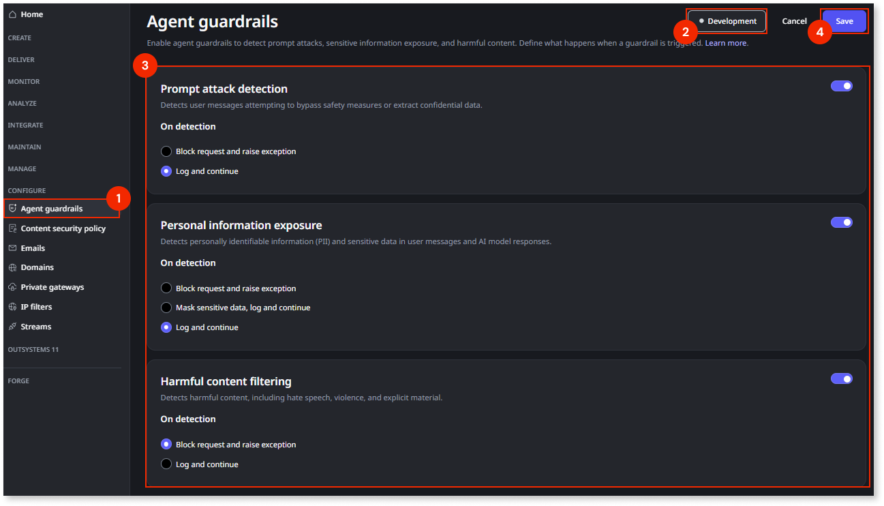
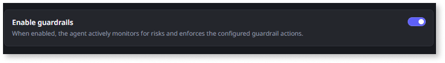

# Configure agent guardrails

Agent guardrails are in Beta. For more information about Beta features, refer to [OutSystems product releases](https://success.outsystems.com/support/release_notes/outsystems_product_releases/#beta)

This article explains how to configure agent guardrails in the ODC Portal. You can establish high-level safety policies at the stage level and then enable them for specific agents.

For an overview of agent guardrail concepts and filter types, refer to [Agent guardrails](guardrails.md).

## Prerequisites

Before you configure agent guardrails, ensure that you have:

* **Required permissions**: The **Manage agent guardrails** permission at the organization level. For more information about permissions, refer to [Roles and permissions for members](../../user-management/roles.md).

* **ODC Portal access**: Administrative access to the ODC Portal with your organization credentials.

* **AI agents**: At least one AI agent created in your organization. If you need to create agents first, refer to [Creating an agent](create-agent.md).

## Configure stage-level guardrails

Stage-level configuration allows you to set safety standards appropriate for each environment in your development lifecycle. For example, you can choose strict blocking rules for **Production** while allowing logging-only rules in **Development**.

To configure guardrails for a stage:

1. In the ODC Portal, navigate to **CONFIGURE** > **Agent guardrails**.

1. Select the target stage: **Development**, **QA**, or **Production**.

1. Configure the specific filters for the selected stage:

    * **Prompt attack protection**: Enable the guardrail and select an action (**Block request and raise exception** or **Log and continue**).

    * **Personal information exposure**: Enable the guardrail and select an action (**Block request and raise exception**, **Mask sensitive data, log and continue**, or **Log and continue**).

    * **Harmful content filtering**: Enable the guardrail and select an action (**Block request and raise exception** or **Log and continue**).

1. Click **Save**.

1. Repeat these steps for other stages as needed.

## Enable agent-level guardrails

Once stage policies are defined, you must enable them for your agents. You can toggle guardrails on or off for specific agents within each stage, allowing you to tailor protection based on the agent's risk profile.

To configure guardrails for an agent:

1. In the ODC Portal, navigate to your target agent app.

1. Select the stage (**Development**, **QA**, **Production**) where you want to modify settings.

1. Locate the guardrails settings and toggle it to enable or disable.

## Handling violations

When a guardrail is triggered, the response depends on the configured action (block, mask and log). You must handle these responses to ensure a smooth user experience and accurate monitoring.

### Exception handling

If a guardrail is configured to **block** a request (input or output), ODC raises a specific exception. The ODC runtime doesn't display a default error message to the end-user.

When a guardrail blocks a request, the system raises the exception code `OS-ABRS-FM-40005`. This code indicates that the input or output violated safety policies and the transaction was stopped. You can use this code to identify when a block has occurred and display a user-friendly message.

### Monitor guardrail events

Guardrail violations are automatically logged, providing visibility into when safety rules are triggered. This helps you assess the effectiveness of your policies.

To view guardrail logs:

1. In the ODC Portal, navigate to **MONITOR** > **Logs**.

1. Select the target stage (**Development**, **QA**, or **Production**) from the stage selector.

1. Filter for guardrail events to review specific violations or interventions.

For more information about logs, refer to [Monitoring and troubleshooting apps](../../monitor-and-troubleshoot/monitor-apps.md#logs).

## Known issues

Guardrail logs currently don't display the name of the app that triggered the guardrail. In the **Asset** column of the log entry, the ODC Portal displays a placeholder image and no name.
