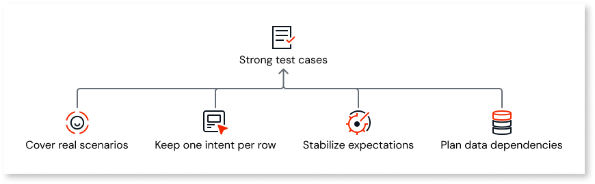

# Create and manage datasets

A **dataset** is the benchmark you attach to an **agentic app** and a **service action** for agent evaluations. Each row is one test case. The dataset supplies values the platform passes into the service action during the run and the reference data the platform judge uses when it scores results. Once saved, a dataset can be edited at any time, so you can refine test cases, fix expected outputs, and extend coverage without recreating the dataset from scratch.

## Prerequisites

Before you create a dataset, confirm the following:

* **Agentic app** and **service action**: The pair you plan to evaluate. You select the agent app and service action when you create the dataset in the ODC Portal, and the JSON you upload must match that service action's public interface.
* **Service action contract**: You know the service action input parameters, return structure, and tools in ODC Studio so the **`inputs`**, **`expectations`**, and tool entries in your JSON match the template from the **ODC Portal**.

### Dataset limits

Each dataset supports a maximum of **50 test cases**. The uploaded JSON file must not exceed **5 MB** in size. Whichever limit is reached first applies. You cannot delete a dataset while an evaluation that uses it is running.

### Permissions

Creating and uploading a dataset requires **Manage Evaluations** at the Organization scope (**View Evaluations** isn't enough). For more information, refer to [Run your first evaluation](run-your-first-evaluation.md#permissions).

For more information about how evaluations use a dataset during the run and during judging, refer to [Agent evaluations](about-agent-evaluations.md).

## Align the dataset with the service action

The dataset reflects the public contract of the service action you're evaluating, not the internal flow.

* **Inputs**: Values that match the service action input parameters for each test case.
* **Expected outputs**: Values the service action returns when behavior is correct (for example, the agent response your test expects).
* **Expected tool calls**: The tool behavior you treat as correct for that test case, when your scenario requires it.

The platform maps dataset fields to the **service action** interface. You don't configure column mapping yourself.

Because the **system prompt**, **user message**, and **grounding data** are produced inside logic at run time, they don't appear as separate fields you edit row-by-row in the dataset. You change those by changing the **service action** (or the elements it calls) in ODC Studio, then [run the evaluation again](run-your-first-evaluation.md) against the same or an updated dataset.

## Compare prompt or logic changes

The dataset holds **test cases and expected references**, not alternate prompt text.

For routine tuning, change **system prompts**, **user messages**, or **grounding** in **server actions** (or other logic) that your **service action** calls. That updates what the evaluation runs; you don't need to duplicate or rename the **service action**. After you publish in ODC Studio, [run the evaluation again](run-your-first-evaluation.md). Adjust **expected** outputs and **expected** tool calls in the dataset only when the correct behavior intentionally changes.

The **ODC Portal** ties each dataset to one **agentic app** and one **service action**. You keep using that same action across iterations; renaming is not required for prompt or inner-logic changes.

To compare two prompt strategies or two implementations **at the same time** without overwriting one another in code:

* Treat each executable variant as its own service action (or its own published logic) that the ODC Portal pairs with an evaluation and a dataset.
* Use datasets that exercise the same scenarios when you want a fair comparison, adjusting expected outputs and expected tool calls only when the new behavior intentionally changes the right answers.

## Design strong test cases

Strong datasets improve regression signal and make judge results easier to interpret.



* **Cover real scenarios** your users trigger, including typical and edge inputs.
* **Keep one intent per row** so a failed case points to a clear gap (wrong tool, wrong arguments, wrong final answer).
* **Stabilize expectations** when the correct answer is deterministic, use judgement-friendly expected text when the answer is naturally variable, per the judge options your organization enables.
* **Plan data dependencies** the service action needs (for example, records in a database or responses from dependencies). You can automate this using the setup and teardown actions
     configured on the dataset, to do it see [Configure setup and teardown](#configure-setup-and-teardown).

## Example dataset JSON

The following example is for a fictional agentic app whose service action takes **`UserInput`** and **`SessionId`** and returns a text **`Response`**. The first test case expects the agent to call an order tool with specific arguments. The second expects a direct FAQ-style answer with **no** tool calls. Replace parameter names, response shape, **`expectedTools`** structure, and **`toolSet`** content with values that match your service action and the template you'll download from the ODC Portal.

```json
{
  "testCases": [
    {
      "name": "tc-order-status",
      "description": "Customer asks for shipment status using a known order number.",
      "inputs": {
        "UserInput": "Where is order SO-44192?",
        "SessionId": "sess-eval-001"
      },
      "expectations": {
        "expectedResponse": {
          "Response": "Order SO-44192 shipped on March 10 and is out for delivery. Tracking: https://example.com/track/SO-44192"
        },
        "guidelines": [
          "The answer must reference order SO-44192 and reflect that it's shipped or in transit.",
          "The answer must not claim the order was canceled unless fixture data says so."
        ],
        "expectedTools": [
          {
            "name": "FetchOrderStatus",
            "arguments": {
              "OrderNumber": "SO-44192"
            }
          }
        ]
      }
    },
    {
      "name": "tc-support-hours",
      "description": "General policy question that should not trigger order lookup tools.",
      "inputs": {
        "UserInput": "What are your support hours?",
        "SessionId": "sess-eval-002"
      },
      "expectations": {
        "expectedResponse": {
          "Response": "Support is available Monday through Friday, 9:00 to 18:00, GMT."
        },
        "guidelines": [
          "No order or account tools should run for this question.",
          "The answer must stay within the published business-hours policy."
        ],
        "expectedTools": []
      }
    }
  ],
  "toolSet": []
}
```

### Map to the template

* **`testCases`**: One object per row you want to run. Use **`name`** and **`description`** so humans know what each row validates.
* **`inputs`**: Values passed into the service action for that run. They must align with the service action's input parameters (here **`UserInput`** and **`SessionId`**).
* **`expectations.expectedResponse`**: The structured output the judge compares against the run (here a single **`Response`** field).
* **`expectations.guidelines`**: Free-text hints for the platform judge about what "good" looks like when the answer isn't an exact string match.
* **`expectations.expectedTools`**: The tool calls (or empty array) you treat as correct for that scenario. The exact JSON shape for each tool entry must match your product contract.
* **`toolSet`**: Reserved for tool metadata when your template requires it. The downloaded template defines usage.

## Upload the dataset in the ODC Portal

Use this procedure to create a dataset from a template file, upload your test cases as JSON, and save the dataset in the ODC Portal.

<div class="info" markdown="1">

Field names, nesting, and types for the JSON file follow the product contract for evaluations. Use the official schema or specification from engineering when you author files, and don't skip validating a small file before you upload a large benchmark set.

</div>

To create and save a dataset, follow these steps:

1. In the **ODC Portal**, navigate to **ANALYZE** > **Agent evaluations** > **Datasets**.
1. Select **Create dataset**.
1. Enter the **Dataset details**: **Name**, **Description** (optional), **Agentic app**, and **Service action**.
1. Download the template.
1. Edit the template JSON to add your test cases. For recommendations on coverage and expectations, refer to [Design strong test cases](#design-strong-test-cases) earlier in this topic.
1. Upload the completed JSON file.
1. Optionally, configure a **Setup** action and a **Teardown** action to prepare and clean up the evaluation environment. Refer to [Configure setup and teardown](#configure-setup-and-teardown) to know how to do this.
1. Click **Save**.
  

After you save, the dataset is associated with the agentic app and service action you selected. That association is permanent, you cannot change it on an existing dataset. You can edit the test cases at any time. To do it, see [Edit a dataset](#edit-a-dataset).

## Edit a dataset

After running an evaluation, you may find test cases with incorrect expected outputs, missing coverage, or scenarios that no longer apply. You can open a saved dataset and update it without recreating it from scratch.

The **agentic app** and **service action** association is set at creation and cannot be changed on an existing dataset.

To edit a dataset:

1. In the **ODC Portal**, navigate to **ANALYZE** > **Agent evaluations** > **Datasets**.
1. From the list, select the dataset you want to update. You can filter by **Agentic app** to narrow the list.
1. Select **Edit**.
1. The dataset opens in the same view used to create it, pre-populated with the existing test cases.
1. Make your changes:
   * To **update** a test case, select its card and edit the fields.
   * To **add** test cases, select **Add test case** at the bottom of the list, or upload a new JSON file. Note that uploading a file replaces all existing test cases.
   * To **remove** a test case, open its card click the **Delete** icon.
1. Select **Save** to apply your changes.

### How edits affect evaluation runs

Edits to a dataset apply to future runs only. Existing run reports are unchanged — each run records the dataset name and the dataset version (the timestamp of the last edit before the run started). If you edit a dataset and run it again, the run history shows the version timestamps side by side, so you can see which runs used the same test cases.

## Export a dataset as JSON

You can export a saved dataset as a JSON file to back it up, store it alongside your agent code in version control, share it with colleagues working in a different environment, or edit it offline and re-import it.

To export a dataset:

1. Open the dataset you want to export.
1. Select the **Export** dropdown and choose **Export as JSON**.
1. Save the file when prompted.

The exported file contains the test cases only. Inputs and expected outputs are exported as structured JSON objects, not serialized strings. The format is the same as the JSON upload format, so the file can be re-imported as-is.

<div class="info" markdown="1">

Re-importing an exported file creates a new dataset — it does not overwrite the original.

</div>

## Configure setup and teardown

Many agents depend on data in external systems: a CRM, a test database, an order fixture. If that data is absent or stale when a run starts, test cases fail for the wrong reason. Setup and teardown let you automate environment preparation so every run starts from a known state.

* **Setup** — a service action that runs once before test case execution begins. Use it to seed data, reset state, or load fixtures.
* **Teardown** — a service action that runs once after all test cases complete. Use it to delete temporary records, restore defaults, or clean up side effects.

Both are optional. You can configure either, both, or neither. The platform invokes them automatically on every evaluation run that uses the dataset. For details on what happens when setup or teardown fails, refer to [Run your first evaluation](run-your-first-evaluation.md).

### Add setup and teardown actions

You can configure setup and teardown when you create a dataset or when you edit an existing one. The **Setup and teardown** section appears below the test cases area.

1. Scroll to the **Setup and teardown** section.
1. Enable the **Setup and teardown** toggle. When the toggle is off, the dropdowns are visible but inactive.
1. To add a **Setup** action:
   1. Select the **App** that contains the service action.
   1. Select the **Service action** from that app.
1. To add a **Teardown** action, repeat the previous step for the teardown fields.
1. Select **Save dataset**.

The configured actions appear in the dataset details alongside the agentic app, service action, and test case count.

### Constraints

<div class="warning" markdown="1">

**Setup and teardown service actions must require no input parameters.** The platform invokes these actions with no arguments. If you select an action with required parameters, the platform shows an error and prevents the selection. If the action has only optional parameters, a warning is shown and the selection is allowed. Optional parameters aren't sent.

Design your setup and teardown actions to be self-contained. They should read any configuration from your app's settings or entities rather than from parameters passed at call time.

</div>

* The service action can come from **any app** in your organization — it is not restricted to the agentic app being evaluated.
* Setup and teardown run **once per evaluation run**, not once per test case.
* **Input parameters are not supported** for setup and teardown actions.

## Next steps

* To run an evaluation with your saved dataset, refer to [Run your first evaluation](run-your-first-evaluation.md).
* To understand what happens during a run when setup or teardown is configured, including failure behavior, refer to [Run your first evaluation](run-your-first-evaluation.md).
