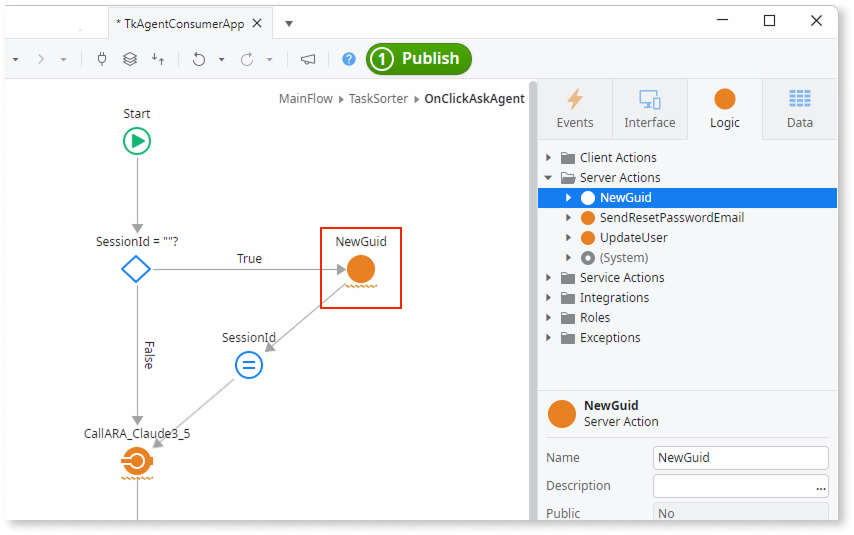
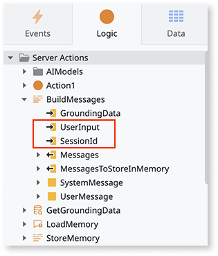

# Consuming AI agents in apps

Agentic app creation is available through the Early Access Program. Click here to [apply for the Early Access Program](https://www.outsystems.com/low-code-platform/agentic-ai-workbench/eap-agent-workbench/). 

Consumer apps are the user-facing applications that interact with AI agents to provide intelligent experiences to end users. These apps manage user sessions, process user input, and orchestrate communication with AI agents to deliver contextual, conversation-driven functionality.

 When making calls to the AI agent, the consumer app must pass the `UserInput` and `SessionId` parameters. The `UserInput` contains the user's message, query, or request that the agent processes. The `SessionId` [maintains conversation context across multiple interactions](agentic-apps.md#state-persistence), ensuring the agentic app can reference previous exchanges and provide contextually relevant responses. Generate a unique `SessionId` using the `GenerateGuid` Server action in ODC Studio, though you can use any method that produces a unique identifier.

## High-level process overview

A consumer app handles user interactions through a simple workflow that leverages [state persistence](agentic-apps.md#state-persistence):

1. **Session setup**: Generate a unique `SessionId` using `GenerateGuid`
1. **User interaction**: Capture `UserInput` from the UI components  
1. **Agent call**: Invoke the agent's service action with `UserInput` and `SessionId`
1. **Response handling**: Process and display the `Response` output parameter from the Service action
1. **Session continuity**: Persist the `SessionId` for subsequent interactions

The following screenshot shows a consumer app's logic flow. The sample logic generates a unique session identifier using the built-in `GenerateGuid` Server action. This action creates a globally unique identifier (GUID) that serves as the `SessionId` for maintaining conversation context, though any unique identifier generation method works. Add the `GenerateGuid` action to your logic by dragging it from the toolbox or typing its name in the action flow.

This example shows multiple Server calls from Client actions for demonstration purposes. In production apps, [minimize Server action calls from Client actions](../logic/best-practices-logic.md#avoid-multiple-server-calls-in-a-client-action-flow) by consolidating logic into fewer server-side operations to improve performance and user experience.

### Agentic app logic

On the agentic app side, the Service action receives `UserInput` and `SessionId` as input parameters and processes the request. The agent uses the `SessionId` to retrieve conversation context and track interaction history, while the `UserInput` contains the specific message or query to process. The agent then orchestrates the [necessary actions](create-agent.md)- such as retrieving grounding data, building messages for the AI model, and generating a contextually relevant response- before returning the result through the `Response` output parameter to the consumer app.

