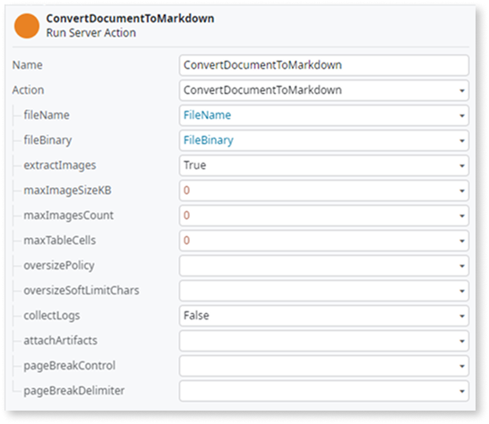
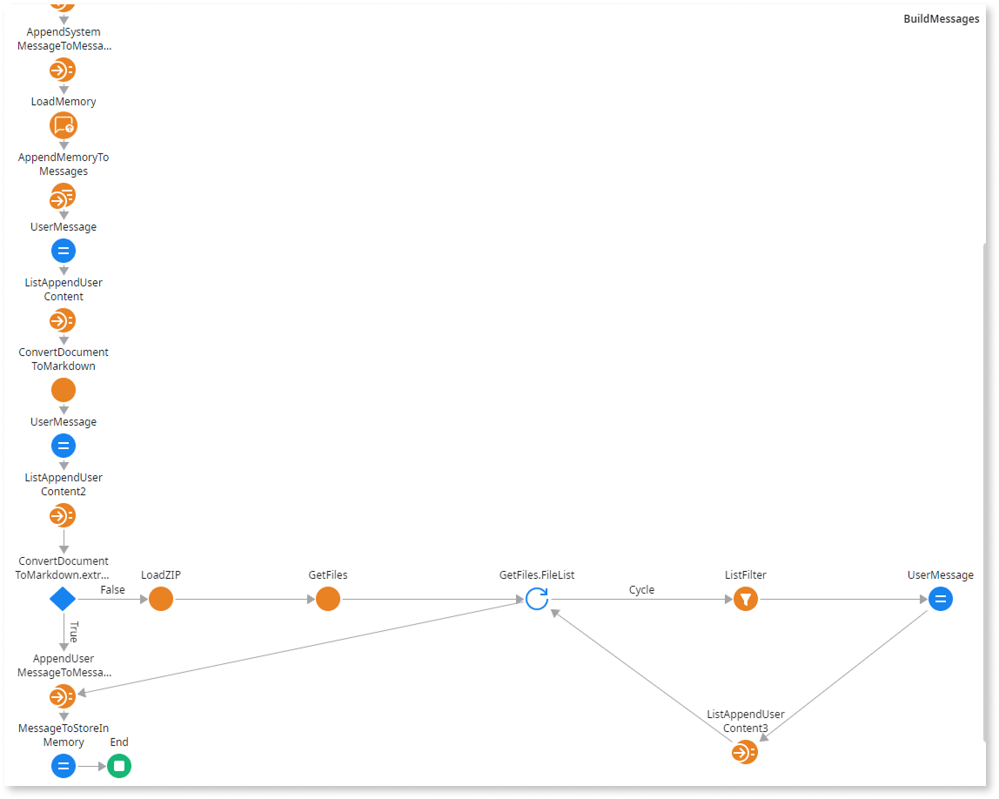

# Convert files to Markdown

When your app stores or receives files such as Word documents, PDFs, spreadsheets, presentations, HTML, or plain text as Binary Data, use the **OmniDoc2MD** Forge component to convert them to Markdown while preserving document structure, and to extract any images contained in the file. Common use cases include feeding document content to AI agents in Agent Workbench, populating searchable knowledge bases, rendering document content in apps, or persisting normalized text for downstream processing.

<div class="info" markdown="1">

**OmniDoc2MD** converts DOCX, PDF, PPTX, XLSX, HTML, and plain text to semantically structured Markdown and metadata. For details, refer to [OmniDoc2MD (ODC) on Forge](https://www.outsystems.com/forge/component-overview/22443/omnidoc2md-odc).

</div>

## Prerequisites

Before you convert documents, follow these steps:

* Install the [**OmniDoc2MD**](https://www.outsystems.com/forge/component-overview/22443/omnidoc2md-odc) Forge component in your organization. For instructions, refer to [Install or update a Forge asset](../forge/install.md).
* In ODC Studio, add all the [public elements](../libraries/use-public-elements.md) from **OmniDoc2MD** in the app or library where you implement the conversion.
* If you plan to process extracted images, also add the **LoadZIP** and **GetFiles** public elements from the **Zip** source.

## Convert a file to Markdown

To convert a file to Markdown, follow these steps:

1. Upload the file binary from an OutSystems file upload or an external source.
1. Call `ConvertDocumentToMarkdown` with the following inputs:

    * `fileBinary`: the file binary.
    * `fileName`: the original file name.
    * `extractImages`: set to `True` to extract images embedded in the document.
    * Numeric limits (`maxTableCells`, `maxImageSizeKB`, `maxImagesCount`): set them to `0` to use the component's defaults. For details on each parameter, refer to the [OmniDoc2MD component on Forge](https://www.outsystems.com/forge/component-overview/22443/omnidoc2md-odc).
    * `collectLogs`: set to `False` unless you need diagnostic information.

    

1. Read the action outputs:

    * `Markdown`: the converted Markdown text.
    * `metadata`: document-level metadata.
    * `extractedImagesMetadata`: list describing each extracted image (empty when the document has no images).
    * `imagesZipFile`: a ZIP binary that contains the extracted image files (empty when the document has no images).

1. Store the Markdown and metadata in a data entity, pass them to the next step in your flow, or use them in any downstream logic. For more information, refer to [Use the extracted Markdown in an agent](#use-the-markdown-in-an-agent).

1. Optional: For long documents, chunk the Markdown and generate embeddings so your app can retrieve only the most relevant passages at runtime, instead of processing the full text in every request. The simplest path in ODC is to store the Markdown in an entity attribute and enable [semantic search](semantic-search/semantic-search-intro.md) on that attribute, which handles chunking and embeddings for you.

## Use the extracted Markdown in an agent {#use-the-markdown-in-an-agent}

To use the converted Markdown in an agent in Agent Workbench, pass it into the agent's context. The typical hooks are **GetGroundingData**, where you assemble the agent's grounding data, and **BuildMessages**, where you assemble the prompt. For example, assign the formatted content directly:

```outsystems
"This is the attached file to the chat converted into Markdown format. The file name was " + ConvertDocumentToMarkdown.metadata.FileName + " Detected Type " + ConvertDocumentToMarkdown.metadata.DetectedType + NewLine() + "The content:" + NewLine() + ConvertDocumentToMarkdown.Markdown
```

## Convert a file with images and add it to an agent's user message

If the file contains images and you're using a multimodal AI model in an agentic app, add the extracted images to the same user message that carries the Markdown.

<div class="info" markdown="1">

For more information on passing image data to a multimodal model, refer to [Image input for AI models](image-input.md).

</div>

This section assumes you're starting from the **BuildMessages** server action provided by the Agent Workbench template.

To convert a file to Markdown and add it with the extracted images to the user message, follow these steps:

1. In the **BuildMessages** server action, add the **ConvertDocumentToMarkdown** run server action after the **ListAppendUserContent** element.

1. Set the following parameters:

    * **fileName** to `FileName`
    * **fileBinary** to `FileBinary`
    * **extractImages** to `True`
    * **maxImageSizeKB** to `0`
    * **maxImagesCount** to `0`
    * **maxTableCells** to `0`
    * **collectLogs** to `False`

    

1. After the **ConvertDocumentToMarkdown** node, add an **Assign**, and name it `UserMessage`.

1. Add the following assignments:

    ```outsystems
    UserMessage.Role
    = Entities.AIRole.User
    ```

    ```outsystems
    UserMessageContent.ContentType
    = Entities.AIContentType.TextContent
    ```

    ```outsystems
    UserMessageContent.ContentText
    = "This is the attached file to the chat converted into Markdown format. The file name was " + ConvertDocumentToMarkdown.metadata.FileName + " Detected Type " + ConvertDocumentToMarkdown.metadata.DetectedType + NewLine() + "The content:" + NewLine() + ConvertDocumentToMarkdown.Markdown
    ```

1. Add a **ListAppend** run server action after the **UserMessage** element, and name it `ListAppendUserContent2`.

1. Set the following parameters:

    * **List** to `UserMessage.Content`
    * **Element** to `UserMessageContent`

1. Add an **If** element after **ListAppendUserContent2**, and set **Condition** to `ConvertDocumentToMarkdown.extractedImagesMetadata.Empty = True`.

1. Right-click the arrow of the **False** branch, and click **Swap** connectors.

    Now, the **AppendUserMessageToMessages** element is on the True branch. If the result is `True`, it means no images were extracted.

1. In the **False** branch, add a **LoadZIP** run server action, and set **ZIPBinary** to `ConvertDocumentToMarkdown.imagesZipFile`.

1. After the **LoadZIP** action, add the **GetFiles** run server action, and set **ZIPHandle** to `LoadZIP.ZIPHandle`.

1. After the **GetFiles** action, add a **For each** element, and set **Record List** to `GetFiles.FileList`.

    **FileList** is the collection of files inside the ZIP.

1. After the **For each** element, in the Cycle branch, add the **ListFilter** system action, and set the following parameters:

    * **SourceList** to `ConvertDocumentToMarkdown.extractedImagesMetadata`
    * **Condition** to `ConvertDocumentToMarkdown.extractedImagesMetadata.Current.FileName = GetFiles.FileList.Current.File.Name`

1. After the **ListFilter** system action, add an Assign element, and name it **UserMessage**.

1. Set its following properties:

    ```outsystems
    UserMessage.Role
    = Entities.AIRole.User
    ```

    ```outsystems
    UserMessageContent.ContentType
    = Entities.AIContentType.ImageBinary
    ```

    ```outsystems
    UserMessageContent.ContentBinaryData
    = GetFiles.FileList.Current.File.Content
    ```

    ```outsystems
    UserMessageContent.FileFormat
    = ListFilter.FilteredList.Current.MimeType
    ```

1. After the **UserMessage** assign, add a **ListAppend** run server action, and name it `ListAppendUserContent3`.

1. Set the following parameters:

    * **List** to `UserMessage.Content`
    * **Element** to `UserMessageContent`

1. To close the cycle, connect `ListAppendUserContent3` to the `GetFiles.FileList` **For each** element.

1. Connect the `GetFiles.FileList` **For each**'s exit to the **AppendUserMessageToMessages** element of the **True** branch.

    

    At the end of the loop, the user message contains one text item with the Markdown plus one image item per extracted image, forming a complete multimodal representation of the uploaded document.

1. Publish your app.

The agent now receives both the Markdown text and the extracted images on every call.
