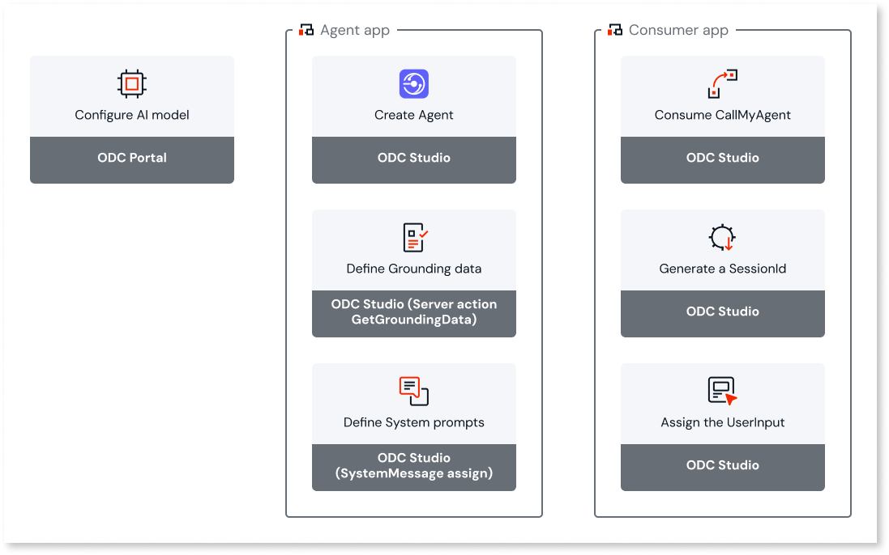

# Creating an agent in ODC Studio

Define your agent's purpose, structure its capabilities, and develop the logic that powers its [actions](function-calling.md). After you create the agent, reference its functionality in a consumer app. For more information about consuming agents in consumer apps, refer to [Consuming agents in consumer apps](consumer-app.md).

## Prerequisites

Before you create an agent, configure an [AI model in the ODC Portal](add-ai-models.md).

## Use agents in ODC

Follow these steps to create, configure, and integrate agents into your OutSystems apps. The process involves creating an agentic app with the agent functionality and then consuming that functionality in a consumer app.

### 1. Configure AI model and create agentic app

Start by configuring an AI model in the ODC Portal, then create an agentic app in ODC Studio. You can either open ODC Studio directly or start from the ODC Portal. In the ODC Portal, click **Create** and select **Agentic app**. ODC Studio opens so you can define and develop the agent capabilities.

You can create more than one agent in the same agentic app. For example, you might create one agent specialized in planning with deeper reasoning and another optimized for faster execution responses. Refer to [Create additional agents](#create-additional-agents) for details.

### 2. Create agent and choose AI model

In ODC Studio, create your agent and select the large language model (LLM) that the agent uses. Refer to [Adding AI Models](add-ai-models.md) for details about connecting your apps to LLMs.

### 3. Define grounding data and system messages

Build the foundational elements of your agent by defining grounding data and system messages:

* **Define grounding data**: Create a `GetGroundingData` server action to retrieve contextual or [grounding data](agentic-apps.md#grounding) the model needs. Use custom logic to gather context from data sources such as an AI search service, REST API, aggregate, or static text.

* **Define system messages**: Use an assign node to define the [system prompt](agentic-apps.md#system-prompts) that establishes the agent's role, capabilities, and behavior guidelines.

### 4. Add actions

Provide your agent with specific capabilities by adding server actions that it can call autonomously. Actions enable your agent to go beyond generating text responses and interact with external systems, process data, or execute business logic. The AI model analyzes the context and autonomously decides which actions to call based on the user's request and the action descriptions you provide. Refer to [AI agent actions](function-calling.md) for more information about adding actions. The agent can include actions such as those from an [MCP server](tools/mcp-connectors.md).

### 5. Build agent functionality

An `AgentFlow` server action encapsulates the agent functionality. It orchestrates interaction with the AI model and handles data preparation and response processing. A typical `AgentFlow` action calls these server actions:

* `GetGroundingData` – Retrieves contextual or [grounding data](agentic-apps.md#grounding) the model needs. Use custom logic to gather context from data sources such as an AI search service, REST API, aggregate, or static text.
* `BuildMessages` – Builds the prompt and conversation history that the model receives. It combines user input, prior conversation turns, and grounding data. Use an Assign node to define the [system prompt](agentic-apps.md#system-prompts).
* `Call<AgentName>` – Sends the formatted messages to the selected AI model and receives a response. The agent can include actions the model can invoke, such as those from an [MCP server](tools/mcp-connectors.md), if they use simple data types. The agent can also include a structured format that can be included in your agent’s response. You can also perform tests by entering different messages to evaluate how the selected models respond.
* `StoreMemory` – Saves the conversation or generated information for future reference. This maintains context and enables multi-turn or personalized interactions. For details about state persistence, refer to [Agentic apps in ODC](agentic-apps.md#state-persistence).

The service action encapsulates the agent logic. After you publish, the service action becomes available for other apps to reference.

### 6. Develop consumer app functionality

After you publish the agentic app, create or update a consumer app to use the agent functionality:

* **Consume CallMyAgent**: Add a dependency on the agentic app's service action in the consumer app. The action appears as `Call<AgentName>`.

* **Generate SessionId**: Create logic to generate and manage session identifiers to maintain conversational context across interactions.

* **Assign UserInput**: Create interface elements and logic to capture and process user input that is sent to the agent.

Integrate the agent functionality into your consumer app logic by passing:

* `SessionId` to maintain conversational context.
* `UserInput` for the user's query or instruction.

## Create additional agents

By default, a new agentic app includes one agent. You can create additional agents to serve different purposes within the same app.

To create a new agent:

1. In **ODC Studio**, open the **Automations** tab.

1. Right-click the **Agents** folder and select **Add Agent**.

1. Configure the agent’s properties and associate it with an AI model (ensure the model is a public element).

1. Add the new agent to your AgentFlow logic by:

   * Dragging a **Call Agent** element from the **Toolbox** and selecting the desired agent, **or**

   * Dragging the agent directly from the **Automations** tab into your logic.

## Next steps

To learn how to consume a `Call<AgentName>` service action in a consumer app, refer to [Consume an agent in an app](consumer-app.md).
