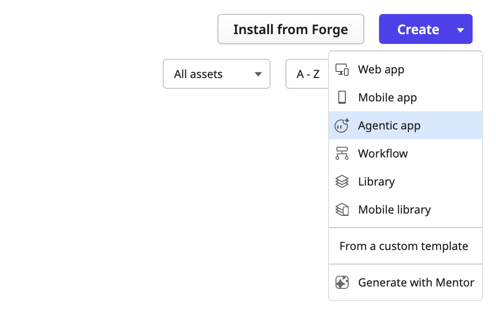
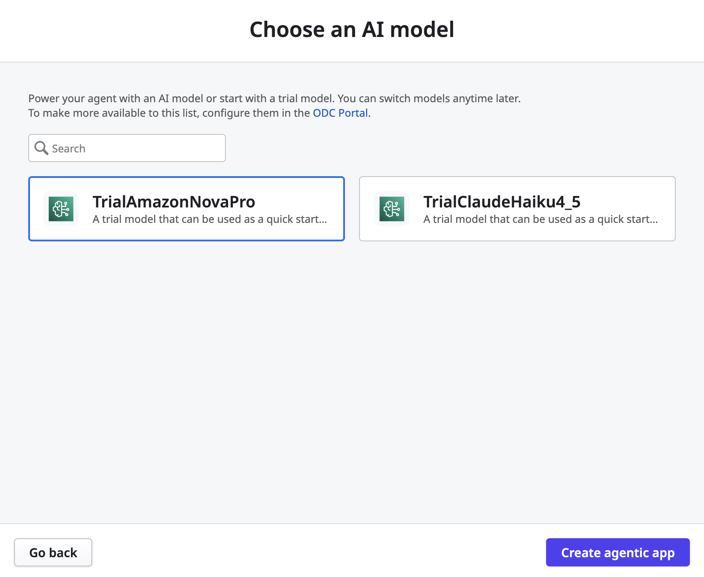
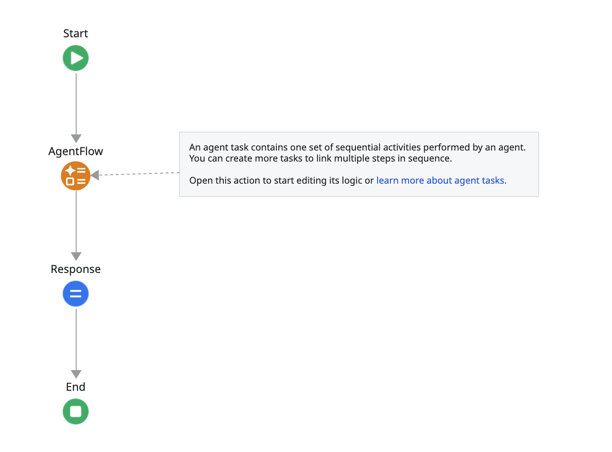
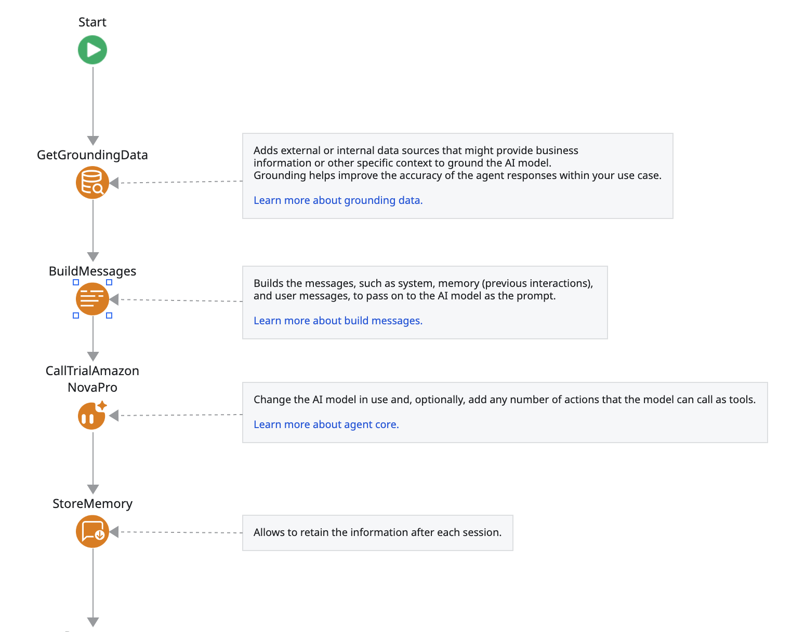
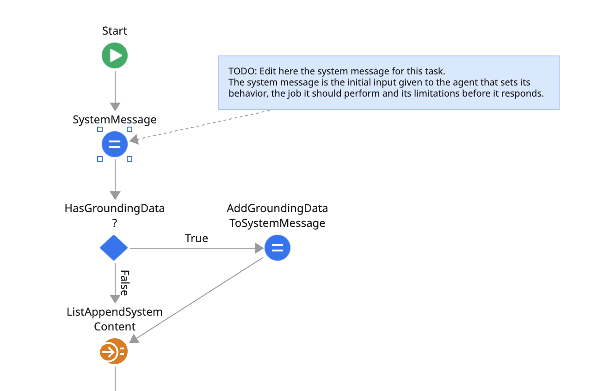
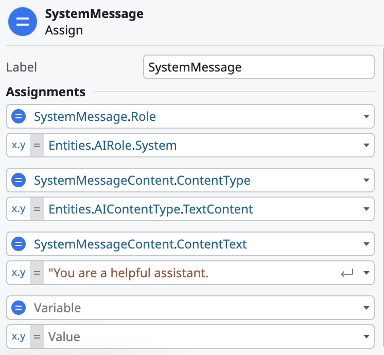
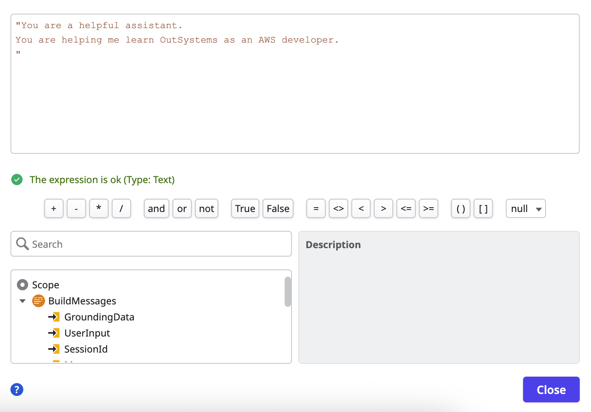
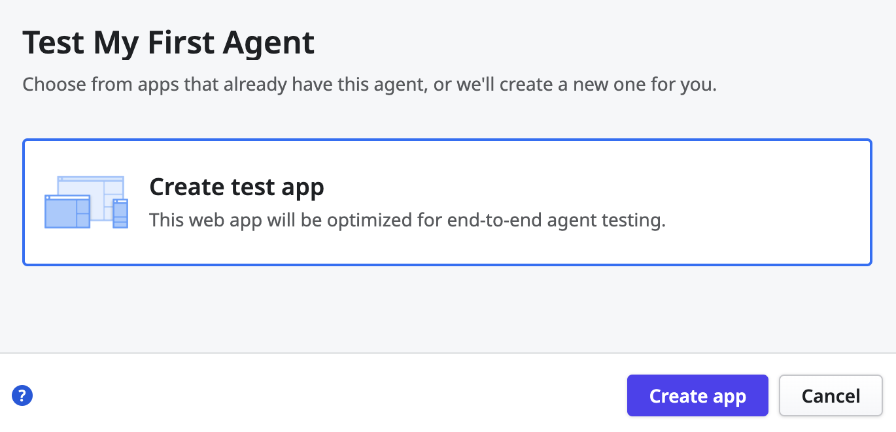
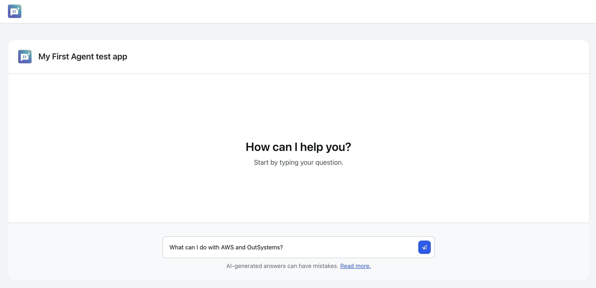

# Getting atarted with an Agentic app

Quickly build your first agentic app in ODC Studio by creating an app and customizing its system message. Afterwards, you can learn more about customizing it in depth, including [configuring AI models, creating agents, defining grounding data, system messages, and actions in ODC.](create-agent.md)

## Prerequisites

Before you create your first agent, you need to install ODC Studio and have a server ready to run the agent (such as a Personal Edition or any other an ODC subscription).

## Create an agent in ODC Studio

Follow these steps to get your agent up and running, and test it in an app. The process involves creating an agentic app with the agent functionality and then exposing that functionality in a test app.

### 1. Create an Agentic app

Start by opening ODC Studio. On the main screen, click the **Create** button on the right and select **Agentic app**. Give the app a name.

You can also start from the ODC Portal. In the ODC Portal, click **Create** and select **Agentic app**. ODC Studio will open from there and you can follow the same steps.

### 2. Choose an AI model

After naming the app, you'll be prompted to select the large language model (LLM) that the agent uses. For now, select one of the included trial models and click **Create agentic app.**

Later on, you can refer to [Adding AI Models](add-ai-models.md) for details about connecting your apps to other LLMs.

### 3. Customize the system message

After the app is created, you're presented with the **Call Agent** logic flow. You may now customize your system message before publishing your agent.

**Double-click the AgentFlow action node** to open that action and edit its logic.

You'll see the main components of the agent's logic:

1. Get the Grounding data
1. Build messages to send to the model
1. Call the model
1. Store memory
1. Return the response

**Double-click the BuildMessages action node** to open the Build Messages action and edit the system message.

You're now presented with the logic that adds the grounding data, the system message and any other memories or context to the set of messages we'll send to the model.

**Click the SystemMessage Assign node** to see its properties and customize the system message.

In the Properties panel at the bottom right of ODC Studio you'll see the current System Message content text.

To edit it, either change the **SystemMessageContent.ContentText** property text inline in that box, or **double-click the x.y label under it** to open the Expression Editor.

Close the editor after editing the System Message.

### 4. Test your first agent

Now that you made your first agent, you need to Publish it by clicking the **Publish** button at the top of ODC Studio. This will publish the agent, making it available for any app to consume it.

To be able to test it, click the **Test agent** button at the top of ODC Studio. You will be prompted to **Create a Test App** to consume it via a web app. Select that option, and click the **Create app** button to proceed.

After the test app is published, it will open a new broser window automatically and you can test your agent.

Congratulations. You have created your first agent with OutSystems!

## Next steps

As next steps, there are quite a few things you can explore.

* To learn more about agentic apps in OutSystems, refer to [Agentic apps in ODC.](agentic-apps.md)
* To learn more about creating and customizing agents, refer to [Creating an agent in ODC Studio.](create-agent.md)
* To learn about becoming an AI Developer with OutSystems, refer to our [Become and AI Developer training journey.](https://explore.outsystems.com/Journeys/MyJourney/BecomeAnAiDeveloper/AWSPromo)
