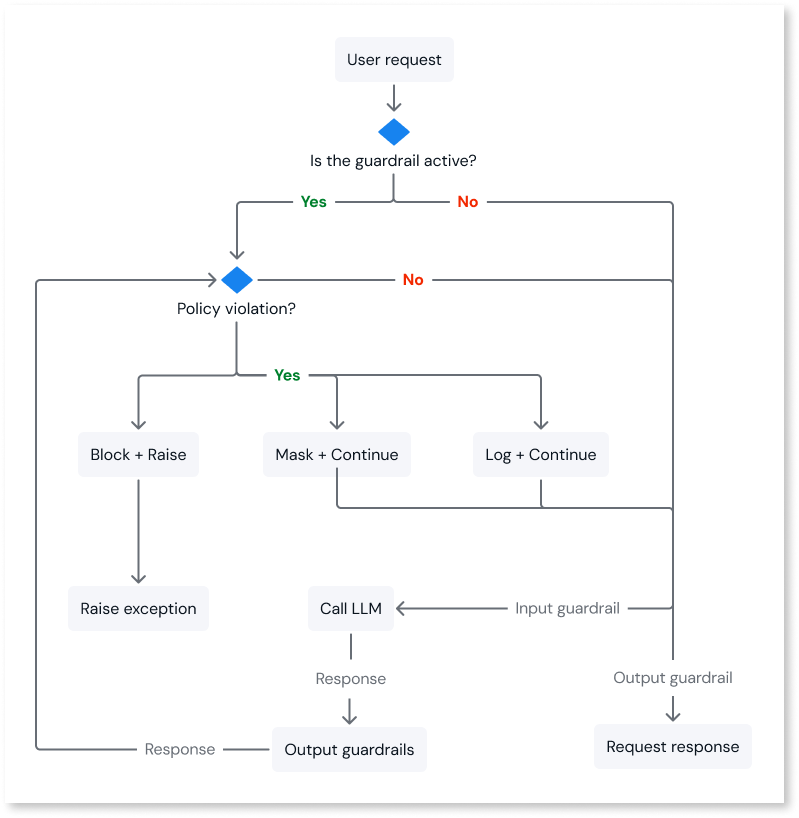
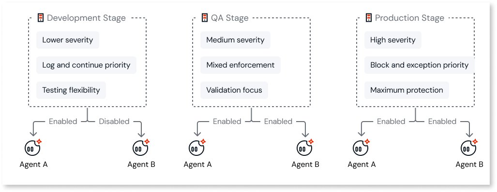

# Agent guardrails

Agent guardrails are in Beta. For more information about Beta features, refer to [OutSystems product releases](https://success.outsystems.com/support/release_notes/outsystems_product_releases/#beta)

Agent guardrails are a safety and governance layer designed to ensure your AI agents behave responsibly. They act as an interceptor between your agent and the AI model, monitoring both user inputs (prompts) and model outputs (responses) in real-time.

Guardrails serve different primary functions:

* **Risk prevention**: They intercept and block harmful content before it affects the user.

* **Enterprise-grade safety**: The system provides configurable safety rules that you can enable per agent, allowing you to achieve enterprise-grade responsibility with straightforward setup.

## Why use guardrails

Guardrails are the key enabler for moving agents from experimentation to production.

* **Trust and control**: Guardrails provide safety enforcement that gives you the confidence needed for mission-critical use cases.

* **Data privacy**: Guardrails automatically detect and handle personally identifiable information (PII) to prevent data leaks.

* **Security**: Guardrails protect against prompt attacks (attempts to trick the AI into ignoring safety rules).

* **Compliance**: Guardrails allow organizations to define baseline safety levels that all developers must adhere to, ensuring consistent governance.

## How guardrails work

The ODC platform uses a predefined architecture to apply safety rules efficiently across all tenants.

* **Rule enforcement**: The platform provides various guardrail types, which you can activate and configure with different response actions.

* **Deterministic assignment**: When you configure a policy in the ODC Portal, the platform generates a unique internal ID based on your specific settings.

* **Runtime enforcement**: The system enforces these rules in real-time during agent execution.

To understand the runtime flow, consider the following steps:

1. **Request**: When an agent runs, it sends its unique Guardrail ID to the Runtime Service.

1. **Lookup and apply**: The service locates the corresponding predefined policy in a configuration map and applies it to the request.

1. **Result**: If the input or output violates the policy, the system carries out the defined action. For example, the system might block the response or mask sensitive data.

## Regional availability and limitations

Agent guardrails rely on cloud AI infrastructure. Due to variances in regional service availability, the capabilities of guardrails differ depending on the region where your ODC environment is hosted.

### Guardrail coverage tiers by region

Guardrail capabilities are divided into **Enhanced** and **Basic** coverage tiers.

* **Enhanced coverage**: Available in most regions (US, EU, Asia Pacific). Supports over 60 languages and provides optimal performance.

* **Basic coverage**: Restricted to specific regions due to infrastructure constraints. Supports only English, French, and Spanish.

| Coverage tier | Affected regions | Language support |
| -------------- | ------------------ | ------------------ |
| **Enhanced** | All regions not listed in Basic coverage tier | **60+ Languages** (Full Support) |
| **Basic** | • Canada (ca-central-1) • São Paulo (sa-east-1) • London (eu-west-2) | **English, French, Spanish ONLY** (Restricted Support) |

If your environment is hosted in a Basic coverage region, guardrails only function effectively for content in English, French, and Spanish. Prompts or responses in other languages may bypass safety filters.

### Unsupported regions

Guardrails are currently unavailable in the following regions. In these regions, the Guardrail Runtime service isn't accessible, and safety rules can't be applied to agent transactions.

* Cape Town (af-south-1)

* Hong Kong (ap-east-1)

* Jakarta (ap-southeast-3)

* Tel Aviv (il-central-1)

* UAE (me-central-1)

To determine your ODC environment's region, refer to the information provided when you purchased ODC or contact your account manager.

## Guardrail filters

You can configure different dimensions of protection. To ensure optimal performance and coverage, enabling a category implicitly covers multiple sub-types.

### Filter categories

* **Prompt Attack Protection**: Detects user messages that attempt to bypass safety measures or extract confidential data.

* **Personal information exposure (PII) filters**: Detects personally identifiable information (PII) and sensitive data in user messages and AI model responses.

* **Harmful content filtering**: Blocks harmful categories such as hate speech, violence, and explicit material.

### Action to take on detection

When a violation is detected, the guardrail performs one of the following actions based on your configuration:

* **Block request and raise exception**: Stops the transaction entirely.

* **Mask sensitive data, log, and continue**: Replaces sensitive data with placeholders, logs the transaction, and allows the rest of the response to proceed.

* **Log and continue**: Logs the violation but allows the response to proceed.

| Filter Type | Block & exception | Mask & continue | Log & continue |
| ------------- | :----------------: | :---------------: | :--------------: |
| **Prompt Attack Protection** | Yes | No | Yes |
| **Personal Information Exposure** | Yes | Yes | Yes |
| **Harmful Content Filtering** | Yes | No | Yes |

## Configuration

Guardrails are managed directly within the ODC Portal. To balance governance with flexibility, configuration occurs at two levels:

* **Stage level**: Defines the baseline safety standards (severity and enforcement) for each environment (Development, QA, Production).

* **Agent level**: Enables or disables the stage-level guardrails for specific agents.

The following diagram shows a possible guardrail configuration by stage:

For step-by-step configuration instructions, refer to [Configure agent guardrails](configure-agent-guardrails.md).

## Associated costs

Using guardrails consumes resources based on the volume of text processed. For information on usage limits for your edition, such as the Personal Edition, refer to the [OutSystems Personal Edition FAQ](https://www.outsystems.com/tk/redirect?g=2f0b4814-c8d5-41be-a9bf-c0a15b5cc917).

For detailed information regarding Agent Workbench add-on packs and the underlying cost structure for commercial environments, contact your account manager for provisioning.

## Next steps

* To learn more about how to set up guardrail policies at stage and agent levels, refer to [Configure agent guardrails](configure-agent-guardrails.md).
