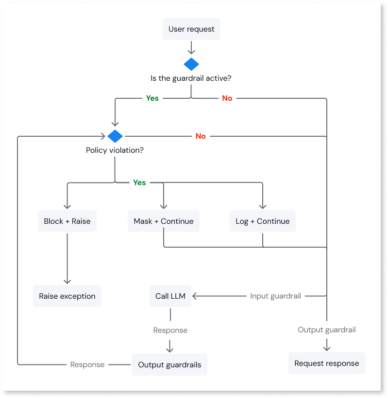
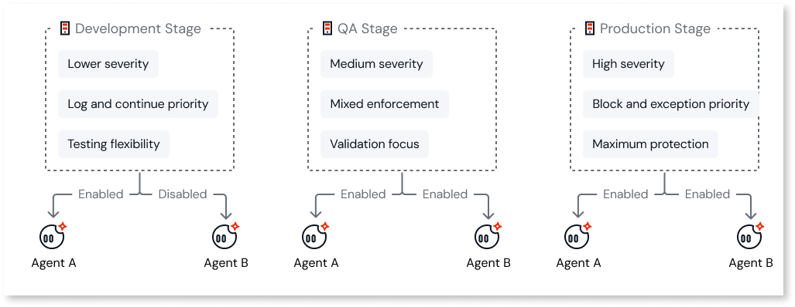

# Agent guardrails

Agent guardrails are a safety and governance layer designed to ensure your AI agents behave responsibly. They act as an interceptor between your agent and the AI model, monitoring both user inputs (prompts), system prompts, and model outputs (responses) in real-time.

Guardrails serve different primary functions:

* **Risk prevention**: They intercept and block harmful content before it affects the user.

* **Enterprise-grade safety**: The system provides configurable safety rules that you can enable per agent, allowing you to achieve enterprise-grade responsibility with straightforward setup.

## Why use guardrails

Guardrails are the key enabler for moving agents from experimentation to production.

* **Trust and control**: Guardrails provide safety enforcement that gives you the confidence needed for mission-critical use cases.

* **Data privacy**: Guardrails automatically detect and handle personally identifiable information (PII) to prevent data leaks.

* **Security**: Guardrails protect against prompt attacks (attempts to trick the AI into ignoring safety rules).

* **Compliance**: Guardrails allow organizations to define baseline safety levels that all developers must adhere to, ensuring consistent governance.

## How guardrails work

The ODC platform uses a predefined architecture to apply safety rules efficiently across all tenants.

* **Rule enforcement**: The platform provides various guardrail types, which you can activate and configure with different response actions.

* **Deterministic assignment**: When you configure a policy in the ODC Portal, the platform generates a unique internal ID based on your specific settings.

* **Runtime enforcement**: The system enforces these rules in real time during agent execution, exclusively on user inputs (prompts), system prompts, and AI model responses. It does not analyze or enforce rules on documents, images, or other files sent to the agent.

To understand the runtime flow, consider the following steps:

1. **Request**: When an agent runs, it sends its unique Guardrail ID to the Runtime Service.

1. **Lookup and apply**: The service locates the corresponding predefined policy in a configuration map and applies it to the request.

1. **Result**: If the input or output violates the policy, the system carries out the defined action. For example, the system might block the response or mask sensitive data.

## Regional availability and limitations

Agent guardrails rely on cloud AI infrastructure. Due to variances in regional service availability, the capabilities of guardrails differ depending on the region where your ODC environment is hosted.

### Guardrail coverage tiers by region

Guardrail capabilities are divided into **Enhanced** and **Basic** coverage tiers.

* **Enhanced coverage**: Available in most regions (US, EU, Asia Pacific). Supports over 60 languages and provides optimal performance.

* **Basic coverage**: Restricted to specific regions due to infrastructure constraints. Supports only English, French, and Spanish.

| Coverage tier | Affected regions | Language support |
| -------------- | ------------------ | ------------------ |
| **Enhanced** | All regions not listed in Basic coverage tier | **60+ Languages** (Full Support) |
| **Basic** | • Canada (Central) • South America (São Paulo) • Europe (London) | **English, French, Spanish ONLY** (Restricted Support) |

If your environment is hosted in a Basic coverage region, guardrails only function effectively for content in English, French, and Spanish. Prompts or responses in other languages may bypass safety filters.

### Unsupported regions

Guardrails don't operate in the following regions. The Guardrail Runtime service doesn't run in these regions, so it doesn't enforce safety rules on agent transactions.

* South Africa (Cape Town)
* Asia Pacific (Hong Kong)

To determine your ODC environment's region, refer to the information provided when you purchased ODC or contact your account manager.

## Guardrail filters

You can configure different dimensions of protection. Guardrails apply only to user inputs (prompts), system prompts, and AI model responses. They don't analyze or enforce rules on documents, images, or other files sent to the agent, even when those files are used by the agent to generate a response. To ensure optimal performance and coverage, enabling a category implicitly covers multiple sub-types.

### Filter categories

* **Prompt Attack Protection**: Detects user messages that attempt to bypass safety measures or extract confidential data.

* **Personal information exposure (PII) filters**: Detects personally identifiable information (PII) and sensitive data in user messages and AI model responses.

* **Harmful content filtering**: Blocks harmful categories such as hate speech, violence, and explicit material.

## Custom guardrail policies

Beyond the predefined filter categories, you can define custom guardrail policies tailored to your organization's compliance requirements and proprietary data formats. 
* Platform administrators configure custom policies at the organizational level in **Management** > **Configure** > **Agent guardrails** in the ODC Portal. 
* Developers configure custom policies for the agents they own in the agent's **Agent elements** tab.

Three types of custom policies are available: denied topics, word filters, and custom PII patterns. Interventions triggered by custom policies are logged and traced the same way as other guardrail violations, and each is identifiable by the name of the triggering rule.

### Denied topics

Define topics that your agent should never discuss, for example, competitor products or subjects unrelated to your agent's purpose. Each denied topic requires a name and a natural-language description of the topic's scope. You can optionally add up to five sample phrases to improve detection accuracy.

Topic detection evaluates the meaning and intent of a message, not just specific words. A topic raised through paraphrase or implication is blocked the same as a literal mention.

The combined total of organizational and agent-level denied topics can't exceed 30 per agent.

### Word filters

Block specific words and phrases, such as competitor names or internal codenames, using exact, case-insensitive matching. Phrases of up to three words are supported per entry. Word variations, such as plurals, require a separate entry.

You can manage word filter entries individually or upload them in bulk.

The combined total of organizational and agent-level word filter entries can't exceed 10,000 per agent.

### Custom PII patterns

Detect sensitive data formats that the platform's built-in PII filters don't cover, such as internal employee IDs, account numbers, or other organization-specific identifiers. Each pattern requires a name and a regular expression. An optional description documents the pattern's purpose.

When a pattern's action is set to **Mask**, detected content is replaced with a placeholder derived from the pattern's name. For example, a pattern named `EMPLOYEE_ID` produces `{EMPLOYEE_ID}` in the output, in logs, and in any downstream system that receives the masked content.

The combined total of organizational and agent-level custom PII patterns can't exceed 50 per agent.

<!-- WRITER NOTE (2026-07-13): unconfirmed whether the Basic/Enhanced regional coverage tiers described in "Regional availability and limitations" apply to custom PII regex patterns. Neither source document (VM5 PRD, Enterprise Guardrails HLD) addresses this. Confirm with engineering/PM before asserting either way, then remove this note. -->

## Action to take on detection

When the guardrail detects a violation, it performs one of the following actions based on your configuration:

* **Block request and raise exception**: Stops the transaction entirely.

* **Mask sensitive data, log, and continue**: Replaces sensitive data with placeholders, logs the transaction, and allows the rest of the response to proceed.

* **Log and continue**: Logs the violation but allows the response to proceed.

| Filter Type | Block & exception | Mask & continue | Log & continue |
| ------------- | :----------------: | :---------------: | :--------------: |
| **Prompt Attack Protection** | Yes | No | Yes |
| **Personal Information Exposure** | Yes | Yes | Yes |
| **Harmful Content Filtering** | Yes | No | Yes |
| **Denied Topics** | Yes | No | No |
| **Word Filters** | Yes | No | Yes |
| **Custom PII Patterns** | Yes | Yes | Yes |

## Configuration

You manage guardrails directly in the ODC Portal. To balance governance with flexibility, you configure guardrails at two levels:

* **Baseline guardrails**: Sets the baseline safety standards (severity and enforcement) for each environment (Development, QA, Production). When you enable a stage-level policy, it applies to every agent in that stage.

* **Agent level guardrails**: If there's no baseline guardrails defined, you can enable guardrails on a per-agent basis. This allows you to apply specific protections to high-risk agents without enforcing them across the board.

If there are baseline guardrails defined, you can make the guardrail stricter at the agent level, but not more lenient. For example, if you set a policy to "Log and continue" at the stage level, you can choose to "Block and raise exception" for a specific agent, but not the other way around.

The same rule applies to custom guardrail policies. The organizational baseline always applies in full, and agent-level denied topics, word filters, and custom PII patterns can only add further restriction on top, never remove or loosen it. In the agent's **Agent elements** tab, developers see the full effective set of custom policies: organizational entries appear alongside the agent's own, marked as inherited.

In a multi-portfolio organization, stage-level guardrails, including custom guardrail policies, are configured separately for each portfolio's stages. For more information about portfolios, refer to [Asset portfolios](../../manage-platform-app-lifecycle/portfolios/portfolios-overview.md).

The following diagram shows a possible guardrail configuration by stage:

For step-by-step configuration instructions, refer to [Configure agent guardrails](configure-agent-guardrails.md).

## Associated costs

Using guardrails consumes resources based on the volume of text processed. For information on usage limits for your edition, such as the Personal Edition, refer to the [OutSystems Personal Edition FAQ](https://www.outsystems.com/tk/redirect?g=2f0b4814-c8d5-41be-a9bf-c0a15b5cc917).

For detailed information regarding Agent Workbench add-on packs and the underlying cost structure for commercial environments, contact your account manager for provisioning.

## Next steps

* To learn more about how to set up guardrail policies at stage and agent levels, refer to [Configure agent guardrails](configure-agent-guardrails.md).
