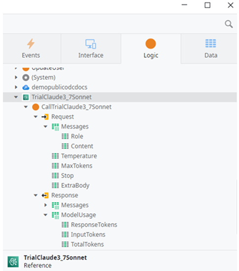

# Integrating AI models and search services

Integrating AI capabilities often involves connecting to AI models or specialized AI search services. Once you establish the connections in the ODC Portal, the next step is to incorporate calls to these services within your app logic in ODC Studio. Doing so lets you enhance user experiences or automate processes using AI directly.

This article focuses on that implementation step, detailing the procedures for calling configured AI models and AI search services from ODC Studio, including common patterns like Retrieval-Augmented Generation (RAG).

For more information on the models available in an ODC trial, refer to [AI models and search services in ODC](ai-models.md#trial).

## Implementing AI model calls

The following video walks you through adding and configuring AI models, using AI models and ODC Studio and enabling RAG through search services. 

<iframe src="https://player.vimeo.com/video/1112003106" width="750" height="422" frameborder="0" allow="autoplay; fullscreen" allowfullscreen="">Video on how to implement AI model calls in your app logic.</iframe>

First, identify the name you gave your [AI model connection](add-ai-models.md#add-ai-models) in the **ODC Portal**. Navigate to **INTEGRATE** > **AI models**, select your model, and check the **Name** field in its **Details**. ODC uses this name, referred to here as **(model name)**, to expose an action named **Call(model name)**.

This section explains how to call a configured AI model from your ODC app logic. This is how the interaction generally works when your ODC app logic communicates with an AI model using the provided structures:

1. **Prepare the request:** When a user provides input (like typing a question into your app), your app logic in ODC Studio needs to package this information correctly for the AI model. This involves creating the **Request** data structure. The most important part is the **Request.Messages** field, which is a list of **Message** structures. For a simple prompt, you typically add one **Message** to this list where:
    * Set **Role** to `user` to indicate the message is from the end user.
    * **Content** contains the actual **text input from the user**.
    * For multi-turn conversations, you would include previous user and assistant messages in this list as well.

    

    You can also set optional input parameters within the **Request** structure to influence the model's behavior. Examples include **Temperature** to influence randomness, **MaxTokens** to limit the response length, **Stop** for sequences to stop generation, or **ExtraBody** for any other custom parameters.

1. **Call the model action:** Your app logic then calls the specific Server Action associated with your AI model connection **Call(model name)**, passing the prepared **Request** structure as its input.
1. **Receive the response:** After the AI model processes the input and generates its response, the **Call(model name)** action returns a **Response** data structure to your app logic. This response contains:
    * Messages (List of `Message`): This list holds the model's output. Typically, the main response is in the first message (`Response.Messages[0]`) where `Role` is `"assistant"` and `Content` contains the generated text.
    * ModelUsage: A structure providing details on token usage like **InputTokens**, **ResponseTokens**, **TotalTokens** for the interaction.
1. **Process the response:** Your app logic then extracts the needed information from the **Response** structure, usually the text content from `Response.Messages[0].Content`, to display back to the user or use in subsequent steps.

## Implementing AI search calls for RAG

This section explains how to call a configured AI Search connection from your ODC app logic, typically to retrieve context for RAG.

**Prerequisite:** A [configured connection](add-ai-search-services.md#add-a-search-service) to your AI Search service (like Azure AI Search, Amazon Kendra, or a custom provider) in the ODC Portal under **Connections**.

Follow these steps to implement the call in ODC Studio:

Identify the name you gave your connection in the **ODC Portal**. Navigate to **INTEGRATE** > **CONNECTIONS**, select your connection, and check the **Name** field in its **Details**. ODC uses this name, referred to here as **(connection name)**, to expose an action named **Call(connection name)**.

1. Locate the Server Action in the Logic tab: Find the **Search(connection name)** action, under the **Logic** tab > **Server Actions** > **(connection name)**.
1. Implement the logic to prepare input: Prepare the input parameters required by the **Search(connection name)** action. Common inputs include text search and the number of results. Other parameters like filters might be available depending on the specific search service connection type. 
1. Implement the call: Drag the **Search(connection name)** action onto your logic flow. Assign the prepared input variables to the corresponding input parameters of the action.  
1. Implement logic to process the output: Process the response output parameter from the **Search(connection name)** action. This typically contains a list of results. Each result might include the retrieved text snippet, metadata, and relevance score. You can iterate through or select from this list to gather the context needed for RAG.

## Combining calls for RAG patterns

RAG involves using both AI Search and AI Models together:

1. Implement the search call: Call the **Search(connection name)** action with the user's query.  
1. Process search results: Extract the relevant text snippets from the **Search(connection name)** response. Format these snippets into a single text block or structure suitable for context.  
1. Prepare AI model input: Create the **Request.Messages** list for the **Call(model name)** action. Include the original user query and the formatted context retrieved from the search results. Structure this using specific roles or prompt engineering techniques.  
1. Implement the model call: Call the **Call(model name)** action with the prepared request containing the retrieved context.  
1. Process model output: Ground the AI model's response in the specific information retrieved from your knowledge base via the search service.
