# Create and manage a knowledge base in the ODC Portal

This article explains how to manage the full life cycle of a knowledge base in the ODC Portal: create, view, edit settings, and delete.

## Prerequisites

Before you begin, confirm the following:

* You are using ODC Studio 1.7.15 or later, which supports knowledge base search server actions.
* You understand that each stage has its own files, storage area, and search index.
* You understand the [data transaction constraints](knowledge-bases-overview.md#regional-availability-and-limitations).
* You are aware of the different chunking strategies and how they affect search results. See [Chunking strategies](chunking-strategy-reference.md) for details.

## Create a knowledge base

1. In the ODC Portal, in the left navigation, go to **Integrate** > **Knowledge bases**.
1. Click **Create knowledge base**.
    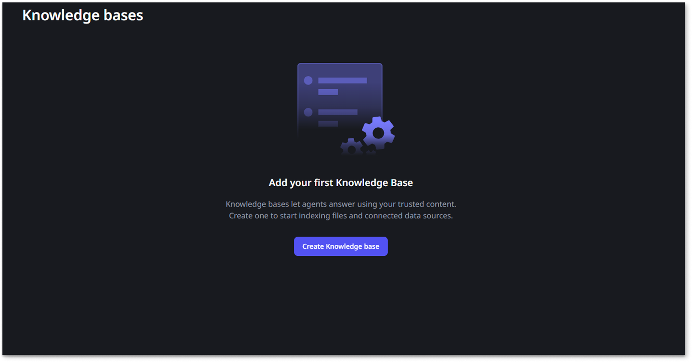
1. Enter a **Name** for the knowledge base. Use a name that clearly identifies the document set, for example, `HR Policies` or `Legal Contracts`.
1. Enter a **Description** to help other users understand what this knowledge base contains. This is also important to help the agent understand the context. Then click **Continue**.
    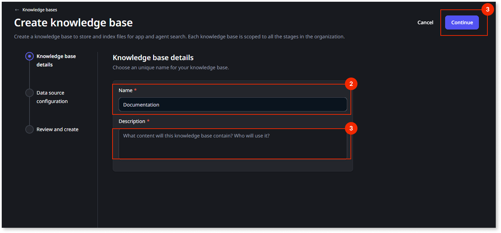
1. On the Data source configuration screen, fill in the Data source Name and Description (optional), and select your Chunking configuration. Then click **Continue**.

    Keep in mind that the data source configuration and chunking strategy can't be changed after the knowledge base is created and it's shared by all stages.

    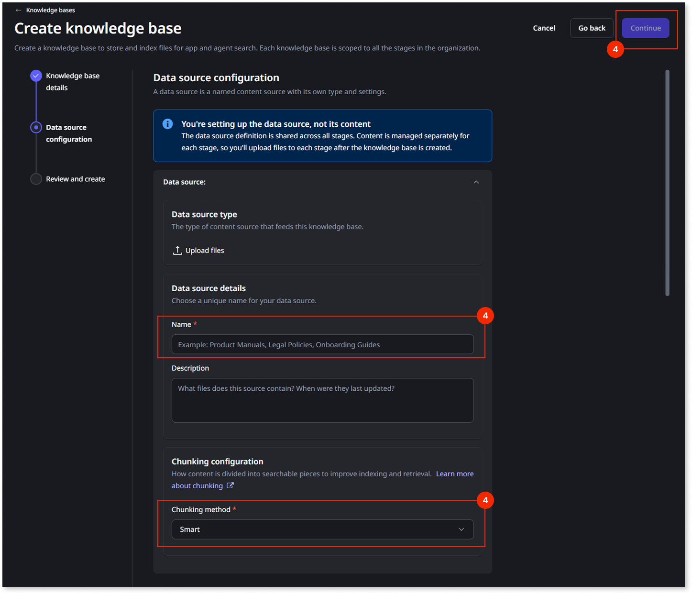

1. Review your settings and click **Publish and create knowledge base** to create the knowledge base.
        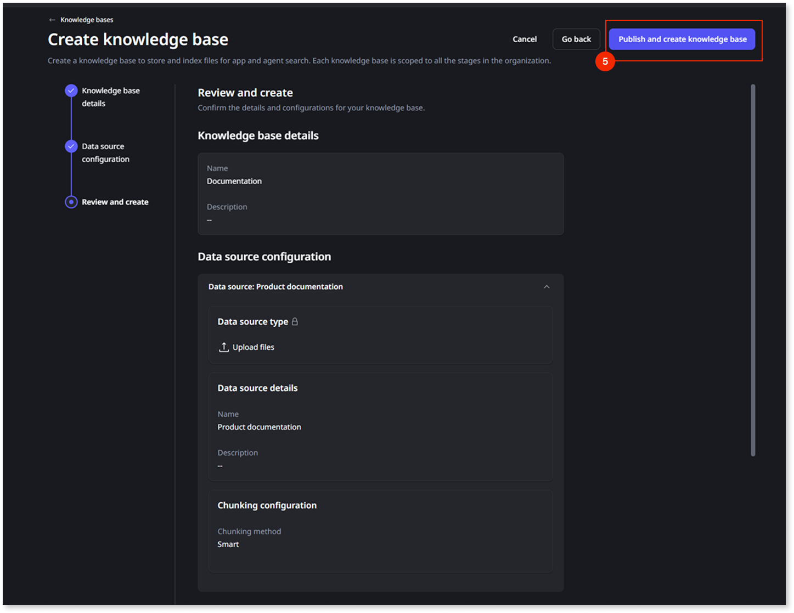

The knowledge base is created and appears in the list. It's empty until you upload files to it.

## Upload files to a knowledge base

1. In the ODC Portal, go to **Integrate** > **Knowledge bases**.
1. Double-click the card of the knowledge base you want to upload files to. This opens the knowledge base details view.
1. In this screen you can see a list of all the data sources associated with the knowledge base. Click the **...** icon next to the data source you want to upload files to, and select **Open data source**.
    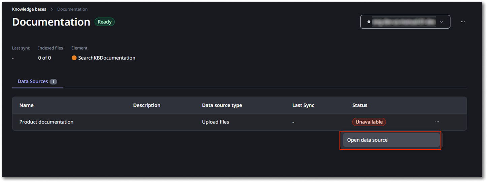
1. In the data source details screen you can see a list of all files that exist on the data source, along with their ingestion status. To add new files, click **Upload files**.
    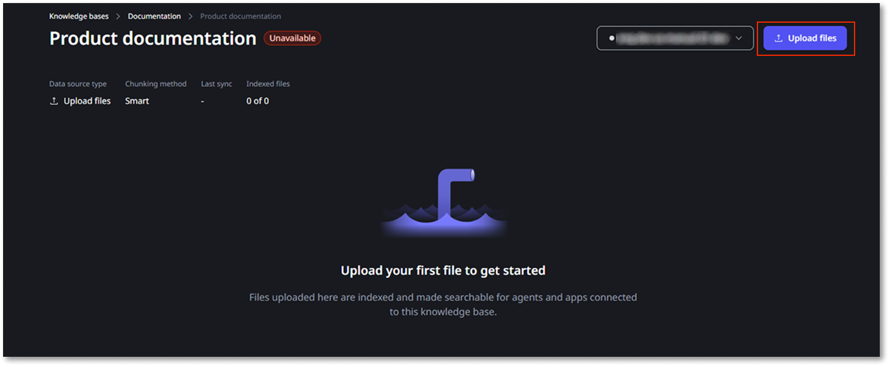
1. Select the files you want to upload and click **Upload**.
    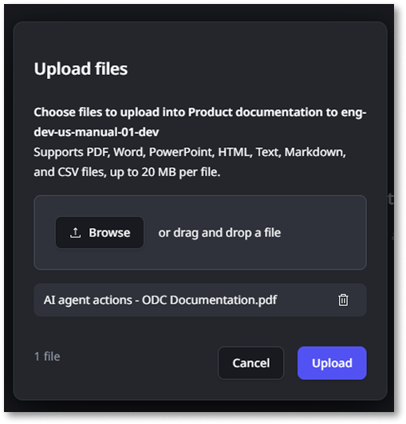

    A notification appears in the bottom right corner of the portal indicating that the files are being processed.
    The ingestion process can take several minutes depending on the number and size of files uploaded. You can continue to work in the portal while the ingestion is running.

    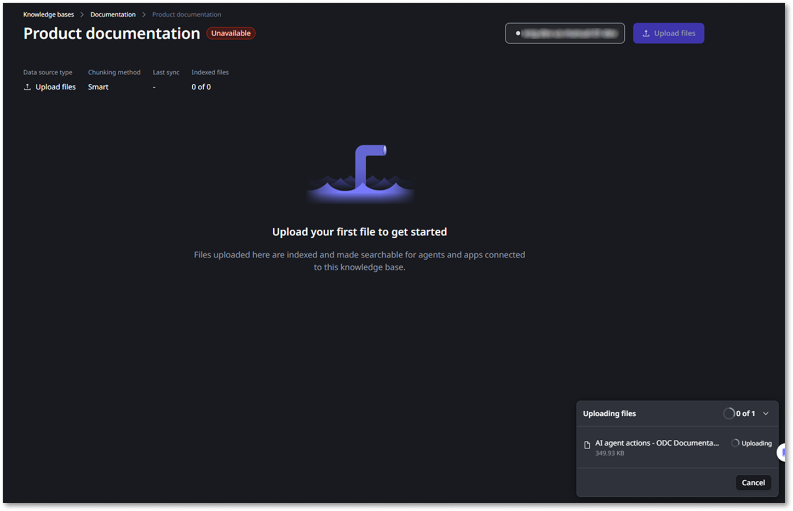

1. When the files are successfully uploaded, the status for each file changes to **Succeeded**. If any files fail to upload, the ingestion status changes to **Failed**.
    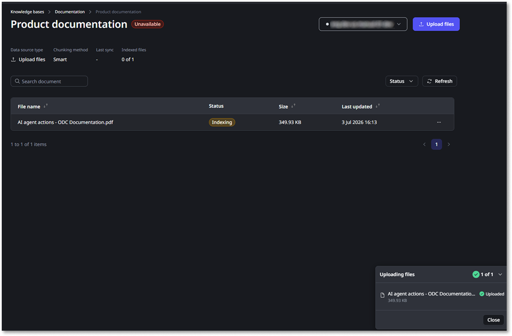
1. The files that were successfully uploaded are now available for use in your knowledge base. You can view the details of the files and their status on the Data source details screen.
    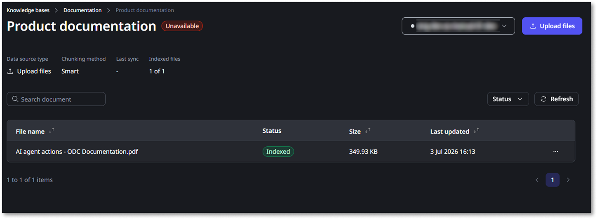

## View knowledge base details

To see the files and ingestion status for a knowledge base:

1. In the ODC Portal, go to **Integrate** > **Knowledge bases**.
1. Double-click the card of the knowledge base you want to inspect.

The knowledge base detail view shows:

* The list of uploaded files and the ingestion status of each file (pending, running, succeeded, or failed).
* Summary counts for chunks, embeddings, and vectors currently indexed.

## Edit knowledge base settings

You can change the name and description of a knowledge base at any time. You can't change the stage a knowledge base belongs to.

1. In the ODC Portal, go to **Integrate** > **Knowledge bases**.
1. Click the **...** icon next to the name of the knowledge base you want to edit.
1. Click **Edit knowledge base details**.
    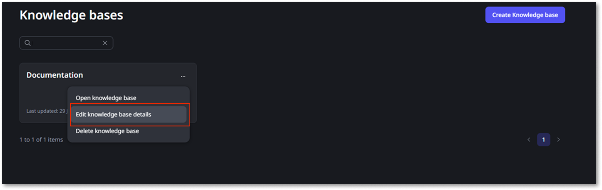
1. Update the **Name** or **Description** as needed.
1. Click **Save**.

Keep in mind that renaming a knowledge base doesn't affect how developers reference it in ODC Studio. The Studio XIF is generated from the knowledge base identifier, not the display name.

## Delete a knowledge base

Deleting a knowledge base permanently removes it, all uploaded files, and all indexed content (chunks, embeddings, and vectors) for that stage. This action can't be undone.

1. In the ODC Portal, go to **Integrate** > **Knowledge bases**.
1. Click the **...** icon next to the name of the knowledge base you want to delete.
1. Click **Delete knowledge base**.
    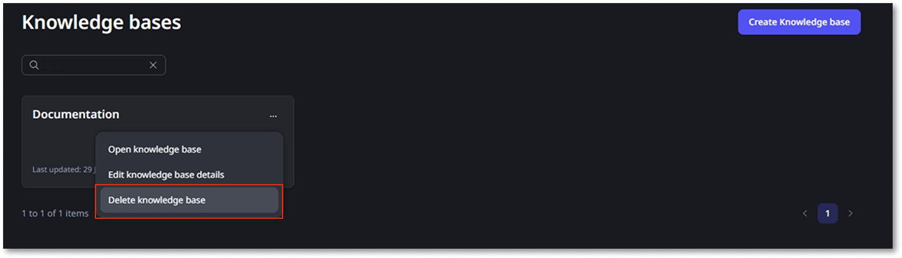
1. In the confirmation dialog, type the knowledge base name to confirm, then click **Delete permanently**.
        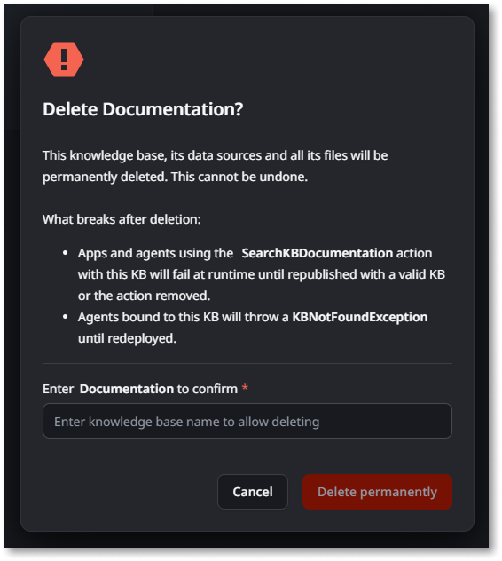

Keep in mind that any agent or app that references this knowledge base fails at runtime after deletion. Notify developers before deleting a knowledge base that's in active use.

## Calling a knowledge base from an app

For every knowledge base an user creates and publishes in the ODC Portal, the platform generates a **Server Action** that developers can add to their apps in ODC Studio.
This action runs semantic search on that knowledge base's indexed content, no manual API wiring or custom integration code required.

### Add the server action to your app

1. In ODC Studio, your Agentic app.
1. In the app tree, right-click and select [**Add public element**](../../libraries/use-public-elements.md), or use the equivalent toolbar action.
1. In the All sources drop-down, filter by the Knowledge Base name you want to use.
1. Then pick up server action with the name `SearchKB<KnowledgeBaseName>`. The **Source** column shows the originating knowledge base, and the **Description** column shows the description of the elements.
1. Select the action and click **Add**.

The server action now appears under **Server Actions** in your app's Logic tab, ready to drag into any flow. For example you can call in a CallAgent [Action calling](../function-calling.md).

## Things to keep in mind

* **One action per knowledge base.** If an IT-user deletes and recreates a knowledge base with the same name, you may need to re-add the server action, since the underlying identifier changes even if the display name doesn't.
* **Renaming in the Portal doesn't break your app.** The server action reference in Studio is tied to the knowledge base's internal identifier, not its display name — so an user renaming a knowledge base in the Portal doesn't require you to re-add the action.
* **Stage awareness.** The knowledge base you search is scoped to the stage your app is running in. An app published to PROD searches the content that exists in production, and not in any other stage.
