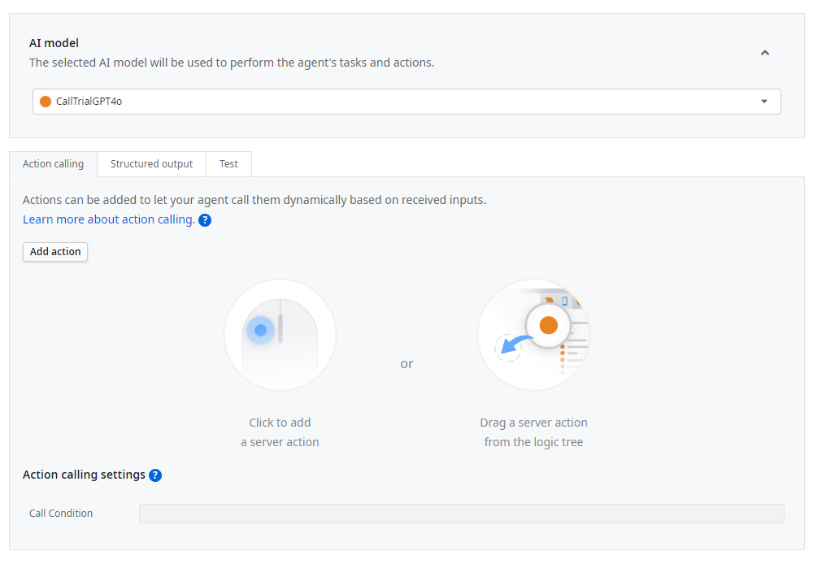
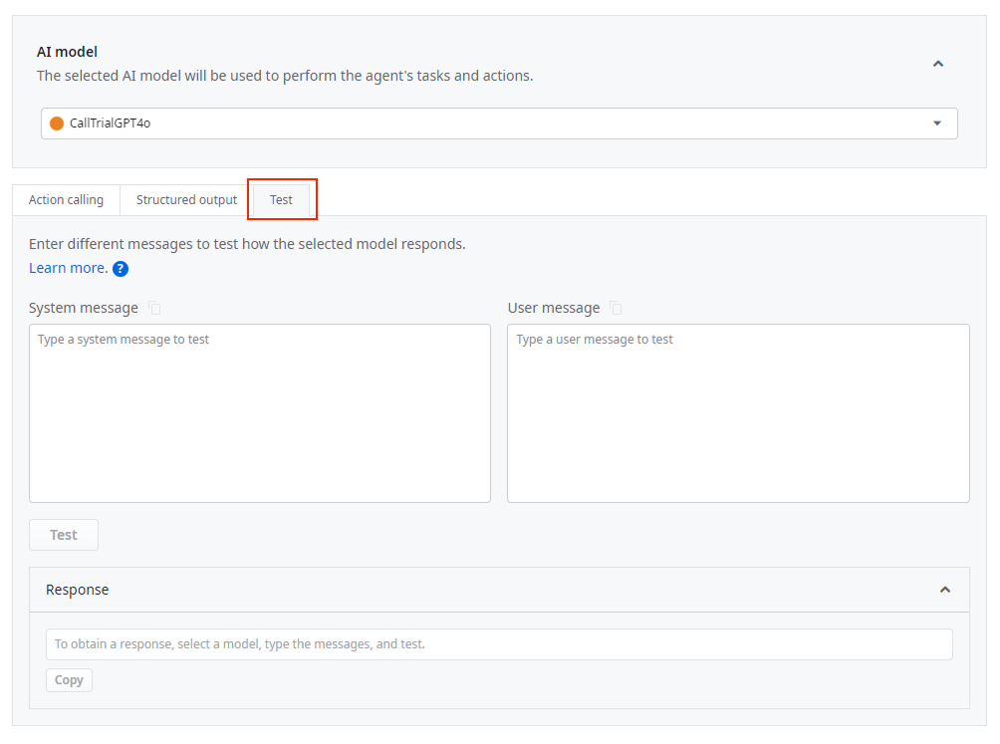
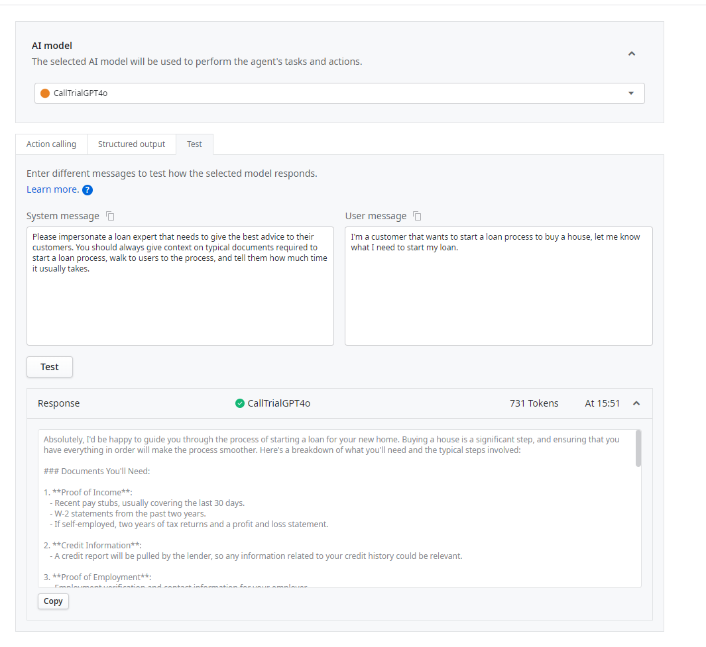

# Testing your messages

System and user messages are an essential part of making your Agentic app's response the best possible. To avoid a time-consuming process, ODC allows you to preview your messages before committing to them. This way, when you publish your agent, it has the right set of messages for your use case.

## How to test your messages in ODC Studio

You can test System messages, User messages, or both in the Test area. To test your messages on ODC Studio:

1. Inside your Agentic App, double-click on the Call Agent node within the Agent Flow. This opens the Call agent window:

    

1. Select the Test tab:

    

1. In the Test, you can:

    1. Select from the AI model drop-down the model you want to use in your testing.
    1. Write the System Message you want to test.
    1. Write the User Message you want to test.
    1. Click Test to test your message(s).

**Tip:** You can copy any of your messages or test results by clicking the copy icon located next to the message or button in the answer. These are added to your clipboard.

To [add a new AI model](add-ai-models.md), add it first in the ODC Portal. After, add it as a Public Element in your app.

## Testing example

In the following example, you can see a test for both a System message and a User message:

Whenever you test messages, you'll get:

* The test response
* The time stamp of your request
* Information on the AI Model used on the test
* The number of input and output tokens used during the test
