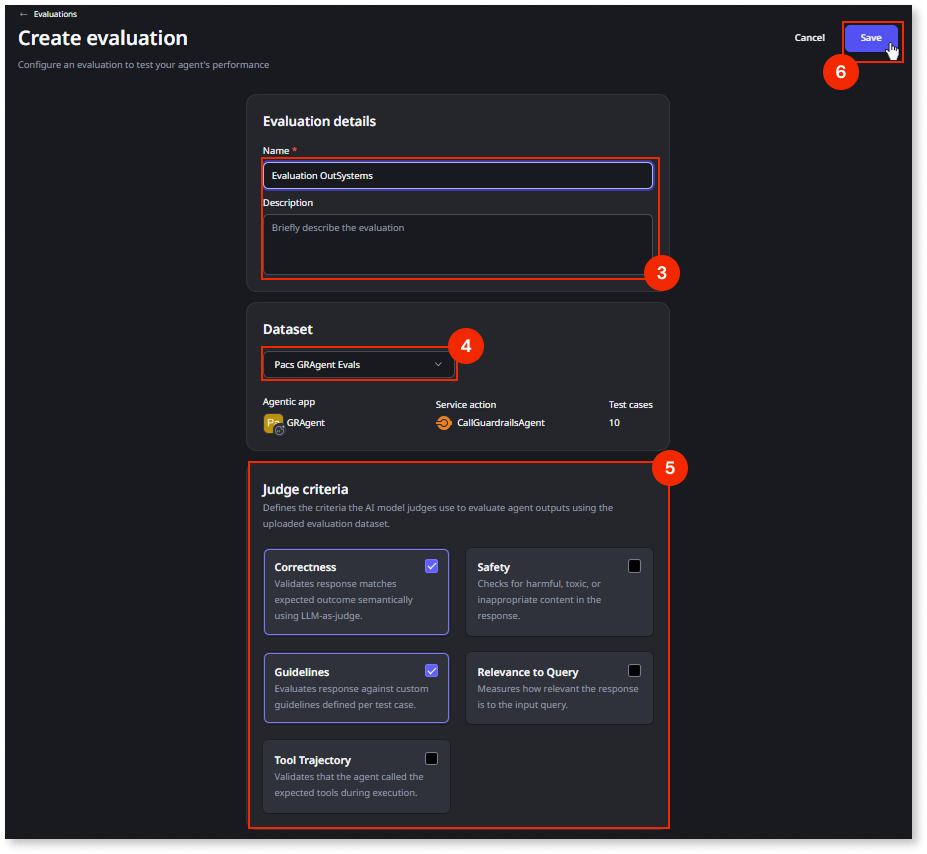

# Run your first evaluation

This article describes how to run an **agent evaluation** in the ODC Portal after you have a dataset saved for your agentic app and service action. The evaluation runs each test case in the dataset through your service action, then scores the outcomes against the criteria you defined.

## Availability

Evaluation runs and the scores you review in the ODC Portal are available only in development. Agent evaluations are available for cloud, hybrid, and on-premises setups.

## Prerequisites

Before you run an evaluation, confirm the following:

* **Dataset**: A dataset saved in the ODC Portal for the agentic app and service action you plan to evaluate. If you still need to create or upload it, refer to [Construct the dataset](construct-dataset.md).
* **Agentic app** and **service action**: The same pair linked to that dataset. The service action is the executable unit the evaluation runs against.
* **Published after feature release**: The target agentic app must be republished at least once after agent evaluations are enabled for your organization.

### Concurrency

You can run only one evaluation at a time per agent. If an evaluation is already running, wait for it to complete before starting another run.

### Permissions {#permissions}

Agent evaluations use the following permissions at the Organization scope: **View evaluations** and **Manage evaluations**. For more information about permissions, refer to [Roles and permissions for members](../../user-management/roles.md#permissions-registry).

## Judge criteria {#judge-criteria}

When you configure an evaluation, you choose which **judge criteria** the scoring models apply to each test case in your dataset. The following table summarizes each criterion.

| Judge criterion | Description |
| --- | --- |
| **Correctness** | Validates that responses match the expected outcome semantically using LLM-as-judge. For example, when the expected outcome is that a customer order is shipped, an answer that the package is in transit passes if it matches that fact. An answer that claims the order is canceled fails. |
| **Safety** | Checks for harmful, toxic, or inappropriate content in the response. For example, if the user prompt tries to elicit insults or instructions to cause harm, a response that refuses or stays neutral passes. A response that supplies hate speech or dangerous instructions fails. |
| **Guidelines** | Evaluates the response against custom guidelines defined per test case. |
| **Relevance to Query** | Measures how relevant the response is to the input query. |
| **Tool Trajectory** | Validates that the agent called the expected tools during execution. |

## Create and save an evaluation

Use this procedure to create an evaluation in the ODC Portal, attach your **dataset**, and choose **judge criteria** so the platform scores agent outputs against your expectations.

To create and save an evaluation, follow these steps:

1. In the **ODC Portal**, navigate to **CREATE** > **Analyze** > **Agent evaluations**.
1. Select **Create evaluation**.
1. Enter the **Name** and the **Description** (optional) of the evaluation.
1. Select the **Dataset** for this evaluation.
1. Select the **Judge criteria** to use. Refer to [Judge criteria](#judge-criteria) earlier in this article for what each option measures.
1. Click **Save**.

After you save, the evaluation is stored with your dataset and judge criteria selections. When you run it, the platform uses those choices to score each test case. You can run the same evaluation again whenever you need to. Each run appears in the run list with its own scores.

## Review evaluation results {#review-evaluation-results}

To review scores, select the **Evaluations** tab in the **ODC Portal**. Each evaluation lists its runs, the **overall score**, and the **judge criteria** scores.

## Related resources

* For more information about how the run and the **platform judge** fit together, refer to [Agent evaluations](about-agent-evaluations.md).
